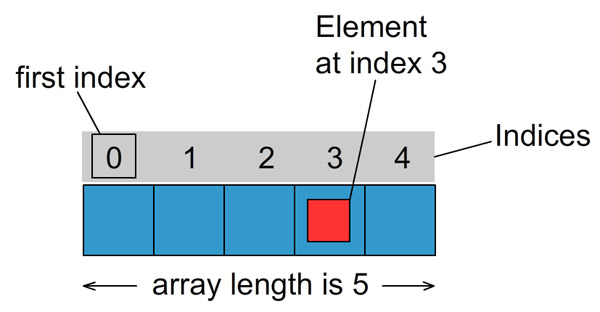

# Tableaux

>C’est un ensemble ordonné d’éléments de **même type** (Collection). Il peut contenir tous les types de données (types primitifs ou Objets).

La taille peut être fixée dynamiquement lors de l’allocation et n’est alors pas modifiable par la suite.  

Après sa déclaration il doit être alloué, puis initialisé : sa déclaration n’est donc qu’une référence.  

Cas particulier : l’initialisation statique condense ces 3 actions sur une même ligne. On peut créer facilement des tableaux à n dimensions.

## Déclaration et allocation d’un tableau

### Déclaration

```java
int[] monTableau; // ou int monTableau[];
```

### Allocation

```java
monTableau = new int[10] ;
```

 indice(*) | contenu |
- |:-: | -:
`0` | **0** | 
`1` | **0** | 
`2` | **0** | 
`3` | **0** | 
`4` | **0** | 
`5` | **0** | 
`6` | **0** | 
`7` | **0** | 
`8` | **0** | 
`9` | **0** | 
 
(*) = index du tableau

Représentation graphique d'un tableau en java




## Initialisation d’un tableau (élément par élément)

```java
monTableau[0] = 1;
monTableau[1] = 2;
monTableau[2] = 10;
monTableau[3] = 11;
```

## Initialisation d’un tableau avec une boucle for

```java
for (int index = 0 ; index < monTableau.length ; index++)
{
monTableau[index] = index ++;
}
```

Cela donne les affectations suivantes :

indice(*) | contenu |
- |:-: | -:
`0` | **1** | 
`1` | **2** | 
`2` | **3** | 
`3` | **4** | 

## Regrouper les étapes de création d’un tableau

### Allocation et initialisation regroupées

```java
int[] monTableau ;
monTableau = new int[] {1,2,3,4} ;
```

### Déclaration, allocation et initialisation regroupées

```java
String[] monTableau = {"One","Two","Three","Four"} ;

```

Cela donne les affectations suivantes :

indice | contenu |
- |:-: | -:
`0` | **One** | 
`1` | **Two** | 
`2` | **Three** | 
`3` | **Four** | 

Il existe une méthode plus simple pour parcourir un tableau (depuis java version 5).

```java
for (int element : monTableau)
{
   System.out.println(element);
}
```

>Attention : la variable **element** contient une copie de **monTableau[i]**. Avec des tableaux contenant des variables primitives comme les **int** par exemple, toute modification de **element** n'aura aucun effet sur le contenu du tableau.

Voici la mauvaise manière d'affecter la valeur 100 à tous les éléments du tableau :

```java
for(int element : monTableau)
{
    element=100;
}
```

Voici la bonne manière de faire :

```java
for(int i=0; i < monTableau.length; i++)
{
    monTableau[i]=100;
}
```

## Tableau à plusieurs dimensions

>Un tableau à plusieurs dimensions est un tableau de tableaux.

Exemple d'allocation d'un tableau de 10 lignes et de 3 colonnes :

```java
int[][] tableau=new int[10][];

for (int i=0 ; i<tableau.length; i++)
{
    tableau[i]=new int[3];
}
```

On peut aussi déclarer le tableau comme ci-dessous :

```java
int[][] matrice=new int[10][3];
```

Dans la première version, on pourrait créer un tableau de tableaux avec des dimensions différentes.

>On peut aussi remplir le tableau lors de la déclaration et déléguer au compilateur le soin de déterminer lui-même les dimensions des tableaux. Il suffit d'imbriquer les accolades comme ci-dessous :

```java
 int[][] tableau =
    {
        { 0, 1, 8, 2 } , // tableau [0] de int
        { 15, 16, 17, 13, 14, 4} // tableau [1] de int
    };
```

Voici un exemple que vous pouvez tester dans votre méthode main() :

```java

// Tableau 2 dimensions de 5 lignes et 3 colonnes, déclaration et initialisation
int[][] bigTableau = new int[5][3];
int ligne=0;
int colonne=0;
int i=1;
for(ligne=0; ligne < bigTableau.length; ligne++)
	{
	for(colonne=0; colonne < bigTableau[ligne].length; colonne++)
		{
			bigTableau[ligne][colonne]= i++;
			System.out.print(bigTableau[ligne][colonne]+ " ");
		}
	System.out.println();
}
System.out.println("nombre de lignes : "+bigTableau[].length);
System.out.println("nombre de colonnes : "+bigTableau[][].length);
```

Résultat que vous devez obtenir dans la console :

```java
1 2 3 
4 5 6 
7 8 9 
10 11 12 
13 14 15

```

Voilà à quoi cela correspond :

indice | colonne0 | colonne1 | colonne2
- |:-: | -: |:-: |:-:
`0` | **1** | **2** |**3** |
`1` | **4** | **5** |**6** |
`2` | **7** | **8** |**9** |
`3` | **10** | **11** |**12** |
`4` | **13** | **14** |**15** |

Autre exemple avec des tableaux de String à 2 dimensions :

```java

// Tableau 2 dimensions de 2 lignes et 2 colonnes
String[][] miamTableau = new String[2][2];
// miamTableau[0] => Fruits
// miamTableau[1] => Légumes
miamTableau[0][0]="Pomme";
miamTableau[0][1]="Poire";

miamTableau[1][0]="Haricot";
miamTableau[1][1]="Epinard";
for(int l=0; l < miamTableau.length; l++)
	{
		for(int c=0; c < miamTableau[l].length; c++)
		{
			System.out.print(miamTableau[l][c]+ " ");
		}
	System.out.println();
}
```

Résultat que vous devez obtenir dans votre console :

```java
Pomme Poire 
Haricot Epinard 

```

Voilà à quoi cela correspond :

indice | colonne0 | colonne1
- |:-: | -: |:-:
`0` | **Pomme** | **Poire** 
`1` | **Haricot** | **Epinard**

La propriété **length** permet de récupérer la longueur des tableaux. Voici la syntaxe ci-dessous :

```java
tableau.length     //  2 dimensions
tableau[0].length  //  4 dimensions {0, 1, 8, 2}
tableau[1].length  //  6 dimensions.
```

On peut aussi parcourir tous les éléments d'un tableau :

```java
int ligne, colonne;
for(ligne=0; ligne < tableau.length; ligne++)
 {
	for(colonne=0; colonne < tableau[ligne].length; colonne++)
	{
		System.out.println(tableau[ligne][colonne]);
		//on peut réaliser une opération sur tableau[ligne][colonne]
	}
}
```

>Remarque : un tableau ne peut contenir que des types primitifs ou des objets.

Exemple :

```java
float[] tableauDeFloat;
String[] tableauDeChaînes;
Apprenant[] tableauDObjetsApprenants ;
```

>Inconvénients :  
• un tableau, une fois créé a un nombre fixe d'entrées.  
• un tableau ne peut contenir qu’un seul type de données.

Exemples de sources :

```java
public class TableauAvecForeach {
 
    public static void main(String[] args) {
 
        // tableau des chaînes
        String[] fruits = new String[] { "Pomme", "Poire", "Fraise" };
 
        // Boucle for-each pour lire le tableau.
        for (String fruit : fruits) {
 
            System.out.println(fruit);
        }
   }
}
```

```java
import java.util.Scanner;

public class TableauExemple {
	 
	  static Scanner input = new Scanner(System.in);
	 
	  public static void main(String[] args)
	  {
	    int numNoms = getInt("Nombre d'entrées du tableau ?");
	    String[] noms = new String[numNoms];
	    for (int i = 0; i < noms.length; i++)
	    {
	      noms[i] = getString("Entrée n°" + (i+1));
	    }
	    System.out.println("Contenu du tableau :");
	    for (String string : noms) {
	    	System.out.println(string);
		}
	  }

	  public static int getInt(String prompt) {
	    System.out.println(prompt + " ");
	    int entier = input.nextInt();
	    input.nextLine(); // indispensable pour effectuer la lecture
	    return entier;
	  }
	 
	  public static String getString(String prompt) {
	    System.out.print(prompt + " ");
	    return input.nextLine();
	  }
	}
```
Pour passer outre ces restrictions, jetter un oeil sur le chapitre suivant.

## Tableaux avancés avec les classes Spécifiques

### Une classe bien utile : **Array**

La classe **Arrays** du package **java.util** possède plusieurs méthodes de gestion des tableaux de types de base, et d'objets :

- **asList** convertit un tableau en liste
- **binarySearch** effectue la recherche binaire d'une valeur dans un tableau,
- **equals** compare deux tableaux et renvoie un booléen true s'ils ont une même longueur et contenu,
- **fill** remplit un tableau avec la valeur donnée,
- **sort** trie un tableau dans l'ordre croissant de ses éléments.

#### Copie d'un tableau

>La copie d'un tableau implique la copie de ses éléments dans un autre tableau. Dans le cas d'un tableau d'objets, seules les références à ces objets sont copiées, aucun nouvel objet n'est créé.

La méthode arraycopy de la classe System permet de copier tout ou partie d'un tableau vers un autre tableau déjà alloué.

Comme toutes les classes, les tableaux dérivent de la classe java.lang.Object. Les méthodes de la classe Object sont donc utilisables :

```java
int[] premiers = { 2, 3, 5, 7, 11 };
System.out.println( premiers.toString() ); // Par défaut <type>@<hashcode>, exemple : [I@a108298c
System.out.println( Arrays.toString(premiers) );  // Pour afficher son contenu à l'écran
```

La copie intégrale d'un tableau dans un nouveau tableau peut donc se faire en utilisant la méthode **clone()**. La valeur retournée par cette méthode étant de type **Object**, il faut la convertir dans le type concerné.

Exemple :

```java
int[] nombres = { 2, 3, 5, 7, 11 };
int[] copie = (int[]) nombres.clone();
nombres[1]=4; // nombres contient 2 4 5 7 11
// tandis que copie contient toujours 2 3 5 7 11
```

#### Somme des éléments d'un tableau

```java
public class SommeTableaux {
	public static void main(String[] args) {
		int[] nb = {1,2,3,4,5,6,7,8,9};
		int somme = java.util.stream.IntStream.of(nb).sum();
		System.out.println(somme); //45
	}
}
```

#### Comparaison de deux tableaux

Il serait possible de lancer des boucles de comparaison, mais le plus court moyen donne un avant-goût du chapitre Collections

```java
import java.util.*;
public class CompareTableaux {
	public static void main(String[] args) {
		HashSet<String> hs1 = new HashSet<String>(Arrays.asList(new String[] { "2", "3", "5", "7", "11" }));
		HashSet<String> hs2 = new HashSet<String>(Arrays.asList(new String[] { "2", "4", "6", "8", "11", "12" }));
		HashSet<String> similarites = new HashSet<String>(hs1);
		HashSet<String> differences = new HashSet<String>(hs1);
		similarites.retainAll(hs2);
		hs2.removeAll(similarites);
		differences.removeAll(similarites);
		differences.addAll(hs2);
		System.out.println( similarites.toString() );	//[11, 2]
		System.out.println( differences.toString() );	//[12, 3, 4, 5, 6, 7, 8]
	}
}
```

>Par défaut, **Arrays.sort()** place les caractères non ASCII après le "z" (ex : à, é...). Pour tenir compte de l'Unicode, il faut donc remplir son deuxième paramètre, avec un **java.text.Collator** ou un **java.util.Comparator**.

### ArrayList, Vector, ArrayList, TreeSet, HashMap,...

Apperçu des classes Java avec des Collections et des Map


Par exemple, avec la classe **Vector** (obsolète), il existe de nombreuses methodes :

- addElement(o:Object)
- capacity():int
- elementAt(i:int):Object
- removeAllElements()
- remove(o:Object):Boolean
- toString():String
- ...

>Un **Vector** ou **ArrayList** peut être agrandi ou réduit suivant les besoins.  
Un Vector peut contenir des références à divers objets, mais il *ne peut pas contenir de types primitifs*.  
Un Vector peut renvoyer la référence d’un objet si on lui donne un rang (position).  
Quand on enlève un élément d’un Vector, il y a tassage automatique du Vector.   

>La méthode **toString()** d’un Vector appelle la méthode **toString()** pour chacun de ses éléments.

Quelques exemples sur des tableaux simples et des Vecteurs :

```java
String[] s = new String[7];
Vector v = new Vector();

String jour1 = « Lundi »;
s[0] = jour1;
v.add(jour1); // ou v.addElement(jour1)

jour2 = « Mardi »;
s[1] = jour2;
v.add(jour2);

//...
String aujourdhui = s[numJour];
//...ou bien ...
String aujourdhui = v.elementAt(numJour);
```

### Utilisation des Wrappers (Classes enveloppes)

>Problème : On veut stocker directement un type primitif (par exemple un int) dans un Vector. Comment faire ?

Impossible !!!

>Solution : Utiliser un **wrapper** qui permettra de stocker la référence au type primitif. A chaque type primitif correspond une classe, qu’on nomme wrapper (attention à la majuscule !) : par exemple *Boolean est le wrapper du type boolean*.

Attention aux exceptions : **Integer** et **Character**.

Le wrapper stocke simplement une référence au type primitif, ce qui permet plus de possiblités de traitement.

La classe Integer  
Elle possède deux constructeurs :

- Integer(String s);
- Integer(int i);

Il est facile de passer du type primitif à la classe et réciproquement :

```java
int primitifNombre = 4;
Integer objInt = new Integer(primitifNombre);
int nombre = objInt.intValue();
```

Classe **Integer** et quelques méthodes :


Tableau des correspondances 

Type origine (primitif) | Classe Enveloppe |
- |:-: | -:
`boolean` | **Boolean** | 
`int` | **Integer** | 
`long` | **Long** | 
`float` | **Float** | 
`double` | **Double** | 
`char` | **Character** | 

## Collections

(source : JMDoudoux)

Java propose les classes suivantes pour gérer des objets dans des tableaux évolués (Collection ou Map) :

- **HashSet** : Hashtable qui implémente l'interface **Set**
- **TreeSet** : arbre qui implémente l'interface **SortedSet**
- **ArrayList** : tableau dynamique qui implémente l'interface **List**
- **LinkedList** : liste doublement chaînée (parcours de la liste dans les deux sens) qui implémente l'interface **List**
- **HashMap** : Hashtable qui implémente l'interface **Map**
- **TreeMap** : arbre qui implémente l'interface **SortedMap**

Liste des interfaces pour faciliter le **parcours des collections** et leur **tri** :

- **Iterator** : interface *pour le parcours des collections*
- **ListIterator** : interface *pour le parcours des listes dans les deux sens et *pour modifier les éléments lors de ce parcours*
- **Comparable** : interface pour définir un ordre de tri naturel* pour un objet
- **Comparator** : interface pour *définir un ordre de tri quelconque*

Depuis quelques temps, la classe **ArrayList** remplace la classe **Vector** : tableau à taille variable qui implémente maintenant l'interface **List**

la classe **Hashtable** (table de hachage) implémente maintenant l'interface **Map**

## Documentation Java sur les bases en java

Vous trouverez plein de bonnes choses sur ce site !

[bases de java avec JMDoudoux](https://www.jmdoudoux.fr/java/dej/indexavecframes.htm)