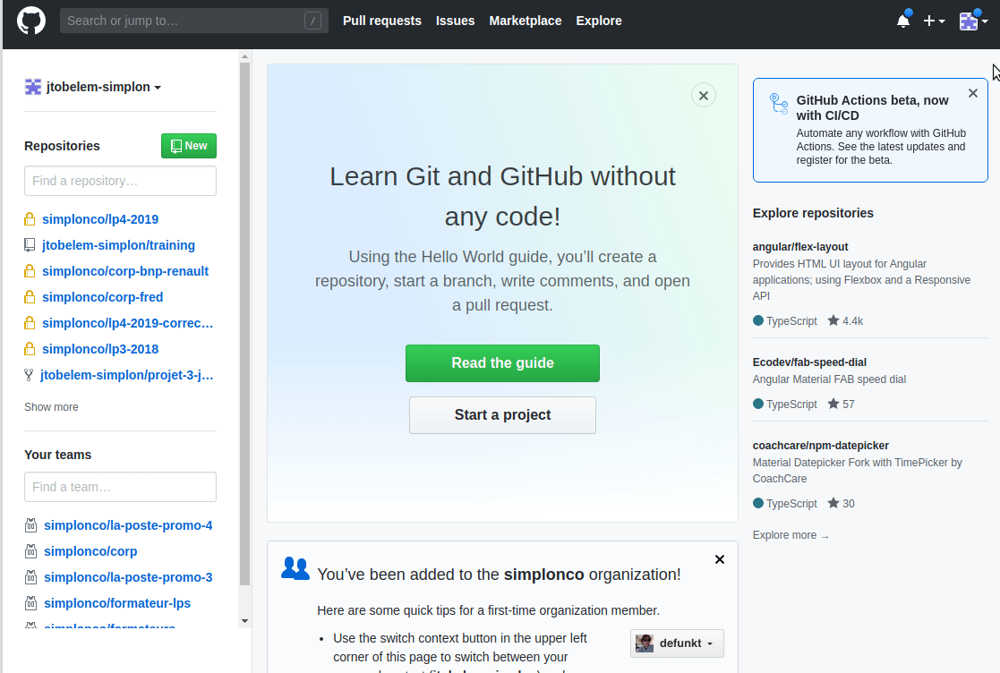
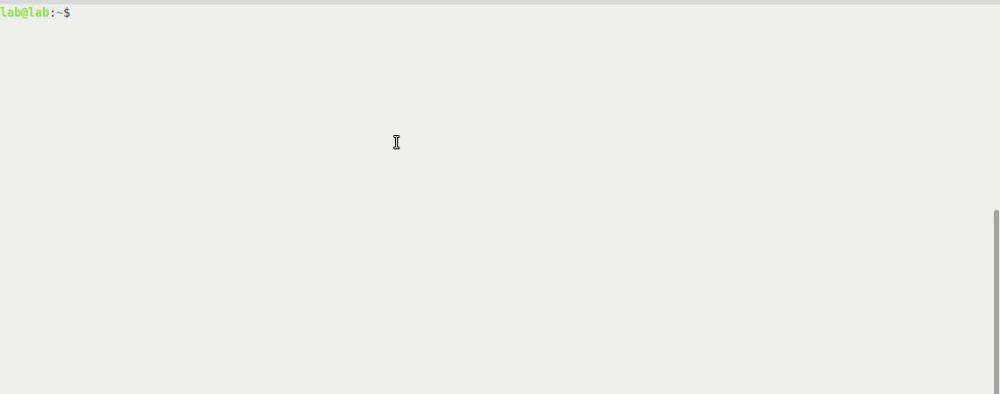
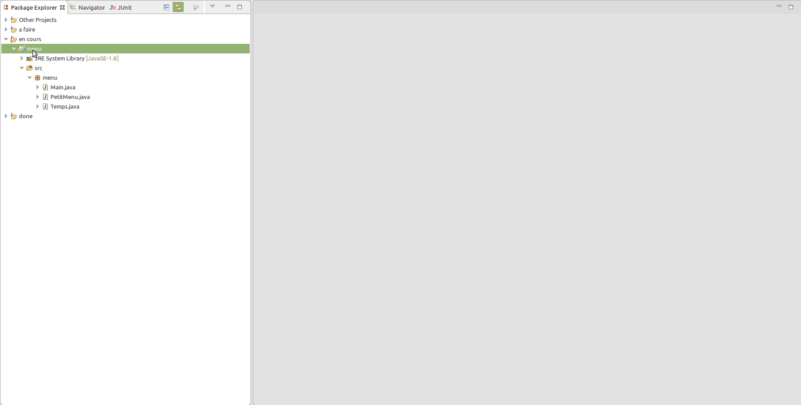
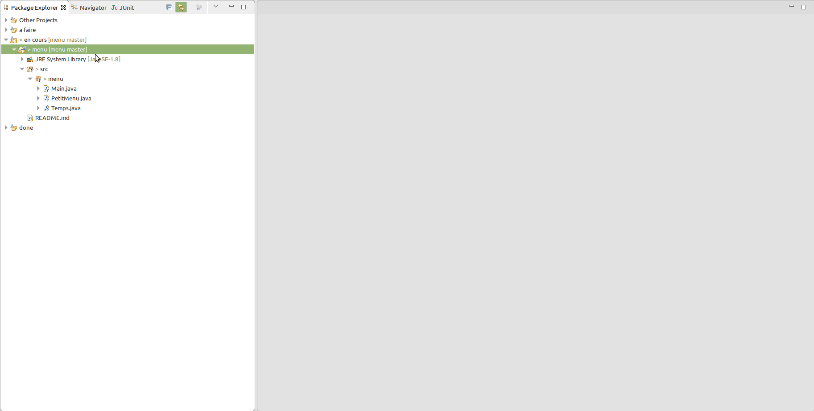
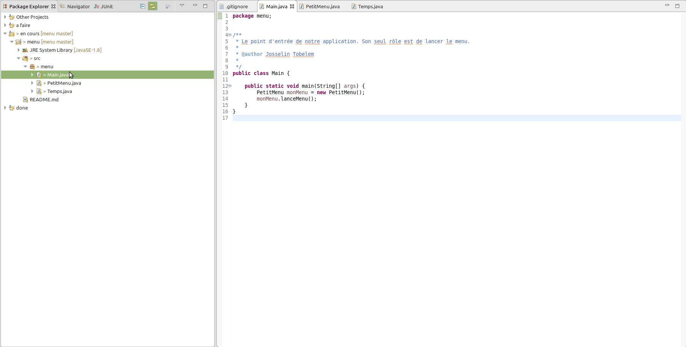

# Projet menu

3 classes : Main, Menu, Calculs (minimum d'une liste, moyenne d'une liste, nombre occurence d'une valeur)

## Step by step : projet simple sous github

1) Création du projet sous eclipse

- new java project
- dans les sources, créer un package menu (en minuscules)
- ajouter dans ce packages les trois fichiers suivants :

[Main.java](java/Main.java)  
[PetitMenu.java](java/PetitMenu.java)  
[Temps.java](java/Temps.java)


2) Création d'un repo github

> Les étapes qui suivent demandent un peu de concentration!



> Il faut ajouter un .gitignore (java) afin d'exclure tous les fichiers inutiles : .class par exemple

3) On récupère directement le .git, le .gitignore et le README.md pour le mettre dans le dossier du projet eclipse



4) On partage le projet depuis eclipse



5) On met à jour le fichier .gitignore pour ne pas pusher les fichiers de configuration propres à eclipse : **.settings**, **.project** et **.classpath**



6) On peut enfin commiter les fichiers sources de notre projet




## Step by step : projet simple soous github avec gradle

On recommence mais avec gradle.

1) Créer un dossier menu-gradle dans votre workspace eclipse (depuis le terminal ou l'explorateur de fichiers)

2) intialiser ce dossier comme un projet d'application java avec gradle

```
cd menu-gradl
gradle init
```

3) Depuis eclipse, file/import.../gradle/ existing gradle project et allez chercher votre projet

4) suivre les étapes 2) à 6) précédentes pour mettre votre projet sur github
