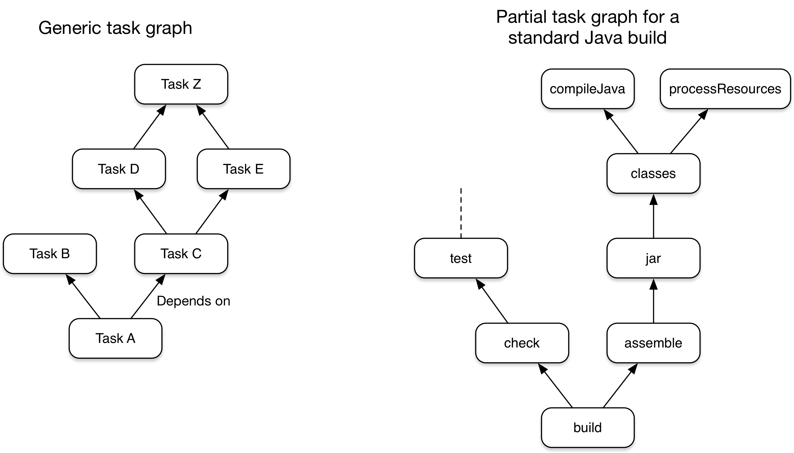

# Gradle

## Introduction

- Gradle est un outil général pour réaliser des [builds](https://en.wikipedia.org/wiki/Software_build)

- Gradle est conçu pour réaliser des taches :

[Plus de détail sur la documentation officielle](https://docs.gradle.org/current/userguide/what_is_gradle.html#what_is_gradle).

> Ce qu'il faut retenir : gradle va nous permettre qu'un projet qui fonctionne chez nous fonctionne partout.
> Il servira à configurer l'architecture de nos projets, et les dépendances utilisées.

## Installation

- [installation avec windows : manuelle](https://docs.gradle.org/current/userguide/installation.html#installing_with_a_package_manager)
- [installation avec linux : via sdkman](https://docs.gradle.org/current/userguide/installation.html#installing_manually)
- intégration avec eclipse

## Pratique

1) Un premier build avec gradle : [tuto : Creating New Gradle Builds](https://guides.gradle.org/creating-new-gradle-builds/)

2) Une application java avec gradle : [tuto : Building Java Applications](https://guides.gradle.org/building-java-applications/)

## Resources

[Manuel : getting started](https://docs.gradle.org/current/userguide/getting_started.html)

[Gradle Plugin Reference](https://docs.gradle.org/current/userguide/plugin_reference.html)  
[Search Gradle plugins](https://plugins.gradle.org/)  
[Sample Gradle builds on GitHub](https://github.com/gradle/gradle/tree/master/subprojects/docs/src/samples)

Pour apprendre à utiliser gradle avec des applications bureau, ou avec des applications web :  
[tuto : Building Java Applications](https://guides.gradle.org/building-java-applications/)  
[tuto : Building Java Web Applications](https://guides.gradle.org/building-java-web-applications/)

Nous n'avons pas encore parlé de springboot, mais on utilisera aussi gradle pour configurer ce cadritiel :  
[tuto : Building Spring Boot 2 Applications with Gradle](https://guides.gradle.org/building-spring-boot-2-projects-with-gradle/)

## Maven

Maven est un outil qui réalise les mêmes fonctions que gradle pour builder des applications. Même s'il est plus ancien, il reste encore très utilisé en entreprise.

Il repose sur un fichier principal appelé **pom.xml**. Ce fichier est un xml, ce qui le rend moins agréable à lire que le fichier de configuration de gradle **build.gradle**.

Pour ceux qui connaissent déjà Maven :
[tuto : Migrating Builds From Apache Maven](https://docs.gradle.org/current/userguide/migrating_from_maven.html)

## Commandes utiles

- ./gradelw tasks
- ./gradelw <taskName>
