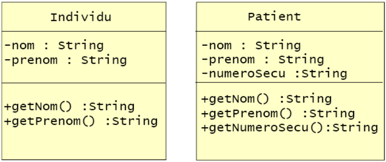
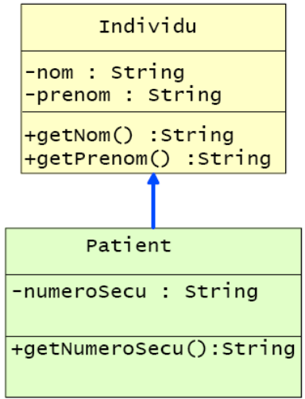
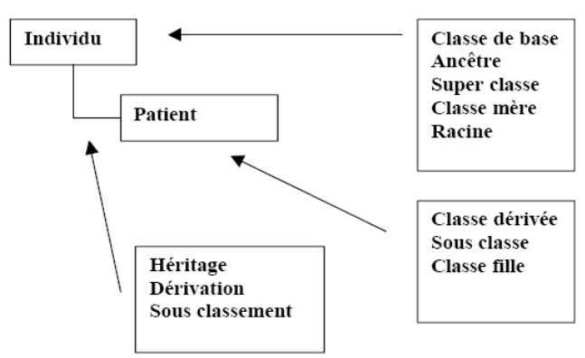
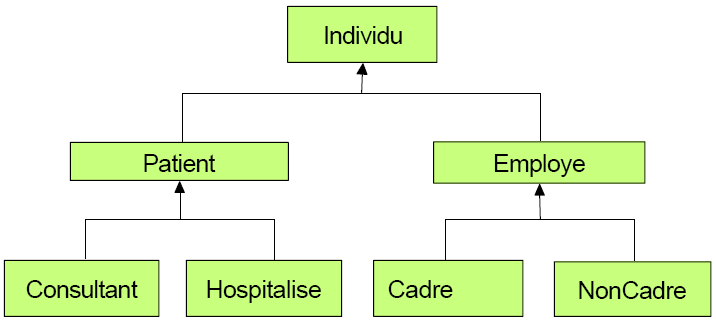
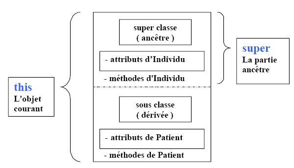
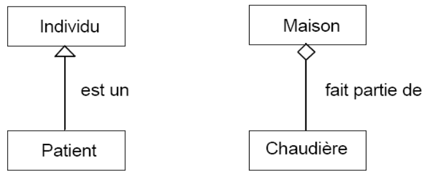

# Java : Héritage (Généralisation)

## Concepts : Héritage et Polymorphisme

### Réutilisation avant l’objet

>Problématique : en développement, on fait des **traitements identiques** pour certaines données communes et des traitements spécifiques pour un certain nombre de données spécifiques.

On s’oriente alors trop souvent vers deux types de solutions qui vont bafouer les principes de base de la programmation.   
- Soit on intègre les traitements dans un même programme et on utilise une structure alternative pour les traitements spécifiques. On aboutit ainsi à un *mégalithe*.
- Soit on duplique le code commun dans des programmes différents et on aboutit à plusieurs *monolithes* contenant la **logique commune dupliquée**.

Vous avez découvert avec les SGBDs, UML et bientôt avec le MCD de Merise que **chaque donnée élémentaire est gérée dans son Entité**, *au bon et à un seul endroit* et tous les SGBDs sont capables de retrouver les liens entre les entités.

>On évite ainsi les redondances !

**Et si on pouvait appliquer le même principe aux traitements ?**

>Données + Traitements => Classes d’objets

Vous savez qu'un objet possède des :

- Attributs (variables, constantes)
- Comportements (méthodes)

>La classification des connaissances humaines permet une économie de mémoire en permettant d'identifier rapidement les caractéristiques d'un objet appartenant à une classe.

Dans l'univers de la programmation Objet, on appelle cela l'**Héritage**

**Malheureusement, il n'y a pas d'argent à rammasser !**

Prenons l'exemple d'une application de santé publique, représentons les objets **Individu** et **Patient** : 



### Relation d’héritage avec UML



Code Java correspondant (sans les constructeurs pour le moment):

```java

class Individu
{
    private String nom ;
    private String prenom ;

    public String getNom()
    {
        return nom ;
    }
    public String getPrenom()
    {
        return prenom ; 
    }
}

class Patient extends Individu
{
    private String numeroSecu;
    public String getNumeroSecu()
    {
        return numeroSecu; 
    }
}

```

### Terminologie de l’héritage



### Héritage sur plusieurs niveaux



### Qui est l’ancêtre commun à toutes les classes ?

>Toutes les classes sont rattachées directement ou indirectement à la classe **Object** (*java.lang.Object*) de Java. Comme nous l’avons vu plus haut, les classes sont organisées de manière hiérarchique. Toutes les classes ont un ancêtre et un seul.

**java.lang.Object** <- **Simplonien** <- **Apprenant**

Ici, la classe **Apprenant** hérite de la classe **Simplonien** qui elle-même hérite comme tous les objets Java, de la classe **OBJECT** du paquetage **Java.lang.Object**.

>Les termes utilisés pour exprimer le principe de l’héritage sont multiples

Dans notre exemple, la classe **Simplonien** est dite :

- Ancêtre
- Mère
- Super-Classe

La classe **Apprenant** est dite :

- Classe dérivée
- Fille
- Sous-classe

>Toutes les classes (sauf la classe Object) ont **UN ANCETRE ET UN SEUL**.

Pour écrire que la classe Apprenant hérite de la classe Simplonien, on utilise le mot-clé :

**EXTENDS** *qui signifie étendre*.

>Remarque : Nous n’avons pas besoin de préciser que la classe **Simplonien** est dérivée de la classe **Object** du langage Java, ceci est implicite.

Object est l’ancêtre commun (Root) de toutes les classes Java. Il propose des méthodes de base pour tous les comportements généraux comme par exemple :

- equals()
- toString()
- clone()

>Ces méthodes de base peuvent être utilisées directement sur tous les objets Java. On peut bien entendu les redéfinir !

### Composition d’un objet

Un objet issu d’une classe dérivée est composé de 2 parties :

- Partie issue de la (ou des ...) classe(s) ancêtre(s)
- Partie propre à la classe dérivée

>Toutes les méthodes publiques de la classe ancêtre sont **« héritées »**, donc utilisables à partir de la classe dérivée.

Dans un langage OO (Orienté Objet), **c’est l’héritage des méthodes qui va considérablement augmenter le taux de réutilisation du code**. Les constructeurs ne font pas partie de l’héritage.

### Opérateurs this et super



Illustration

```java
class Developpeur extends Simplonien
{
    private String langage ;

    // constructeur 1
    public Developpeur(String nom , String langage )
    { 
        super( nom );
        this.langage = langage;
    }
    // constructeur 2
    public Developpeur( String nom )
    {
        this( nom , null ) ;
    }
}
```

#### Règles dans l’utilisation du mot-clé **this()**

>Obligatoirement dans un CONSTRUCTEUR   
TOUJOURS en PREMIERE INSTRUCTION   
UNE SEULE FOIS par constructeur   

#### Héritage et constructeurs : à Savoir !

>Règle : **Les constructeurs ne font pas partie de l'héritage**.

Oulala ! Je comprends plus rien à l'objet, et l'ancêtre alors !

>Si la classe ancêtre ne possède pas de constructeur sans argument, le constructeur de la classe dérivée doit appeler le constructeur de son ancêtre.

A la création d’un objet d’une classe dérivée on peut écrire un constructeur pour initaliser les données spécifiques à la classe dérivée.

>Comment faire pour construire la partie ancêtre de la classe dérivée ?

Solution : Dans le constructeur de la classe dérivée, il suffit d'appeler par le mot clé **super()** *un constructeur de la super-classe en respectant la signature du constructeur*.

>Remarque : l'appel à **super() doit être la première instruction du constructeur**.

```java

class Individu
{
    private String nom ;
    private String prenom ;

    public Individu(String nom, String prenom) // constructeur
    {
        this.nom=nom;
        this.prenom=prenom;
    }
}

class Patient extends Individu
{
    private String numeroSecu;
    public Patient(String nom, String prenom,String numero)
    {
        super(nom, prenom);
        this.numeroSecu=numero;
    }
}

```

>Quelques règles sur les constructeurs d'une même classe   
>- Une classe peut avoir plusieurs constructeurs
>- Un constructeur peut faire appel à un autre de la même classe en utilisant **this()** ce qui évite de dupliquer du code !

### Constructeur avec super

Réécriture d’une méthode (**Override**)

>Une méthode contenue dans une classe ancêtre peut être réécrite (on dit aussi redéfinie) dans une classe dérivée.   
La méthode de la classe dérivée doit avoir la même signature que celle de la classe ancêtre, elle va **surcharger** (override) cette méthode ancêtre.

>C’est toujours la méthode la plus interne qui sera exécutée par défaut.

Par exemple si on a défini une méthode **print()** pour la classe **Individu**, on pourra écrire un **print() spécifique** pour la classe **Patient**.

>**Mais dans le print() de Patient on pourra aussi utiliser grâce à super(), le print() d’Individu**

Exemple de réécriture de méthode :

```java
class Individu
{
    private String nom ;
    private String prenom ;
    public void print()
    {
    ... // formate et imprime nom et prénom 
    }
...
}

class Patient extends Individu
{
    private String numeroSecu;
    public void print()
    {
        super.print()	// appel du print() de la super classe
        ... // impression spécique à la classe dérivée 
    }
}
```

Les règles dans l’utilisation du mot-clé super sont les mêmes que pour le mot **this()**

La référence **super()** permet d'appeler le constructeur de l'ancêtre. Le constructeur de la classe dérivée doit fournir les valeurs nécessaires au constructeur de l'ancêtre comme dans l’exemple ci-dessous :

```java
public Programmeur( String unNom )
{
    super( unNom ) ; // Appel du constructeur de l'ancêtre
}
```

Exemple avec l’utilisation de super :

```java
public Simplonien( String nom)
{
...
}
public Programmeur( String nom)
{
    super(nom) ;
...
}
```

### Polymorphisme : késako ?

>C’est la capacité d’envoyer un même message à des objets de classes différentes, mais d’**activer en fait une méthode spécifique à chaque classe**.

>Le polymorphisme est intéressant dans un contexte d’héritage.

>Ainsi, le même message peut être envoyé à divers objets de la hiérarchie mais il activera la méthode appropriée en fonction de la nature de l’objet récepteur.

Exemple : Si on reprend notre exemple de la méthode **print()**, imaginons que nous stockions des objets **Individu** dans une **ArrayList<Individu>** : des Patients, des Developpeur, Formateur.

**On activera la méthode print() de la même façon sur tous les éléments de l'ArrayList sans se soucier de leur spécificité.**

### Opérateur instanceof

>Il permet de comparer une instance d’objet à une classe Java. Il renvoie vrai si le nom de la classe fait partie des classes dont l’objet référencé est issu.

```java
Patient patient1 = new Patient();
if (patient1 instanceof Patient) // Vrai
if (patient1 instanceof Individu) // Vrai aussi
Individu ind = new Individu() 
if (ind instanceof Individu)
// Vrai
if (ind instanceof Patient)
// Faux
```

### Héritage et Agrégation : Attention à la confusion !

>Utiliser **l’héritage** quand il y a vraie filiation, spécialisation : un patient est un cas particulier d’individu, c’est normal et souhaitable qu’il hérite de toutes ses méthodes.

>Utiliser **l’agrégation** quand on a une relation de contenu à contenant. Une chaudière est un composant d’une maison, mais son comportement est très spécifique.

Exemple :



### Résumé du cours

>L’héritage est la base de la réutilisation en Orienté Objet   
Les classes dérivées permettent d’étendre (extends) les fonctionnalités d’une classe mère.  
Un classe dérivée hérite de toutes les méthodes publiques des classes ancêtres.  
Toute classe en Java est dérivée de la classe Object.   
Le polymorphisme permet d’utiliser un même nom de méthode sans préciser la nature de l’objet récepteur.   
L’héritage et l’agrégation répondent à des cas de figure différents et sont complémentaires.

## Pratique Héritage et Polymorphisme

Maintenant que vous avez découvert les notions d'héritage avec les diagrammes de classes UML et ce cours, voici un TP pour mettre en application vos acquis avec java.

Pour illustrer cette notion particulière à l'univers **Objet** voici ce que vous allez écrire :

Créer 2 classes (la troisième est donnée plus bas) :

- **Personne** avec les attributs et méthodes ci-dessous :
    - prenom : chaîne
    - age : entier
    - dormir() : affiche le message "Rrrrrrr Rrrrrrr"
    - manger(String fruit) : affiche le message "Miam miam, c'est bon ce fruit, *fruit* !"
    - bonjour() : affiche "Bonjour, tu es *prenom* et tu as *age* ans"

- **Apprenant**  avec les attributs et méthodes ci-dessous :
    - lieuDeTravail : chaîne
    - Os : public enum {INDEFINI, WINDOWS, MAC, LINUX}
    - systeme : Os
    - travailler() : affiche "Dur dur java !"
    - chomer() : affiche "Ah que j'aime les pauses café ..."
    - bonjour() : affiche "Bonjour, tu es *prenom* et tu as *age* ans. ET

        - si Os égal INDEFINI alors affiche message="Tu ne connais pas encore ton OS !"  
        - sinon si Os égal WINDOWS alors message="Tu vas bosser sur Windows ! Super, comme en formation !"  
        - sinon si Os égal LINUX alors message="Tu vas bosser sur Linux ! Tu aimes la liberté !"  
        - sinon message="Tu vas bosser sur Mac ! Ouille ! Mais bon, un linux se cache sous le capot..."  
        ET    
        "Ton lieu de travail est à *lieuDeTravail*"

Voici la classe *TestHeritage.java* :

```java
package heritage;

import heritage.Apprenant.Os;

/**
 * @author Philippe
 *
 */
public class TestHeritage {

	/**
	 * @param args
	 */
	public static void main(String[] args) {

		Apprenant phil = new Apprenant("Philippe",54,"Montreuil", Os.WINDOWS);

		phil.bonjour();
		phil.travailler();
		phil.manger("banane");
		phil.chomer();
		phil.dormir();

		Personne jojo = new Personne("Josselin",34);

		jojo.bonjour();
		jojo.manger("pizza");
		jojo.dormir();

		Personne anissa = new Apprenant("Anissa",23, "Montreuil",Os.MAC);
		anissa.bonjour();
		anissa.manger("chocolat");
		anissa.dormir();
	}
}

```

## Solution

[par ici](solution.md)