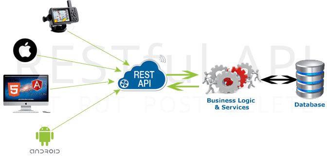

# Format json et api rest



#### Définition json sur wikipedia :

_"JavaScript Object Notation (JSON) est un format de données textuelles dérivé de la notation des objets du langage JavaScript. Il permet de représenter de l’information structurée comme le permet XML par exemple."_


#### Définition rest sur wikipedia :


_"REST (representational state transfer) est un style d'architecture logicielle définissant un ensemble de contraintes à utiliser pour créer des services web. Les services web conformes au style d'architecture REST, aussi appelés services web RESTful, établissent une interopérabilité entre les ordinateurs sur Internet. Les services web REST permettent aux systèmes effectuant des requêtes de manipuler des ressources web via leurs représentations textuelles à travers un ensemble d'opérations uniformes et prédéfinies sans état."_

Simplement une architecture rest vérifie les 5 règles suivantes :
- Règle n°1 : l’URI comme identifiant des ressources
- Règle n°2 : les verbes HTTP comme identifiant des opérations
- Règle n°3 : les réponses HTTP comme représentation des ressources
- Règle n°4 : les liens comme relation entre ressources
- Règle n°5 : un paramètre comme jeton d’authentification

Plus de détail ici : [https://blog.nicolashachet.com/niveaux/confirme/larchitecture-rest-expliquee-en-5-regles/](https://blog.nicolashachet.com/niveaux/confirme/larchitecture-rest-expliquee-en-5-regles/).


# Librairies java

Java ne lit pas nativement des fichiers json.

Il existe plusieurs libraires pour récupérer le texte json à partir d'une requête puis pour parser (découper) ce texte. On peut regarder sur le site [https://json.org/](https://json.org/) (par exemple la librairie gson, ou jackson) pour une liste exhaustive.

#### java-json
[http://www.java2s.com/Code/Jar/j/Downloadjavajsonjar.htm](http://www.java2s.com/Code/Jar/j/Downloadjavajsonjar.htm
)

#### apache commons-io
[https://commons.apache.org/proper/commons-io/download_io.cgi](https://commons.apache.org/proper/commons-io/download_io.cgi
)

L'exemple suivant utilise les deux libraires précédentes pour aller interroger l'api web de github afin d'obtenir la liste de tous les utilisateurs github qui ont plus de 1000 followers (donc des gens influents :).

```java
public static void main(String[] args)
    throws MalformedURLException, IOException, JSONException {

    String url = "https://api.github.com/search/users?q=repos:%3E42+followers:%3E1000"; // plus de 1000 followers

		String jsonText = IOUtils.toString(new URL(url), Charset.forName("UTF-8"));

		JSONObject json = new JSONObject(jsonText);

		int totalCount = (int) json.get("total_count");

		System.out.println("total count : "+totalCount);
	}
```
