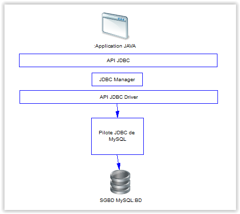

# Découverte de JDBC

## Qu’est–ce que JDBC

### Introduction

**JDBC** (Java DataBase Connectivity) est l’API java qui a été développé par Sun MicroSystems pour se connecter à des bases de données hétérogènes. JDBC est conçue pour que le développeur puisse se concentrer au maximum sur son application en perdant moins d’énergie pour traiter des problèmes techniques liés à l’utilisation d'une base de données.

JDBC a 3 rôles :

- **Se connecter** à une base de données avec l’interface adéquate (driver ou pilote).
- **Envoyer des requêtes** SQL. (exécuter une requête)
- **Exploiter les résultats** des requêtes. (récupérer le résultat)

Avec une interface JDBC, nous avons une solution objet simple en Java, à condition de disposer du pilote JDBC correspondant à la base de données.

Heureusement, il existe des pilotes pour Oracle, Sybase, Informix, DB2 et MySQL ainsi que des pilotes dit "génériques" comme ODBC pour Windows que nous n’aborderons pas dans ce cours (ce n'est plus trop d'actualité).

Le pilote JDBC pour MySQL a normalement été chargé lors de l'installation de MySQL.

>Vous pouvez le récupérer dans le répertoire suivant :   
**C:\Program Files (x86)\MySQL\Connector J 8.0**

>le fichier du pilote est :   
  **mysql-connector-java-8.0.18.jar**.

Si vous ne l'avez pas, vous pouvez le [télécharger ici](https://dev.mysql.com/downloads/windows/installer/8.0.html)

Voici le lien vers la page qui permet de charger les différents pilotes MySQL pour différents langages : [pages des pilotes](https://www.mysql.com/fr/products/connector/)

Exemple d'implémentation JDBC (notion de couches)



## Le package java.sql

Tous les objets et les méthodes relatifs aux bases de données sont présents dans le package **java.sql**. Il est donc indispensable de l'importer dans tout programme utilisant cette technologie.

Les principales interfaces de java.sql sont :

- **DriverManager** : Que l’on peut traduire par gestionnaire de pilote. Elle permet le chargement des pilotes et la création de nouvelles connexions à des bases de données.

- **Connection** : Elle représente une connexion à une base de données.

- **Statement** : Que l’on peut traduire par *instruction*. C'est une classe que l'application emploie pour transmettre des instructions à la base. Elle représente une requête SQL.

- **ResultSet** : Cette classe symbolise un ensemble de résultats dans la base de données et autorise l'accès aux résultats d'une requête, enregistrement par enregistrement.

- **PreparedStatement** : Interface qui permet d’exécuter des requêtes paramétrées.

- **CallableStatement** : Interface qui permet l’appel de procédures stockées.

## La connexion aux bases de données

La classe DriverManager est le gestionnaire des pilotes permettant à l’utilisateur d'accèder aux bases de données.

Quelque soit le gestionnaire de base de données, les étapes pour manipuler les données d'une base sont toujours les mêmes :

1. Charger le pilote
2. Ouvrir une connexion à la base de données
3. Préparer la requête SQL
4. Exécuter la requête
5. Récupérer les résultats ou pas (que l'on peut afficher)
6. Fermer la connexion à la base de données.

### 1) Chargement de la classe du Driver

Pour se connecter à une base de données il est essentiel de charger dans un premier temps le pilote de la base de données à laquelle on désire se connecter grâce à un appel au **DriverManager** (gestionnaire de pilotes) :

**Class.forName("NomDeLaClasse");**

Cette instruction charge le pilote et crée une instance de cette classe.

Dans le cas du pilote propriétaire MySQL, il faut importer le fichier *.jar* dans la librairie du projet Eclipse :

**mysql-connector-java-5.1.44-bin.jar** pour une version antérieure à MySQL 8
**mysql-connector-java-8.0.18.jar**

#### Etape de chargement du pilote dans un projet Eclipse

- Sélectionnez votre projet dans le **Project Explorer** d'éclipse
- Appuyez sur la touche **ALT** et **ENTER** pour ouvrir la fenêtre de propriétés du projet java
- Mettez votre curseur sur **Java Build Path** puis sur l'onglet **Librairies**
- Cliquez sur **Add External JARs...**
- Sélectionnez le pilote pour MySQL que vous venez de télécharger
- Cliquez sur le bouton **Apply and Close**
- C'est terminé !

Exemple :

```java
try
{
  Class.forName("com.mysql.jdbc.Driver").newInstance();
}
  catch (Exception e)
{
  System.out.println(e);
  JOptionPane.showMessageDialog(null,"Pilote non valide ou introuvable !","Accès BD impossible",JOptionPane.WARNING_MESSAGE);
}
```

Exemple de paramètres pour une connexion JDBC avec Oracle :

```java
private static String pilote="oracle.jdbc.driver.OracleDriver";
private static String url="jdbc:oracle:thin:@42.11.11.105:1521:oradadb";
private static String utilisateur="root";
private static String motDePasse="root";
```

Exemple des paramètres pour une connexion JDBC avec MySQL :

```java
private static String pilote = "com.mysql.jdbc.Driver";
private static String url = "jdbc:mysql://localhost:3306/banque";
private static String utilisateur="root";
private static String motDePasse="root";
```

#### Version 8 de MySQL

Vous devez modifier l'url de connection avec MySQL version 8 sinon vous avez un message d'erreur.
Voici ce qu'il faut saisir en changeant évidemment le nom de votre base de données :

```java
String url = "jdbc:mysql://localhost:3306/NOM-DE-MA-BASE-DE-DONNEES?useUnicode=true&useJDBCCompliantTimezoneShift=true&useLegacyDatetimeCode=false&serverTimezone=UTC";
```

>Attention au numéro de port de votre Serveur MySQL !

**3306** par défaut et pour certain, **3308** lors de l'installation.

Idem pour le chargement du pilote :
Ce n'est pas **com.mysql.jdbc.Driver** mais **com.mysql.cj.jdbc.Driver**

### 2) Etablir la connexion

Une fois le pilote chargé, vous pouvez alors établir une connexion à la base de données. Pour ce faire, on utilise la méthode **getConnection()** de la classe DriverManager qui retourne un objet Connection et prend 3 arguments.

- URL qui spécifie :
  - l'utilisation de JDBC
  - le pilote ou le type du SGBDR
  - le nom de la base de données.
- Identifiant de connexion
- Mot de passe de connexion

Syntaxe :

```java
Connection connexion = null;
try
{
connnexion = DriverManager.getConnection("url","identifiant","motDePasse");
}
catch(Exception e)
{
…
}
```

Exemple à titre d’information :

```java
// importation des classes
import java.sql.Connection ;
import java.sql.DriverManager;

public class GestionConnexion
{
  public static void main (String[] args)
  {
    try
    {
      // chargement de la classe du pilote JDBC
      Class.forName("com.mysql.jdbc.Driver");
      String url = "jdbc:mysql://localhost:3306/bd-avion"
      // bd-avion est le nom de votre base de données

      Connection connexion=DriverManager.getConnection(url,"Toto","miamiam");
      System.out.println ("ça marche ! ");
    }
    catch(Exception e)
    {
      System.out.println ("Zut, la connexion a échoué");
      e.printStackTrace ();
    }  
  }
}
```

### 3) Passage d'une requête et exploitation des résultats

Ici nous allons passer une requête à la base de données et exploiter les éventuels résultats. Dès que nous avons récupéré une connexion, nous allons pouvoir passer des requêtes à la base. Nous allons pouvoir travailler de trois manières différentes.

- Les requêtes directes à la base ( **Statement** )
- Les requêtes préparées ( **PreparedStatement** ). Ce sont des requêtes, souvent paramétrées, qui sont pré-compilées par la base, ce qui accélère leur traitement. Nous utiliserons des requêtes préparées chaque fois qu'une requête doit être passée sur un grand ensemble de données.
- L'appel de procédures stockées (plus rare mais à connaitre).

Nous verrons également comment exploiter les résultats des requêtes.

#### Requêtes directes

Voici un exemple de requête, une fois que nous avons obtenu une connexion :

Nous récupérons un objet de type Statement.

```java
Statement instruction = connexion.createStatement();
```

On déclare un objet de type ResultSet pour récupérer les données à récupere.

```java

ResultSet resultat=null;
```

On exécute la requête qui doit nous permettre d'obtenir le nom, prénom et âge de la table apprenants.

``` java
resultat = instruction.executeQuery("SELECT nom, prenom, age FROM apprenants");
```

Il existe trois manières d'exécuter des requêtes SQL :

- **executeQuery()** : c'est une interrogation qui produit un ensemble simple de lignes de résultat ( SELECT )

- **executeUpdate()** : c'est la modification de l'état de la base ( INSERT, UPDATE, DELETE, CREATE TABLE, DROP TABLE ). Le résultat est la modification de une ou plusieurs colonnes de 0 à plusieurs lignes de la table. Cela retourne le nombre de lignes modifiées ( pour les requêtes CREATE et DROP le résultat est toujours 0 ).

- **execute()** : est utilisé pour quelques cas rares (procédures stockées)

### 4) Exploitation des résultats

Un **ResultSet** contient en retour d'une méthode *executeQuery()* toutes les lignes qui satisfont les conditions.Reprenons notre code :

```java
resultat = instruction.executeQuery("SELECT nom, prenom, age FROM apprenants");

 // Lecture des résultats avec une boucle While
 int i =1;
while (resultat.next())
{
   String colonne1 = resultat.getString("nom");
   String colonne2 = resultat.getString("prenom");
   int colonne3 = resultat.getInt("age");
   System.out.println("ligne" + i + " = "+colonne1+" "+colonne2+" "+colonne3);
   i++;
}
// il est recommandé de fermer l’objet Statement, même si le garbage collector fait le travail.

instruction.close();
connexion.close();
```

Le ResultSet a un curseur sur les lignes résultantes. Initialement, ce curseur est positionné avant la première ligne. La méthode **next()** le positionne sur l'enregistrement suivant.

Pour récuperer la valeur de chaque colonne, nous utilisons les méthodes suivantes :

- **getXXX("nomDeColonne");** XXX est le type de la donnée lue.
- **getXXX(numéroDeColonne)**; ou XXX est le type de la donnée lue ( voir la classe ResultSet ) et numéroDeColonne est le numéro de la colonne concernée (1 pour la colonne la plus à gauche ).

Les noms de colonne ne peuvent être utilisés que s’ils sont retournés par la requête SQL. Il est plus efficace de passer par le numéro de colonne, mais il est plus lisible de passer par le nom des colonnes (sauf dans le cas ou le nom est dupliqué).

Voici un exemple de traitement d'une requête SQL en direct sans résultat et d'une requête SQL avec un ResultSet.

```java
// exemple de requête SQL sans résultat

import java.sql.Connection;
import java.sql.DriverManager;
import java.sql.ResultSet;
import java.sql.SQLException;
import java.sql.Statement;
public class TestSQL
{

  public static void main (String[] args)
  {
    ...
  try
    {
      Class.forName(pilote).newInstance();
      connexion = DriverManager.getConnection(url, utilisateur, motDePasse);
      statement = getConnection().createStatement();
      statement.executeUpdate("INSERT INTO unTable VALUES(X,Y,Z)");
    }
    catch (SQLException sqlException)
  {
    System.out.println(sqlException);
    // ou sqlException.printStackTrace();

    JOptionPane.showMessageDialog(null,"Pilote non valide ou introuvable !","AccesBD",JOptionPane.WARNING_MESSAGE);  
     ...
    }
    ...
```

```java
// exemple de requête SQL avec un résultat

import java.sql.SQLException;
import java.sql.Connection;
import java.sql.ResultSet;
import java.sql.DriverManager;

public class TestSQL
{
  public static void main (String[] args)
  {
…   ...
    try
    {
      ResultSet resultat =statement.executeQuery ("SELECT * FROM TABLEX");
      // next() renvoie vrai (true) lorsqu'il existe un enregistrement supplémentaire.
      while(resultat.next())
      {
        //conversion du résultat dans le bon type
        int col1=resultat.getInt(1);
        String col2=resultat.getString(2);
        System.out.println ("col1 : " + col1 + " col2 : " + col2);
      }
      ...
    }
  }
}
```

### Les requêtes pré compilées (ou paramétrées)

Les requêtes précompilées sont des requêtes « à trous » que le SGBD compile afin de préparer leur exécution. Cela permet d'accélérer leur traitement.

La classe **PreparedStatement** représente ce type de requête. Une requête avec PreparedStatement contient une requête pré-compilée. Elle a au moins un paramètre en entrée. Ce paramètre est représenté dans la requête par un point d'interrogation **?** .

Avant l'exécution d'une PreparedStatement, il faut appeler la fonction setXXX() pour chacun de ces paramètres (afin d'assigner des valeurs à tous les paramètres).

Les PreparedStatements sont des requêtes exécutées un grand nombre de fois, qui sont pré-compilées afin d'en optimiser le traitement.

La classe ***PreparedStatement** hérite de ***Statement***, mais il ne faut pas utiliser les méthodes de la classe mère, mais toujours les méthodes de la classe fille.

Exemple d'utilisation :

```java
// préparation de la requête
PreparedStatement instruction = connexion.prepareStatement("UPDATE table SET m=? WHERE x=?");

// affectation de valeurs aux paramètres de la requête
instruction.setString(1,"toto");
instruction.setFloat(2,5.0);

// exécution de la requête
instruction.executeUpdate();
```

Pour l'appel suivant nous pouvons redéfinir un ou plusieurs des paramètres, les paramètres non modifiés étant conservés. La fonction **clearParameters()** efface tous les paramètres.

Le mode de fonctionnement par défaut est le mode **autocommit**.

- setNull() met un paramètre à vide (null).
- setXXX() xxx représente le type Java.

Dans le cas d'un SELECT le traitement du ResultSet retourné est le même que pour une requête directe.

Il est à noter que les points d'interrogation de la PreparedStatement ne remplacent que des valeurs de champs de la base. Ils ne peuvent pas se substituer à des noms de colonne ou de table, cela serait l'objet de la définition d'une nouvelle requête.

Voici un exemple de traitement par une requête pré compilée :

```java
// exemple de requêtes paramétrées
  ...
public class Test
{
  public static void main (String[] args)
  {
    try
    {
      Class.forName("com.mysql.jdbc.Driver");
    }
    catch(Exception e)
    {
      System.out.println ("Le pilote n'a pu être chargé !");
    }
    try
    {
      String url="jdbc:mysql://localhost:3306/baseavion";

      Connection con= DriverManager.getConnection(url, utilisateur, motDePasse);
      PreparedStatement stm = con.prepareStatement ("SELECT * FROM apprenants, region WHERE apprenants.region_id = region.id_region and region.libelle = ? ");

      // valeur du paramètre pour l'exécution de la requête
      stm.setString (1,"Ile de France");
      // la requête deviendra "SELECT * FROM apprenants WHERE region='Ile de France'

      //exécution de la requête (lecture de la base)
      ResultSet resultat =stm.executeQuery();

      //affichage du résultat
      while(resultat.next())
      {
        String nom =resultat.getString(1);
        String prenom=resultat.getString(2);
        System.out.println ("nom : " + nom + " prénom : " + prenom);
      }
  ```

Exemple de requête prédéfinie avec deux paramètres

  ```java
    instruction = connexion.prepareStatement ("UPDATE apprenants SET region=? WHERE age=? ");

    //donner les valeurs manquant à la requête pour chacun des deux paramètres de la requête paramétrée

    instruction.setString(1,"Ile de France");
    instruction.setInt (2, 45 );
    // la requête deviendra UPDATE apprenants SET region="Ile de France" WHERE  age=45;

    //exécuter la requête
    instruction.execute (); // ou executeUpdate()
    ...
```

## Exercices pratiques

[Détails](exercices/README-bd-avion.md)

Pour la démo, il faut créer une Base de Données nommée **pratique** comme cela :

```java
String creerBD = "CREATE SCHEMA IF NOT EXISTS `pratique` DEFAULT CHARACTER SET utf8 ";
instruction.execute(creerBD);
```

Entraînement avec un projet Eclipse à télécharger et à compléter ultérieurement (fichier ZIP)

[projet de démonstration](demo/Projet-Demo-BD-Avion-Java-JDBC-SQL.zip)

[Fichier SQL de la BD-Avion](demo/script-création-bd-avion.sql)

### Procédures stockées (prochaine session avec PL/SQL et Transaction)

Une procédure stockée est une procédure enregistrée dans la base de données. La classe **CallableStatement** est la classe qui permet d’exécuter une requête via une procédure stockée. Elle hérite de PreparedStatement. Un objet CallableStatement contient un appel à une procédure stockée.

Nous trouverons plusieurs appels pour une procédure stockée :

- Les procédures non paramétrées.
- Les procédures paramétrées.
- Les procédures renvoyant un résultat : les fonctions stockées

Exemple d'utilisation :

```java
// pour une procédure stockée
CallableStatement appelProcedure = connexion.prepareCall("{call proc (?,?)}") ;

// pour une fonction stockée
CallableStatement appelProcedure = connexion.prepareCall("{? = call func (?,?)}");
```

Il existe une deuxième syntaxe :

```java
// pour une procédure stockée
CallableStatement appelProcedure = connexion.prepareCall ( "begin proc (?,?); end;" ) ;

// pour une fonction stockée
CallableStatement appelFonction = connexion.prepareCall ( "begin ? := func(?,?); end;" );
```

Avant d'exécuter la requête il faut bien évidemment renseigner les paramètres comme pour les requêtes des exemples précédents.

Les paramètres en sortie seront décrits avant l'appel, par la méthode registerOutParameter().

Le retour dans le cas d'une fonction se fera par l'appel de la méthode getXXXX()

Exemple d'exécution de fonction stockée PL/SQL avec paramètre :

```java
create or replace function bonjour(nom char)
return char as
begin
   return 'Bonjour ' || nom;
end;
```

L'appel à la fonction stockée peut se faire dans votre programme java de la façon suivante :

```java
CallableStatement cs = connexion.prepareCall ("begin ? := bonjour(?); end;");
cs.registerOutParameter(1,Types.CHAR);
cs.setString(2, "Philippe");
cs.executeUpdate();
String resultat = cs.getString(1);
```

## Le contrôle d'intégrité de la base de données

Il serait temps de s'intéresser à l'intégrité de la base de données. Toutes les requêtes effectuées jusqu'à maintenant ont été effectuées en autocommit,  mode par défaut, c'est-à-dire que chaque requête SQL est considérée comme une transaction individuelle.

Le commit (la validation) s'effectue quand la requête se termine ou quand la prochaine exécution démarre. Dans le cas d’une requête retournant un ResultSet, le commit s'effectue quand la dernière ligne du ResultSet a été lue ou lorsque le ResultSet a été fermé.

Les méthodes suivantes sont utilisées (méthodes de la classe Connection) :

- **getAutoCommit()** : retourne le mode vrai si autocommit.
- **setAutoCommit(true)** : positionne le mode autocommit à vrai.

- **commit()** : si le mode est non autocommit, cela enregistre les derniers changements depuis le dernier commit/rollback et relâche tous les verrous posés par la connexion.

- **rollback()** : si le mode est non autocommit, cela annule les derniers changements depuis le dernier commit/rollback et relâche tous les verrous posés par la connexion.

Voici un exemple de sécurisation de transaction en utilisant les exceptions, pour ne valider une transaction que si tout c'est bien passé (cas classique d'un virement bancaire)

Exemple de programme java de préservation de l'intégrité de la base de données

```java
public class Test
{
  ...
  public static void main (String[] args)
  {
    ...
    Connection connexion=null;
    try
    {
      Class.forName ("com.mysql.jdbc.Driver");
    }
    catch(Exception e)
    {
      System.out.println ("le pilote n'a pu être chargé");
    }
    try
    {
       String url="jdbc:mysql://localhost:3306/bd-banque";
       Connection connexion = DriverManager.getConnection(url,"crésus","minus");

      Statement stm= connexion.createStatement();
      // les transactions devront être validées manuellement

      connexion.setAutoCommit(false);

      // l'Opération est un virement (faire 2 mises à jour ou aucune des 2 pour des raisons d'intégrité de la base).

      stm.executeUpdate("INSERT INTO COMPTE(NumCompte, Montant)"+"VALUES(100001, 100)");
      stm.executeUpdate("INSERT INTO COMPTE((NumCompte, Montant)"+"VALUES(100002, -100)");

      //validation des deux requêtes si aucune des 2 n'a générée d'exception

      connexion.commit();
      ...
    }
    catch(SQLException e)
    {
      e.getSQLState();
      try
      {
        if (connexion!= null)   // si la connection existe
        {
          connexion.rollback(); //on annule la transaction
        }
      }
    }
  }
}
```

Remarque : les exemples de code ne sont pas représentatifs de ce qu'il faut faire en développement. Nous avons volontairement intégré le code dans la méthode main() alors qu'il devrait s'intégrer dans des méthodes de classe de votre projet.

Auteur : **Philippe Bouget**