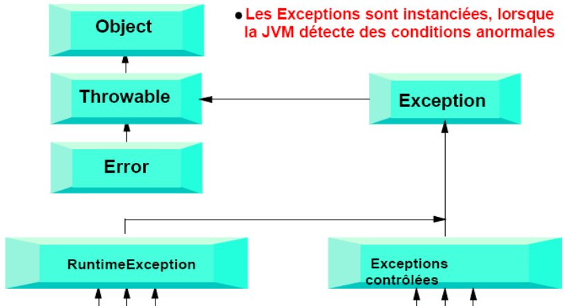

# Exceptions

## Qu'est ce qu'une Exception ?

Les Exceptions sont instanciées, lorsque la JVM détecte des conditions anormales.



- Explications :

>Une exception est la conséquence de toute condition anormale. Java étant un langage objet, les exceptions sont représentées par des sous-classes de la classe java.lang.Exception. Java fournit un modèle grâce auquel la gestion des exceptions se fait par la compréhension de la hiérarchie de la classe Exception.


Exemples d&#39;exceptions diverses :

- Une erreur matériel (disque dur plein, ports série inutilisables, …)
- Utilisateur saisit des informations erronées.
- Erreurs de programmation (tentative d&#39;accès en dehors des limites d&#39;un tableau, …)

**La Classe Error**  :

Une erreur est une condition qui empêche le programme de se terminer. Les erreurs surviennent à l&#39;exécution et ne sont généralement pas gérées par le mécanisme d&#39;interception des exceptions. Les erreurs provoquent la fin du programme et généralement les programmeurs ont très peu de moyens de contrôle sur elles. Par exemple :

- **OutOfMemoryException**
- **StackOverflowError**
- **UnknownError**

Il existe 2 types (sous-classes) d&#39;Exceptions :

- **RuntimeException**
- **exceptions contrôlées**

**RuntimeException**  :

>RuntimeException est une classe abstraite qui définit un ensemble de conditions pouvant survenir n&#39;importe où dans un programme.

Par exemple :

- **ArithmeticException** (résultat d&#39;une division par zéro),
- **ClassCastException** (tentative de conversion illégale),
- **IndexArrayOutOfBoundsException** (tentative d&#39;accès à l&#39;élément 22 d&#39;un tableau de 15 éléments)

- **NullPointerException** (tentative d&#39;accès à un élément dont la référence est nulle), …

Le compilateur java (javac) ne force pas la gestion des RuntimeException dans le programme (vous pouvez les ignorer !).

>C&#39;est la raison pour laquelle on en parle comme étant des Exceptions non contrôlées. Bien que ce type d&#39;Exception peut être évité par une programmation correcte, on peut l&#39;intercepter comme toutes les autres Exceptions.

**Exceptions contrôlées**  :

Les autres Exceptions peuvent se trouver dans tous les package java. Certaines sont définies dans le package *java.lang*, comme la classe **InterruptedException** utilisée par les Thread en veille.

D&#39;autres sont définies dans les package *java.net* ou *java.io* et sont générées lors de problèmes de connection réseau, de tentative d&#39;accès à un fichier indisponible. Vous pouvez aussi créer vos propres Exceptions et utiliser les mêmes mécanismes d&#39;interception.

>Il suffit de créer une classe qui hérite de la classe **Exception** et de créer les constructeurs adéquats.

Mécanisme des Exceptions

Une erreur détectée à l&#39;exécution provoque la génération d&#39;un objet de type Exception. L&#39;exécution se débranche de son déroulement normal et l&#39;objet Exception remonte à travers la pile des méthodes appelantes, jusqu&#39;à la rencontre d&#39;une portion de code pouvant l&#39;intercepter.

Nous avons ensuite 2 possibilités :

- soit cette portion de code existe, le traitement prévu par le développeur est alors exécuté.
- Soit cette portion de code n&#39;existe pas, un message d&#39;erreur standard est affiché par la machine vituelle java. Ce deuxième cas ne peut s&#39;appliquer qu&#39;aux Exceptions de type RuntimeException.

**Illustration**  :


**Les différents traitements d&#39;une Exception ** :

Il y a 4 possibilités :

- Ignorer l&#39;exception s&#39;il s&#39;agit d&#39;une exception de type RuntimeException
- Intercepter l&#39;exception à l&#39;aide d&#39;un bloc try/catch
- Propager l&#39;exception à la méthode appelante avec le mot clé **throw**
- Intercepter l&#39;exception et la repropager à la méthode appelante

**Ignorer l&#39;Exception**  :


>Une **RuntimeExceptio** peut tout simplement être ignorée. Sans action spécifique, la méthode dans laquelle survient une exception, s&#39;arrête immédiatement. Elle propage ensuite l&#39;erreur à la méthode appelante. Si cette méthode appelante ignore l&#39;Exception, cette dernière est remontée à travers la pile des différentes méthodes appelantes, jusqu&#39;à ce que le programme s&#39;arrête en affichant un message d&#39;erreur standard. On peut éviter cela par une programmation soignée.

**Intercepter l&#39;Exception**  :

Si une méthode est susceptible d&#39;intercepter une Exception contrôlée, cela est indiqué explicitement par la déclaration **throws**. Par exemple, la méthode **read()** de la classe **FileInputStream** est déclarée comme ceci :

```java
public int read(byte[] b) throws IOException
```

Cette déclaration indique au compilateur et à l&#39;utilisateur de cette méthode qu&#39;elle est susceptible de lever une exception **IOException**. Cette exception entre dans la catégorie des exceptions contrôlées et ne peut être ignorée.

il faut :

- Soit **l&#39;intercepter**
- Soit la **propager** au niveau appelant.

Pour intercepter une exception, il suffit de placer le code susceptible de lever cette exception (généralement l&#39;appel d&#39;une méthode possèdant une clause **throws** ) dans un **bloc try/catch** comme dans l&#39;exemple ci-dessous :

```java
String nomFichier = "fichierApprenants.txt";
try
{
 // code succeptible de lever une Exception
FileInputStream f1 = new FileInputStream(nomFichier);
int longueurFichier = f1.available();
// lecture du fichier
byte[] readBuffer = new byte[longueurFichier];
f1.read(readBuffer);
// fermeture du fichier
f1.close();
...
}
catch(IOException e)
{ // action à mener si une Exception survient
System.out.println("Erreur lors de la lecture du fichier");
}
```

>Le rôle du bloc try/catch est d&#39;intercepter une exception et de la corriger afin qu&#39;elle n&#39;interfère pas au bon déroulement du programme. Une exception peut potentiellement surgir à l&#39;intérieur du bloc try. Dans ce cas, le contrôle est immédiatement passé au bloc catch qui gère l&#39;exception.

**Intercepter des Exceptions multiples :**

Vous pouvez mettre en place l&#39;interception de différents types d&#39;exception. Dans ce cas, il suffit **d&#39;ajouter plusieurs bloc catch** , chacun de ces blocs traitant une exception spécifique.

>On peut aussi les mettre dans un seul bloc catch en les séparant par un ou avec **|**

Chaque bloc catch interceptera les exceptions de la classe spécifiée en paramètre, ainsi que des sous-classes.

>S&#39;il existe une relation d&#39;héritage entre les 2 types d&#39;exception à capturer, il faut placer en priorité le bloc catch le plus spécialisé avant le bloc catch le plus général.

Voici un exemple de code ci-dessous :

```java
String nomFichier = "fichierApprenants.txt";
try
{
FileInputStream f1 = new FileInputStream(nomFichier);
int longueurFichier = f1.available();
byte[] readBuffer = new byte[longueurFichier];
f1.read(readBuffer);
...
}
catch(FileNotFoundException e)
 {
System.out.println("Fichier " + nomFichier + " non trouvé !");
}
catch(IOException e)
 {
System.out.println("Erreur lors de la lecture du fichier");
}

```

**Utilisation du bloc finally :**

Dans un bloc try, si aucune exception n&#39;est levée, toutes les instructions du bloc try sont exécutées. Par contre, si une instruction génère une exception, les lignes de codes suivantes ne seront pas exécutées.

Le bloc finally permet d&#39;écrire du code, qui doit être exécuté dans tous les cas, qu&#39;il y ait ou non génération d&#39;exception dans le bloc try. Les 2 scénari les plus courants utilisant le bloc finally sont :

**A**. La méthode propage toutes les exceptions, par exemple parce qu&#39;elle n&#39;a pas de bloc catch. Dans ce cas, le traitement standard est proprement séparé de la gestion des exceptions.

Voici un exemple de code :

```java
try {

}
finally { // exemple : fermeture de fichiers}
```

**B** La méthode gère l&#39;exception et la repropagation

```java
try {
}
catch (ExceptionA e) {
throw new ExceptionB()
}

finally{
// exemple : fermeture de fichiers
}

```

Note : le seul cas dans lequel le bloc **finally** n&#39;est pas exécuté est lorsque la méthode **System.exit()** est exécutée au préalable.

[Plus de détails sur la documentation officielle](https://docs.oracle.com/javase/tutorial/essential/exceptions/finally.html).


**Propager l&#39;exception à la méthode appelante :**

Illustration :


**Explication du graphique ci-dessus :**

Lors de l&#39;exécution de la *méthode3()*, il y a instanciation d&#39;un objet de classe d&#39;ExceptionA.

La directive throw va déclencher le mécanisme d&#39;exception : remontée de l&#39;objet **ExceptionA** dans la pile des méthodes appelantes, jusqu&#39;à la rencontre d&#39;un bloc **try/catch**.

La *méthode3()* et la *méthode2()* ne contiennent pas de bloc try/catch permettant d&#39;intercepter l&#39;ExceptionA. Leur déclaration doit uniquement contenir une directive throws, pour signaler qu&#39;elles sont susceptibles de lancer l&#39;ExceptionA. C&#39;est au niveau de la *méthode1()*, que l&#39;interception de l&#39;**ExceptionA** sera effectuée.

Le regroupement du code de gestion des exceptions en un lieu précis (exemple : dans la méthode1()) permet d&#39;avoir du code plus propre.

**Intercepter et repropager une Exception :**

>Il est possible d&#39;intercepter une exception dans un bloc try/catch, puis de la repropager.

La syntaxe de cette technique est montrée ci-dessous. Avec ce code, vous pouvez distribuer votre gestion d&#39;exceptions. Il peut y avoir un premier niveau de traitement en première instance, puis transmission à un niveau d&#39;appel supérieur pour une poursuite du traitement de l&#39;exception.
```java
public uneMethode() throws UneException
{
try
{
// code pouvant propager UneException
}
catch(UneException e)
{
// Code de gestion d'une Exception 
throw e;
}
}
```

**Créer votre propre Exception :**

La possibilité de créer vos propres exceptions est un point fort du langage java. Généralement vous créez une exception controlée. Pour cela, il suffit d&#39;étendre la classe Exception :

```java
public class MonException extends Exception
 {

public MonException(String message)
 { // laissons tout le travail à la classe Exception
 super(message);
 }
 public MonException()
 { // Il est possible de juste définir un message par défaut
 super(&quot;Une Exception \&quot;MonException\&quot; vient de survenir ...&quot;);
 }

}
```

Au final, votre exception affiche un message approprié lorsque survient un problème. Les constructeurs de la classe Exception sont prévus pour permettre l&#39;affichage d&#39;un message lorsque l&#39;exception survient.

>Cependant, il faut savoir se souvenir que les constructeurs ne sont pas hérités, vous devez donc utiliser l&#39;instruction **super()** dans le constructeur de votre classe **MonException** pour bénéficier de cette caractéristique.

**Propager votre Exception :**

Nous avons vu que *la directive **throw** permet de déclencher le mécanisme d&#39;exception*. Remontée de l&#39;objet MonException dans la pile des méthodes appelantes, jusqu&#39;à la rencontre d&#39;un bloc try/catch pour la traiter.

```java
public class MaClasse
 { // méthode succeptible de lever une exception MonException

public void methode()
 throws MonException
 { ...// traitement
 ...
 // on teste si condition anormale et on lève une exception
 // si nécessaire
 if (codeErreur != 0)
 throw new MonException();
 }

}
```

**Résumé de la gestion des exceptions et redéfinition des méthodes :**

Une méthode redéfinie peut propager :

- aucune exception
- les mêmes exceptions
- des exceptions qui sont des sous-classes des exceptions propagées par la méthodes qui est redéfinie.

public void test() throws ExceptionB => redéfinit => public void test() throws ExceptionA

ExceptionB => extends => ExceptionA

Résumé de la découverte des exceptions :

2 types d&#39;Exceptions :

- RuntimeException
- Exception contrôlée

4 traitements possibles d&#39;une Exception :

- Ignorer s&#39;il s&#39;agit d&#39;une RuntimeException
- Intercepter (try/catch, finally)
- Propager à la méthode appelante (throw)
- Intercepter et repropager

Création d&#39;une Exception spécifique, sous-classe de la classe Exception


## Liens et ressources

Les exceptions sont des classes qui héritent toutes de la classe Exception, par exemple `FileNotFoundException` :

[https://docs.oracle.com/javase/7/docs/api/java/io/FileNotFoundException.html](https://docs.oracle.com/javase/7/docs/api/java/io/FileNotFoundException.html).

Elles héritent à travers `Throwable` de méthodes pratiques comme :
- [getStackTrace()](https://docs.oracle.com/javase/7/docs/api/java/lang/Throwable.html#getStackTrace()
)
- [getMessage()](https://docs.oracle.com/javase/7/docs/api/java/lang/Throwable.html#getMessage()
)
- [getCause()](https://docs.oracle.com/javase/7/docs/api/java/lang/Throwable.html#getCause()
)

[Plus de détails sur la documentation officielle](https://docs.oracle.com/javase/tutorial/essential/exceptions/definition.html).