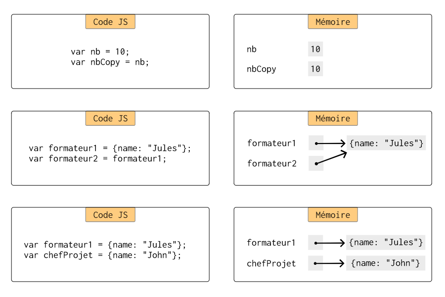
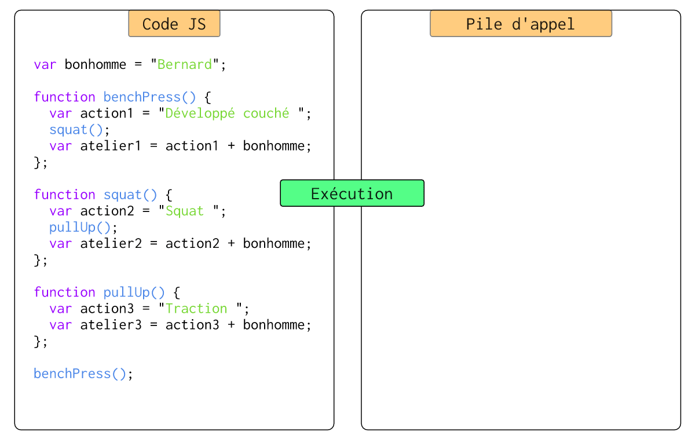

# Introduction au JavaScript

## Dis papa c'est quoi JavaScript

Aujourd'hui de plus en plus d'applications se retrouvent utilisables via un navigateur internet. Les sites web sont de plus en plus dynamiques et proposent de plus en plus de fonctionnalités. Est-ce grâce à **HTML5** ou **CSS3** ?

En réalité c'est surtout grâce à **JavaScript** qui est un langage de programmation qui s'exécute directement dans votre navigateur internet. En effet, lorsque vous vous rendez sur un site web, vous recevez du code **HTML** (le contenu de la page) accompagné de code **CSS** (la mise en forme de la page) et très souvent aussi du code **JavaScript**.

Le code **JavaScript** est interprété par le navigateur. Il n'est pas compilé par le développeur du site web, même s'il est parfois **réduit** (minified) et/ou **enlaidi** (uglified) pour des raisons de performances. C'est donc des fichiers texte de code JavaScript que votre navigateur interprete directement.

Le code **JavaScript** permet de faire beaucoup de choses et notamment de manipuler le code HTML dynamiquement. Il peut remplacer du texte, déplacer un bouton, afficher des boites de dialogue, ...

JavaScript est parfois confondu avec Java mais les deux langages n'ont pas vraiment la même philosophie. JavaScript est un langage interprété (et aujourd'hui compilé car les moteurs d'interprétation compilent vos fichiers JS en code machine pour améliorer les performances). Mais ça reste toujours différent d'un programme Java ou C. En effet ce n'est pas votre responsabilité de compiler le code. De ce fait son fonctionnement est un peu différent d'un programme de type Java par exemple.

JavaScript est **le** langage de programmation le plus _taggé_ sur [StackOverflow Trends](https://insights.stackoverflow.com/trends). Il est dans le top 10 des langages les plus utilisés (ou populaires) [PopularitY of Programming Language](https://pypl.github.io/PYPL.html), [TIOBE Index](https://www.tiobe.com/tiobe-index/).

Attention, accrochez vos ceintures car **JavaScript** permet de faire beaucoup de choses mais n'est pas très strict. Le langage recèle de nombreuses subtilités.

**Remarque** : On utilise aussi aujourd'hui JavaScript côté serveur mais ce n'est pas l'objet de ce cours d'introduction.

## Un langage de programmation dynamique orienté prototype

JavaScript est un langage dynamique orienté prototype. Dynamique car il est interprété sans avoir besoin d'être compilé (même s'il l'est de nos jours pour améliorer les performances). C'est un langage objet et les objets ne sont pas des instances de classe. Un prototype est un _squelette_ à partir duquel on peut recréer un nouvel objet.

```javascript
// Illustration du concept de prototype
// Création d'un objet formateur1 sans besoin de classe
var formateur1 = {
  name: "Bernard"
};

// Je me base sur l'objet formateur1 pour créer un nouvel objet formateur2
var formateur2 = Object.create(formateur1);
formateur2.name = "Jules";
```

On voit aussi dans cet exemple que JavaScript est à **typage faible et dynamique**. En effet, je ne décris pas le type de mes variables `formateur1` et `formateur2` lorsque je les déclare et je peux changer le type d'une variable en faisant une nouvelle affectation.

### Les différents types de variables

**Les types primitifs :**

* `Boolean` : les booléens `true` ou `false`
* `Number` : les nombres `1`, `4.5`, `6e34`, ...
* `String` : les chaines de caractères `"Hello"` ou `'Hello'`
* `undefined` : la valeur initiale d'une variable `var a; // a value is undefined`
* `null` : la valeur nulle d'une variable `var a = null`

Il faut bien faire la différence entre null et undefined :

* `undefined` est la valeur par défaut d'une variable, on n'assigne pas nous même `undefined` à une variable.
* On peut affecter `null` à une variable pour dire qu'elle ne pointe plus sur un objet.

**Les objets :**

* `Object` : Un objet

Exemple de déclaration d'une variable sans assigner de valeur. Elle sera donc `undefined` :

```javascript
// Décalaration d'une variable
var a;
console.log(a); // va afficher undefined dans la console
```

Exemple de déclaration d'un objet avec initialisation et assignation à `null` :

```javascript
// Déclaration d'un objet
var b = {name: "Jules"}
// Ma variable b est maintenant null;
b = null;
console.log(b); // va afficher null en console

```

### 3 façons de déclarer une variable

Depuis la spécification ES6 du langage il y a 3 façons de déclarer une variable :

```javascript
var formateur1 = "Jules";    // Déclare une variable de scope fonction si déclarée dans une fonction, global sinon
let formateur2 = "Bernard";  // Déclare une variable de bloc
const chefProjet = "John";   // Déclare une constante
```

La bonne pratique est toujours de faire du plus strict au moins strict. (`const` > `let` > `var`)

### Valeurs vs Références

Attention, les types primitifs sont copiés par valeur alors que les objets le sont par référence. Pour rappel :



### L'égalité faible `==` vs l'égalité stricte `===`

En JavaScript, il y a deux façons de tester l'égalité, on peut utiliser l'opérateur faible `==` ou l'opérateur strict `===`. Il est important de saisir qu'il y a une différence entre les deux opérateurs. L'opérateur faible fait une conversion avant de tester l'égalité alors que l'opérateur strict ne la fait pas.

Example :

```javascript
1   ==  1  // true
"1" ==  1  // true
1   === 1  // true
"1" === 1  // false
```

La bonne pratique est toujours la même, on part du plus strict et on rend moins strict si nécessaire (`===` est à utiliser avant `==`). Il en va de même pour tester l'inégalité (`!==` est à utiliser avant  `!=`).

### Les fonctions

Les fonctions sont des objets de première classe. Les fonctions peuvent être retournées, assignées à des variables, ...

Voici un exemple simple d'une fonction que l'on assigne à une variable :

```javascript
const sayHello = function () {
  console.log("Hello there!");
}

sayHello();
```

Ici ma fonction n'a pas de nom 😲. Oui, en JavaScript on peut définir des fonctions anonymes, c'est très souvent utilisé pour les fonctions de `callback` que nous verons plus tard avec les évènements. Au final comme ma fonction est assignée à une variable, je peux quand même l'appeler, grâce au nom de ma variable suivie de parenthèses `()`.

De plus en plus, vous verez apparaître les fonctions **fléchées**. Il s'agit d'une écriture raccourcie de ce que l'on vient de voir :

```javascript
const sayBonjour = () => console.log("Bonjour toi!");

sayBonjour();
```

Ce type de fonction est très souvent utilisé pour les fonctions qui n'ont qu'une ligne de code car cela raccourcit bien le code. Et comme le code JavaScript est envoyé à travers le réseau, on souhaite souvent qu'il soit le plus concis possible.

On peut aussi exécuter une fonction qui retourne une fonction. Ici un exemple :

```javascript
function sayHello(string) {
  const hello = string;
  return function(name) {
    return hello + " " + name;
  }
}

// Plusieurs façon de faire la même chose :

// J'exécute directement les deux fonctions
console.log(sayHello("Bonjour")("Jules"));

// Je stocke ma première fonction dans une variable et j'appelle ensuite la deuxième
// Ma variable sayBonjour reçoit la function sayHello appelée avec "Bonjour" !
const sayBonjour = sayHello("Bonjour");
// J'appelle ensuite sayBonjour avec "Jules"
console.log(sayBonjour("Jules"));

// Je stocke le résultat de la fonction sayBonjour("Jules") dans ma variable sayBonjourToJules
const sayBonjourToJules = sayBonjour("Jules");
console.log(sayBonjourToJules);
```

Dans cet example, on a une fonction `sayHello` qui est une fonction **nommée**. Cette fonction retourne une autre fonction qui est **anonyme**.

### Les Objets

Comme vu plus haut, il est très simple de déclarer un objet. Pas besoin de classe, il suffit juste de déclarer une variable et d'ouvrir des accolades pour déclarer le contenu de l'objet. Dans les objets on peut ranger des données et des fonctions.

```javascript
// Je déclare un objet robert
const robert = {
  firstName: "Robert",
  lastName: "De Niro",

  // Present function
  present: function() {
    return "Mr " + this.firstName + " " + this.lastName;
  }
}
```

Tous les objets ont un prototype. Ce prototype ressemble très fortement à une classe Java. On y range souvent les fonctions de nos objets car elles n'ont pas lieu d'être spécifique à chaque objet.

On peut procéder comme suit :

```javascript
// Je déclare un objet george
const george = {
  firstName: "George",
  lastName: "Clooney"
}

// J'ajoute au prototype de george une fonction present
george.__proto__.present = function() {
  return "Mr " + this.firstName + " " + this.lastName;
};

console.log(george.present());
```

Le résultat en console est le même, vous pouvez essayer. L'avantage de la deuxième solution est qu'elle prend moins de place en mémoire.

Si je veux créer un nouvel objet sur la base de george, alors on procède comme suit :

```javascript
const leonardo = Object.create(george);
leonardo.firstName = "Leonardo";
leonardo.lastName = "Di Caprio"

console.log(leonardo.present());
```

### Le hoisting, kezaco

Le JavaScript est interprété (ou compilé) à la volée. Ceci veut dire que le code est _exécuté_ de manière séquentielle. Il serait donc normalement impossible de faire fonctionner ce bout de code suivant :

```javascript
// J'appelle une fonction avant de l'avoir déclarée. Est-ce bien raisonnable ?
sayHelloTo("Bernard");

function sayHelloTo(name) {
  console.log("Hello " + name + "!");
}
```

Et pourtant, ça fonctionne. Tout ça grâce au concept de Hoisting (ou hissage in French).

En fait le code est parcouru (et compilé) avant l'interprétation et les fonctions et les déclaration de variable de type `var` sont mises en mémoire. Ainsi on peut aussi faire :

```javascript
bestFormateur = "Bernard";

sayHelloTo(bestFormateur);

function sayHelloTo(name) {
  console.log("Hello " + name + "!");
}

var bestFormateur;
```

Attention, ça ne fonctionne pas lorsqu'on déclare des variables de type `let` et `const`.

### Le concept de **scope**

Le scope en le contexte d'exécution. Il s'agit de l'environnement dans lequel s'exécute notre code. Ci après un enchaînement de fonction qui représente le phénomène :



#### Le scope **global**

Le scope global, c'est celui dans lequel le script débute.

Exemple :

```javascript
// Je déclare la constante name dans le scode global
const name = "Bernard";

// J'affiche le contenu de la constante name en console
console.log(name);
```

Il faut être très vigilant lorsqu'on déclare des variable avec `let` et `var` dans le scope global car les pages HTML peuvent contenir plusieurs fichiers JS et ils peuvent déclarer des variables ayant le même nom. Cela vous posera des problèmes d'intégrité de vos variables.

Il est donc conseillé de limiter au maximum les définitions de variables **globales**.

#### Les scopes de **bloc**

Un scope de bloc est un environnement spécifique à un bloc (tout ce qui est déclaré entre deux accolades). Ce qui est déclaré dans un scope de bloc n'existe que dans le scope de bloc.

Exemple :

```javascript
// Je déclare la constante name dans le scope global
const name = "Bernard";

// Dans la fonction defineName je déclare une autre constante name
function defineName() {
  const name = "Jules";
  return name;
}

// J'afficherai donc ici en console "Jules"
console.log(defineName());
```

## Le JavaScript pour manipuler les pages HTML

Bon, tout ça c'est bien joli mais à quoi ça peut nous servir ? On parle depuis le début du cours de pages HTML dynamiques, comment ça se passe ?

### Le DOM

Le **Document Object Model**, ou **DOM** pour les intimes est la représentation **objet** d'une page web. En effet les balises de notre code HTML s'imbriquent les unes dans les autres et il est donc possible de naviguer et de les modifier grâce au DOM.

#### L'objet document

Lorsqu'on exécute du JavaScript dans un navigateur, il y a un, objet racine qui contient notre page Web, c'est l'objet `document`. Grâce à cet objet, on peut :

* Créer de nouveaux éléments HTML grâce à la fonction `document.createElement(string)`
* Retrouver des élements grâce à leurs identifiants avec `document.getElementById(string)`
* Retrouver des élements grâce à leur identification CSS avec `document.querySelector(string)`
* Et bien d'autres choses encore ...

Exemples :

```html
<body>
    <h1>Gestion des apprenants Simplon</h1>

    <div id="contenu">
      <p class="lien">Ceci est un paragraphe où il y aura des liens.</p>
    </div>

    <script src="../js/script.js"></script>
</body>
```

```javascript
// Mon fichier script.js
  // Je crée un nouveau contenu
  const newParagraph = document.createElement("p");

  // Je récupère l'élément dont l'ID est contenu
  const contenu = document.getElementById("contenu");

  // Je récupère le premier élément HTML qui correspond au sélecteur CSS p.lien
  const pLien = document.querySelector("p.lien");
```

#### Inserer du contenu ou le modifier

Afin de pouvoir rendre notre page dynamique il faut pouvoir insérer un nouveau contenu ou modifier un contenu existant. Pour cela on a plusieurs fonctions JavaScript qui s'appellent sur un élément parent comme :

* `parent.insertBefore(newChild, refChild)` qui permet d'insérer l'élément `newChild` avant l'élément `refChild` dans un élément `parent`.
* `parent.appendChild(newChild)` qui permet d'insérer un nouvel élément `newChild` dans un élément `parent`.
* `parent.removeChild(oldChild)` qui permet de supprimer un élément `oldChild` dans un élément `parent`.
* `parent.replaceChild(newChild, oldChild)` qui permet de remplacer un élément `oldChild` par un élément `newChild` dans un élément `parent`

On peut aussi accéder aux propriétés des éléments auxquels on accède (cf exemple suivant).

Exemples :

```javascript
  const pLien = document.querySelector("p.lien"); // Récupération du paragraphe p avec class lien

  const newLink = document.createElement("a"); // Création du lien
  newLink.href = "simplon.co"; // Remplissage de l'url du lien
  newLink.textContent = "Simplon"; // Remplissage du titre du lien
  newLink.style.color = "rgb(206, 15, 15)"; // Lien en rouge
  newLink.style.paddingRight = "10px"; // une petite marge intérieure sur la droite
  newLink.style.paddingBottom = "5px"; // une petite marge intérieure en bas
  newLink.style.fontWeight = "bold"; // Texte en gras
  newLink.style.textDecoration = "none"; // Texte non souligné

  pLien.appendChild(newLink); // Ajout de la balise <a> au paragraphe
```

Comme d'habitude, c'est à vous d'aller chercher dans la documentation ce qu'il vous faut pour vos besoins.

### Les évènements

Tout ça c'est sympa mais à quelle occasion insérer ou modifier une page HTML ? Quand notre utilisateur, fait une action spéciale, qu'il clique sur un bouton, que la page a fini d'être chargée. Oui, et tout ça ce sont des évènements. Notre code JavaScript va donc devoir répondre différement en fonctions des différents évènements arrivant sur notre page. On va donc devoir préparer différentes fonctions qui répondront aux différents évènements.

On aura par exemple l'évènement `click` sur un bouton, `submit` sur un formulaire, ...

D'accord, mais comment déclencher une fonction particulière lorsqu'un évènement arrive ? Nous allons pouvoir utiliser des `EventListeners`. Nous pouvons ajouter des fonctions qui se déclencheront lorsqu'un évènement arrivera.

Exemple :

```javascript
// Si l'utilisateur.trice clique sur mon lien alors je lui demande s'il.elle est sûr.e de vouloir partir
const simplonLink = document.getElementById("simplon-link");
simplonLink.addEventListener("click", function(event) {
  const conf = confirm("Are you sure that you want to leave? :'(");

  // S'il.elle n'est pas sûr.e, j'annule la navigation vers le lien
  if (!conf) {
    event.preventDefault();
  }
});
```

Ici aussi, beaucoup de possibilités s'offrent à nous. Allez chercher dans la documentation ce dont vous avez besoin.
