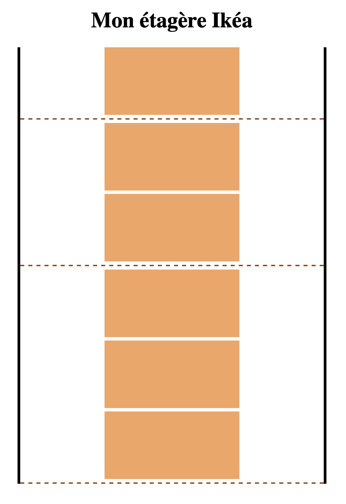
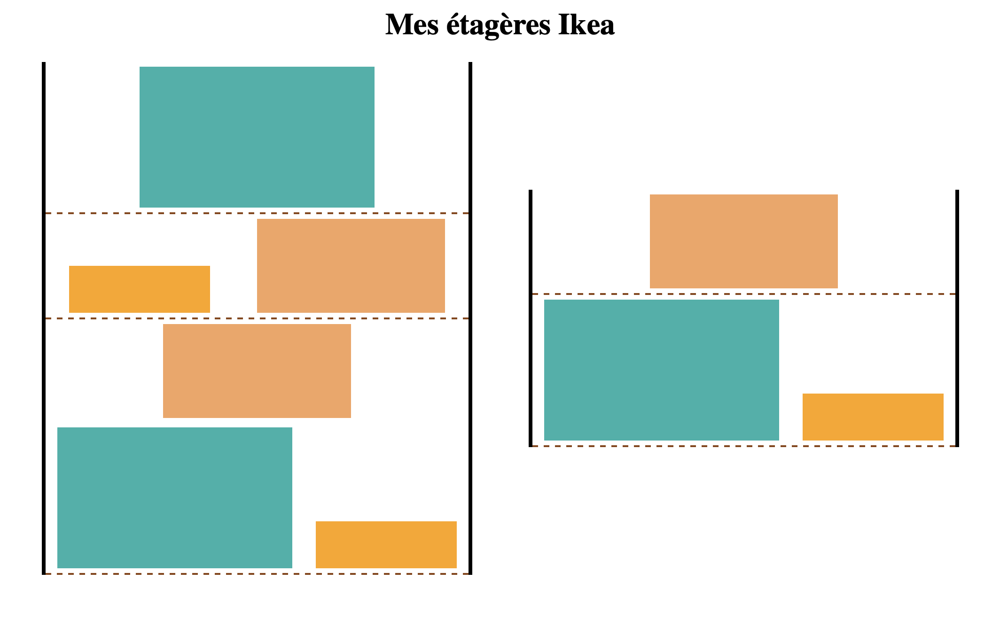

# Exercices étagère

## Etape 1 : Une seule étagère

- Afficher une étagère vide de `450px` de large et centrée sur la page (pour représenter l'étagère on utilisera une `div` avec des bordures sur les côtés de l'étagère à afficher en noir)
- Afficher 3 étages sur l'étagère (en utilisant d'autres `div` avec une bordure en bas de la `div` en pointillés et en marron)
- Remplir les étages de l'étagère avec des boites de `200px` de large et `100px` de haut.

## Etape 2 : Deux étagères

Refaire la même chose mais avec une autre étagère à afficher à côté de la première.

Pour corser la chose :

- Permettre de ranger plusieurs boites côte à côte sur la même rangée.
- Donner des couleurs différentes aux boites sur les différentes étagères.
- Donner des tailles différentes aux boites.

## Etape 3 : Et si je déménage

Adapter le site lorsque l'on passe sur petit écran. Les étagères doivent être l'une sous l'autre si l'on est sur un écran plus petit que `768px`.
