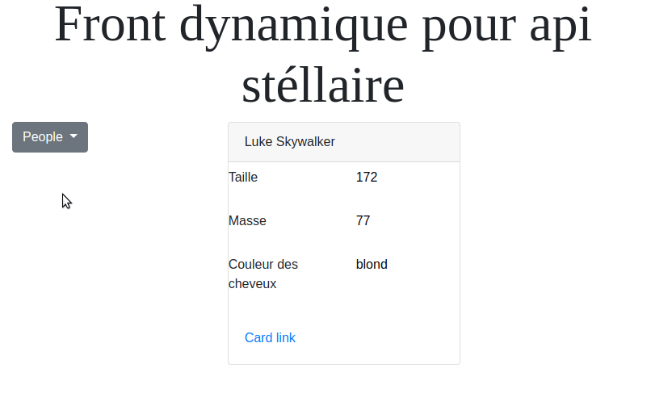

# Api rest cherche front dynamique et réactif <3

Le but de ce projet est de montrer comment consommer une api rest dans une page web.

Pour taper dans (l'oeil de) l'api (qui est composée d'url), on va utiliser ajax via [jquery](https://www.w3schools.com/jquery/default.asp).

Au chargement de la page, il faudra récupérer la liste complète des personnages de starwars en utilisant le endpoint : <https://swapi.co/api/people>.

On utilisera cette liste pour remplir le [dropdown](https://getbootstrap.com/docs/4.0/components/dropdowns/) (liste déroulante).

On veut aussi que la sélection d'un personnage dans cette liste déroulante donne du détail dans un élément [card](https://getbootstrap.com/docs/4.0/components/card/).

Voici un exemple du résultat attendu :



## Squelette html

- Récupérez le fichier [index.html](index.html).
- Ajoutez le script de [jquery](https://jquery.com/download/#using-jquery-with-a-cdn) : <https://code.jquery.com/>
- Ajoutez le css et les scripts de bootstrap : <https://getbootstrap.com/docs/4.4/getting-started/introduction/>

> Remarque : ne prenez qu'une seule version de jquery (car bootstrap propose aussi d'en utiliser une), et la version slim ne convient pas, il faut la minified

## Appel à une api rest

- Créez un fichier main.js qui contient les lignes suivantes :

```java
// contient la liste de tous les people reçue par l'api starwars
var liste = [];

/**
 * Action à réaliser lorsque le dom est chargé
 */
$(document).ready(function () {
    // on utilise jquery pour faire appel à l'api de starwars
    $.ajax({
        url: "https://swapi.co/api/people"
    }).then(function (data) {
        liste = data['results'];
        chargerMenu();
    });
});

/**
 * remplit le dropdown menu avec les noms de tous les people de la liste
 */
function chargerMenu() {
  liste.forEach(function (item) {
    console.log(item);
  });
}
```

- Ajoutez un lien vers le main.js dans index.html à la fin du body :

```html
<body>
...
<script src="main.js"></script>
</body>
```

## Todo

*Pour cette partie, travaillez en pair programming avec quelqu'un qui a un peu d'expérience en js* :

- Après avoir vérifié que chacun des personnages de starwars s'affiche bien dans la console, il va falloir les ajouter à la liste déroulante, par exemple :
```
let newMenuItem = document.createElement('button');
newMenuItem.className = "dropdown-item";
newMenuItem.type = "button";
...
document.getElementById("dropdown-list").appendChild(newMenuItem);
```
- Faites en sortes que la sélection d'un nom dans la liste déroulante affiche le détail dans la card. Il faudra pour cela ajouter un eventListener (`addEventListener`) à l'objet **newMenuItem**, afin de réagir à l’événement **'click'**.

- bonus : ajoutez un [radio button](https://getbootstrap.com/docs/4.0/components/buttons/#checkbox-and-radio-buttons) afin de pouvoir afficher soit la liste des personnages, soit la liste des planètes, soit la liste des vaisseaux.

## Déploiement/hébergement par netlify/github

Pour déployer le projet (rendre accéssible sur le web), une solution simple est de créer un projet sous github (hébergement) et de le connecter à un compte netlify.

Le site en exemple est déployé ici : <https://js-swapi.netlify.com/>
