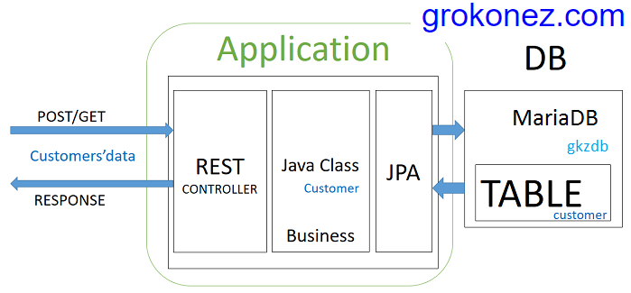

# Un front js sur un back springboot

Dans cette partie, nous allons voir comment créer un backend avec springboot, un frontend en js, et comment lancer le tout sur un même serveur d'applications.

C'est donc un exemple de développement fullstack (sans base de données).

L'illustration suivante montre la partie backend (les couches de l'application = springboot). La bd est mariaDB, mais c'est le même principe avec une base mysql. Il faudrait aussi ajouter le front à gauche (donc pour vous des fichiers html et js).

*L'illustration est tirée du [site suivant](https://grokonez.com/frontend/angular/angular-6/angular-6-httpclient-spring-boot-mariadb-example-spring-data-jpa-restapis-crud-example) dont vous pouvez vous inspirer pour présenter un projet (diagrammes, captures d’écran, extraits de codes bien choisis, explication, ..)*

## Atelier guidé

[cours](cours.md)

## Projet

[projet individuel](projet.md)
