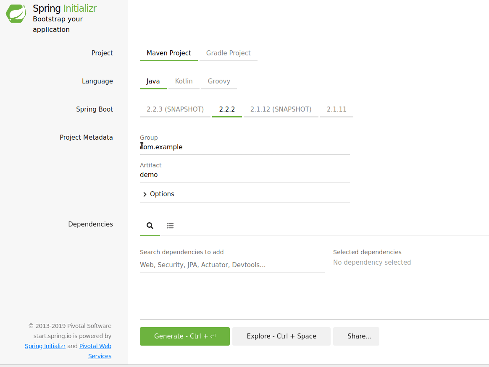

# Un front js sur un back springboot

## 1. Créer un nouveau projet springboot depuis [start.spring.io](https://start.spring.io/)

Choisissez le groupe (le domaine de votre entreprise, on le laisse vide pour nos projets d'école), le nom du projet (artefactID), le type de projet (gradle ou maven) et les dépendances (on prend web).



Décompressez l'archive dans le dossier de votre workspace puis importez le projet dans eclispe.

> Regardez dans le build.gradle les dépendances; on a springboot-starter-web. Les starters permettent d'ajouter en une instruction tout un ensemble de dépendances.

Voici la classe à lancer pour lancer votre application, elle a été générée par start.spring.io. Vous pouvez la lancer comme n'importe quel méthode `main`.

```java
package atelier;

import org.springframework.boot.SpringApplication;
import org.springframework.boot.autoconfigure.SpringBootApplication;

@SpringBootApplication
public class AtelierApplication {

	public static void main(String[] args) {
		SpringApplication.run(AtelierApplication.class, args);
	}

}
```

## 2. Créer un contrôleur et la partie métier
Le contrôleur a pour fonction de réaliser des mappings entre des endpoints et des actions à exécuter par le backend.

La magie de (noël) springboot est que ce contrôleur va automatiquement construire des réponses dans un bon format pour une api rest. Les méthodes du contrôleur peuvent renvoyer indifféremment :
- des `ResponseEntity`
- directement des `objets métiers`

Et aussi, comment faire des requêtes avec des paramètres en utilisant l'annotation `@RequestParam`.

```java
package atelier;

import org.springframework.web.bind.annotation.RestController;

@RestController
public class AtelierController {


}
```

## 3. Vérifier les endpoints avec [postman](https://www.getpostman.com/downloads/)

Postman permet de générer des requetes sur des endpoints en utilisant les verbes http (put, get, post, ...) et visualiser les réponses obtenues.

Cela permet de valider le backend avant de brancher dessus le frontend.

## 4. Développer la partie front

Ajouter dans le répertoire **src/main/ressources/static**, un fichier `index.html` et un fichier `main.js`.

Utilisez vscode pour écrire le contenu de ces fichiers, ils vont communiquer avec backend par l'api en utilisant `jquery` (comme le front de starwars). Ils feront des requêtes telles que : <http://localhost:8080/ateliers>
