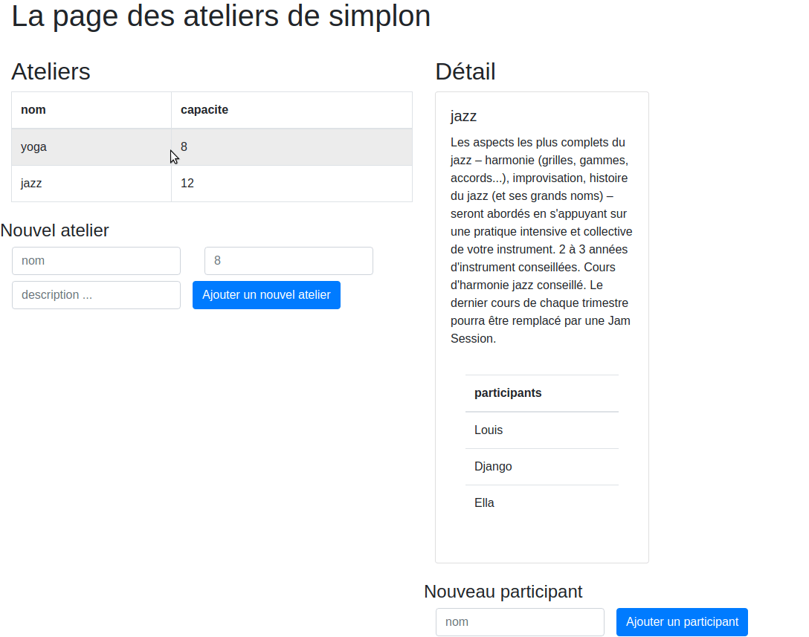

# Livrables

> Le but est de faire un projet comportant un backend structuré avec springboot (avec base de données optionnelle) et un frontend en javascript.    
**Ci-dessous, tous les points à cocher attendus pour la livraison.**

Voici un exemple de front qui affiche des ateliers et donne le détail de chacun d'eux (la liste des ateliers est retournée par le backend) :

## 1. Architecture springboot

#### Le modèle
- [ ] Créer une classe dans un package model (qui peut représenter un film, une voiture, un employé, ..., ce que vous voulez). Cette classe doit avoir un **id** (un long ou un int) et d'**autres attributs**.

> Pour chaque attribut, il faudra un getter, sinon l'objet ne pourra pas être sérialisé en json

#### Le contrôleur
- [ ] Créer une classe contrôleur qui respecte les points suivants :
* son constructeur initialise une liste d'objets du model (donc une liste de films, voitures, ...)
* diffuse une api rest contenant les **endpoints** suivants :
    * retourne un simple string (le nom de votre projet par exemple)
    * retourne une liste d'objets de la classe model (une liste vide n'est pas un problème)
    * retourne un objet de la classe model par son id (s'il est dans la liste), cette méthode doit envoyer `NOT_FOUND` si l'objet n'est pas trouvé
    * ajoute un nouvel objet en utilisant des paramètres

#### Tests de l'api

Les quatre fonctions de l'api devront être testées avec un logiciel tel que [postman](https://www.getpostman.com/downloads/).

## 2. Partie frontend
- [ ] Le front sera composé d'au moins deux fichiers : `index.html` et `main.js`. Déposer les fichiers dans `src/main/ressources/static`.

Vous pouvez ajouter des fichiers css et choisir de mettre le js dans un dossier script si vous souhaitez organiser vos fichiers.

Votre front devra être capable d'appeler chacun des endpoints de votre api backend et permettre visualiser les réponses (le string, un objet, une liste d'objet).

> *Les endpoints sont donnés par difficulté croissante, avancez étape par étape.*

## 3. Documentation

Votre documentation sera donnée sous la forme d'un readme.md. Elle devra comprendre les éléments suivants :
- [ ] une courte introduction non technique du projet
- [ ] un diagramme qui permet de visualiser comment les briques de votre projet interagissent (il pourra y avoir les mots suivants : frontend, backend, controller, json, http, springboot, html, js, model, api)
- [ ] une liste des endpoints de votre application avec des exemples (comme [ici](https://swapi.co/documentation#people))
- [ ] une capture d'écran de votre page principale

## 4. Bonus

Vous pouvez ajouter une partie persistance à votre application, dans ce cas il faudra ajouter jdbc à votre projet springboot, puis prévoir des boutons de CRUD côté front et des endpoints côté back afin de réaliser les actions en bd.

## 5. Livraison

Un projet gradle dans un repo github avec un readme.

## Index

Les mots suivants peuvent faire l'objet de questions à l'oral :
- responsive
- annotation
- framework
- api rest
- serialiser
- json
- http
- get/put/post ([des bonnes pratiques](https://delicious-insights.com/fr/articles/meilleures-pratiques-pour-vos-urls-verbes-http-et-apis/))
- endpoint
- ajax ([wikipedia](https://fr.wikipedia.org/wiki/Ajax_(informatique)))
- [cors](https://developer.mozilla.org/fr/docs/Web/HTTP/CORS)
- [cdn](https://jquery.com/download/#using-jquery-with-a-cdn)
- asynchrone

## Ce qui a posé problème...

surtout côté js :
- addEventListener
- asynchrone
