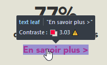

Formation Accessibilité WCAG pour Développeurs & Formateurs
----------------------------------------------

# Introduction aux règles d'Accessibilité

## Contexte

Les nouvelles technologies et internet représentent une chance `d’intégration sociale et professionnelle pour les personnes handicapées`.

Concevoir et réaliser des systèmes d’information en ligne qui leur soient pleinement accessibles est donc une nécessité. Pour cela, des règles techniques d'accessibilité formulées en particulier par le `RGAA` (**R**éférentiel **G**énéral d'**A**ccessibilité pour les **A**dministrations) doivent être prises en compte dans le processus de développement des services en ligne, afin qu'ils ne deviennent pas un facteur d’exclusion supplémentaire.

## Obligations légales en France

En France, *l'accessibilité des services publics de communication en ligne* est une obligation légale du fait de l’article 47 de la loi n° 2005102 du 11 février 2005 «*pour l'égalité des droits et des chances, la participation et la citoyenneté des personnes handicapées*»

Il s’agit de mettre le Web à la disposition des personnes handicapées. Le décret d’application a été publié (JORF n°0113 du 16 mai 2009 page 8245 texte n° 32).

>Le référentiel d'accessibilité **RGAA** fixe les règles :

- Techniques
- Sémantiques
- Organisationnelles
- Ergonomiques

 Ces règles doivent en principe être respectées par les services de communication publique en ligne afin d'assurer aux personnes handicapées la réception et la compréhension de tout type d'information diffusée sous forme numérique et de leur permettre d'utiliser ces services.

 Ce référentiel s'applique aux différents types de handicap et aux différentes technologies mises en oeuvre par les services de communication publique en ligne, en particulier l'Internet, le téléphone et la télévision.

La loi DADVSI n° 2006-961 du 1er août 2006 prévoit la mise en oeuvre d'une exception au droit d'auteur, aux droits voisins et au droit des producteurs de bases de données en faveur de personnes atteintes d'un handicap. Le décret d'application prévoit un dispositif pour la mise à disposition par les éditeurs des fichiers numériques ayant servi à l'édition d'oeuvres imprimées à des organismes accrédités pour les rendre accessibles aux personnes handicapées (JORF n°0299 du 24 décembre 2008 page 19948 texte n° 35).

## Normes d'accessibilité


Le **World Wide Web Consortium2** (`W3C`) élabore des normes d’accessibilité avec les associations d’usagers et les industriels au sein de la **Web Accessibility Initiative** (`WAI`).

- 1996 : création de l'Initiative WAI (Web Accessibility Initiative)

    - Vérifier l'accessibilité des technologies W3C
    - Produire des recommandations
    - Contribuer aux développements d'outils
    - Coordonner la R&D sur l'accessibilité

Ces normes sont :

- **Web Content Accessibility Guidelines** (`WCAG`)
    - recommandations techniques pour l'accessibilité des contenus Web
    - norme internationale ISO/IEC 40500:2012 depuis le 15 octobre 2012
- **User Agent Accessibility Guidelines** (`UAAG`)
    -  recommandations destinées aux agents utilisateurs (navigateurs Web, lecteurs multimédia, plug-ins, lecteurs d'écran)
- **Authoring Tools Accessibility Guidelines** (`ATAG`)
    - recommandations destinées aux outils d'édition de contenus Web (CMS, éditeurs WYSIWYG, blogs, wikis ...)
- **Web Accessibility Initiative** (`WAI`)
    - spécification pour rendre les applications Internet riches (AJAX) compatibles avec les technologies d'assistance

Le Consortium Daisy établit des normes pour le codage et la structuration des documents électroniques afin qu'ils puissent être rendus accessibles aux personnes handicapées (comme pour la balisation des documents au format PDF).

L'ISO fournit des recommandations pour l'amélioration de l'accessibilité de l'équipement, des services des TIC, des logiciels, de manière qu'ils présentent une accessibilité plus étendue dans des environnements professionnel, personnel, mobile et public. Ces normes couvrent les aspects liés à la conception pour les personnes présentant un large éventail de capacités physiques, sensorielles et cognitives, y compris les personnes présentant des déficiences temporaires et les personnes âgées.

## Contexte Européen

La Commission Européenne a engagé un certain nombre d’actions sur la base des recommandations d’accessibilité du **W3C/WAI** :

- Le Parlement européen a adopté le 13 juin 2002 une résolution pour l’accessibilité des sites Web publics et leur contenu : « tous les sites publics européens doivent avoir le niveau Double A du W3C/WAI »
- Le plan d'action **eEurope** depuis 2010 oblige les sites Web publics des états membres à être accessibles aux personnes handicapées
- La Commission Européenne a adopté le 1er décembre 2008 une communication
"Vers une société de l'information accessible" demandant aux états membres de prendre un certain nombre de mesures en faveur de l'accessibilité numérique, incluant des mesures de formations des acteurs concernés.
- Le Conseil de l'Union Européenne a adopté des conclusions le 31 mars 2009
demandant aux états membres d’appliquer les critères d’accessibilité dans leurs appels d’offres concernant les services et biens TIC, incluant les sites Web publics.

Il existe donc aujourd’hui un véritable enjeu pour les personnels de l'Etat, des collectivités territoriales et des établissements publics qui en dépendent.

**Tout ça c'est bien beau mais que pouvons-faire concrêtement en tant que développeur.euse ?**

___

# Plan accessibilité

[Objectif et exigence](#objectifs)

[Outils à votre disposition](#outils)

[Applications Web à auditer](#liste-des-sites)

[Lecteurs d'écran et accessibilité](#lecteurs-ecran)

[Donner un titre de page](#titre-page)

[Donner des titres aux rubriques](#titre-rubrique)

[Mettre en place des listes](#listes)

[Séparer le contenu de la présentation](#contenu)

[Validité du code](#validite-code)

[Indiquer la langue principale du document et les changements](#langue-document)

[Formulaires](#formulaire)

[Associer une étiquette pertinente à chaque champs de formulaire](#formulaire-etiquette)

[Fournir un équivalent textuel pour les images](#equivalents-textes-images)

[Proposer plusieurs accès au CAPTCHA](#captcha-acces)

[Fournir un transcrit pour toute piste vidéo ou audio](#transcrit-video)

[Structurer les tableaux de données](#tableau-structure)

[Couleurs et contraste](#couleurs-contrastes)

[Ne pas utiliser la couleur comme seule source d'information](#couleur-info)

[Assurer un contraste suffisant entre texte et fond](#contraste)

[Agrandissement des textes](#agrandissement-de-texte)

[Utiliser des tailles relatives pour les textes](#taille-relative)

[Liens](#liens)

[Rendre l'intitulé d'un lien compréhensible hors contexte](#intitule-lien)

[Prévenir l'utilisateur de l'ouverture d'une nouvelle fenêtre](#lien-nouvelle-fenetre)

[Fournir des liens d'évitement](#liens-evitement)

[Fonctionnalités accessibles au clavier](#clavier-fonctionnalites)

[Permettre d'utiliser les principales fonctionnalités de l'application au clavier](#clavier-fonctionnalites-principales)

[Rendre le parcours du focus séquentiel et logique sans piège clavier](#focus-logique)

[Rendre visible le focus en toute circonstance](#focus-visible)

[Javascript et Ajax](#javascript-ajax)

[Conserver un ordre de tabulation logique lors de d'une insertion ou d'une modification dynamique](#tabulation-logique)

[S'assurer qu'une interaction utilisateur à des effets prévisibles](#interactions-previsibles)

[Travail](#travail)

## Objectif et exigence<a id="objectifs"></a>

Cette présentation a pour vocation de vous initier à l'accessibilité en ne prenant que `20 critères d'exigences à respecter` pour qu'un site web évite les principales erreurs d'accessibilité et s'engage dans une démarche de mise en accessibilité progressive.

La mise en œuvre de ce socle d'exigences ne permet pas d’obtenir à coup sûr un site accessible à 100% ! L'objectif de cette présentation consiste à aller un peu plus loin qu'une simple sensibilisation à l'accessibilité en prenant des exemples concrêts.

#### 4 principes

- **Perceptible**
    - Proposer des équivalents textuels à tout contenu non textuel
- **Utilisable**
    - Accessible au clavier : rendre toutes les fonctionnalités accessibles au clavier
- **Compréhensible**
    - Prévisible : faire en sorte que les pages apparaissent et fonctionnent de manière prévisible
- **Robuste**
    - Compatible : optimiser la compatibilité avec les agents utilisateurs actuels et futurs, y compris les technologies d'assistance

#### 3 niveaux

- Niveau A, niveau minimal :
    Exemple : « Proposer des équivalents textuels à tout contenu non textuel. »
- Niveau AA, niveau satisfaisant :
    Exemple : « Changement de langue d'un passage de texte. »
- Niveau AAA, niveau amélioré :
    Exemple : « Fonction du lien sans son contexte. »


## Outils à votre disposition<a id="outils"></a>

Côté développeur  

- Accessibility Toolbar (AT) : extension FF

Dans Firefox, il suffit d'appuyer sur la touche <kbd>F12</kbd> pour avoir accès à **l'inspecteur de l'accessibilité**.   
<a href="https://developer.mozilla.org/fr/docs/Outils/Inspecteur_accessibilite" target="_blank">Lien vers le guide de Firefox en cliquant ici</a>

- Web Developper Toolbar (WDT) : extension FF


- Color Contrast Analyser 2.1

- NVDA (lecteur d'écran)

- Extensions pour Chrome :

    - Color Enhancer
    - WCAG Accessibility Audit
    - Wave Evaluation Tool
    - WAT (Web Accessibility Toolbar)

Voici les liens :

[Inspecteur d'accessibilité de Firefox : **https://developer.mozilla.org/fr/docs/Outils/Inspecteur_accessibilite**](https://developer.mozilla.org/fr/docs/Outils/Inspecteur_accessibilite)

[Web Accessibility ToolBar : **https://developer.paciellogroup.com/resources/wat/**](https://developer.paciellogroup.com/resources/wat/)

[Checking-the-accessibility-of-your-site-with-accessibility-toolbars-for-firefox](https://etc.usf.edu/techease/4all/web-accessibility/checking-the-accessibility-of-your-site-with-accessibility-toolbars-for-firefox/)

[Extensions pour Chrome](https://www.digitala11y.com/accessibility-plug-ins-ie-chrome-firefox-browsers/)

[Wave ToolBar et extensions pour Firefox](https://soap.stanford.edu/tips-and-tools/tools/firefox-extensions)

Côté utilisateur

- **JAWS** : [logiciel de revue d’écran (moteur de synthèse vocale) pour Windows (payant)](http://www.accessolutions.fr/Jaws-pour-Windows.html)

- **ZoomText** : [logiciel d'agrandissement (loupe logicielle) (payant)](http://www.accessolutions.fr/Zoomtext.html)

- **NVDA** : [lecteur d'écran (gratuit)](https://www.nvda-fr.org/)

- **VoiceOver** : [lecteur d'écran pour Mac (intégré au système)](https://help.apple.com/voiceover/mac/10.14/#/vo28017)

- **Orca** : [lecteur d'écran pour Linux (Bundle avec Gnome)](https://doc.ubuntu-fr.org/orca)

- **BRLTTY** : [Afficheur braille et lecteur intégré pour UNIX](http://mielke.cc/brltty/)

### Simulateurs Handicap

- NoCoffee, simulateur visuel– extension chrome : https://chrome.google.com/webstore/search/NoCoffee Vision Simulator?hl=en&gl=US
- Simulateur visuel – extension chrome : https://chrome.google.com/webstore/detail/i-want-to-see-like-the-co/jebeedfnielkcjlcokhiobodkjjpbjia?hl=en-GB
- Atalan, simulation visuelle : https://www.atalan.fr/agissons/fr/
- Simulateur de vieillissement : http://www.simulateur-du-vieillissement.com/simulation-du-handicap.html

### Outils pour le développement/intégration

- Visualisation des alternatives d’images - extension firefox : https://piro.sakura.ne.jp/xul/_popupalt.html.en
- Visualisation d’alternative d’image - extension chrome : https://chrome.google.com/webstore/detail/alt-text-tester/koldhcllpbdfcdpfpbldbicbgddglodk/related
- Les contrastes : https://webaim.org/resources/contrastchecker/
- Contraste : http://www.checkmycolours.com/
- Validateur de couleur : https://color.a11y.com/?bp09
- **Axe** : Extension de référence sur Firefox et Chrome pour les développeurs : https://www.deque.com/axe/
- **Tota11y** : une bonne extension qui teste différents WCAGs : http://khan.github.io/tota11y/
- **Wave** : une autre extension qui teste différents WCAGs : https://wave.webaim.org/

## Applications Web à auditer<a id="liste-des-sites"></a>

- Elysée (pour rigoler !):

    - [https://www.elysee.fr/](https://www.elysee.fr/)

- SNCF :

    - [https://www.oui.sncf/](https://www.oui.sncf/)

- Le Bon coin (ou le mauvais coin-coin !):

    - [https://www.leboncoin.fr/](https://www.leboncoin.fr/) 

- Un site exemplaire (la référence en matière d'accessibilité) :

    - [https://www.accede-web.com/](https://www.accede-web.com/)

- Un site sur lequel il est difficile d'accéder au sous-menu sans souris :

    - [http://www.evreux.fr/](http://www.evreux.fr/)

## Lecteurs d'écran et accessibilité<a id="lecteurs-ecran"></a>

Ce qu'il faut savoir !

>Un lecteur d'écran effectue un balayage de la page HTML en partant du haut vers le bas. Il faut donc que le découpage de la page soit cohérent. L'astuce consiste à construire sa page en tenant compte du parcours de l'oeil de l'internaute. Certains lecteurs d'écran tiennent compte des CSS et d'autres pas.

Exemple de code `HTML/CSS` qui peut perturber un lecteur d'écran alors que visuellement tout semble correct !

Avec CSS activées :


Avec CSS désactivées :


Voici ce que donne la lecture avec NVDA (NonVisual Desktop Access) :

>Document titre de niveau 1 démonstration accessibilité web d'un nid de coucou vol au dessus

La raison vient de ce bout de code ci-dessous écrit dans le mauvais ordre !

```html
<div class="droite"> d'un nid de coucou</div>
<div class="gauche"> vole au dessus</div>
```

Code corrigé :

```html
<style type="text/css">

.droite {
	float:right;
	background-color:yellow;
}
.gauche {
	float:left;
	background-color:pink;
}
</style>
</head>
<body>
<h1>Démonstration Accessibilité Web</h1>

<div class="row">
<div class="col-md-6">
    <div class="card">
        <div class="card-body">
            <div class="gauche"> vole au dessus</div>
            <div class="droite"> d'un nid de coucou</div>
        </div>
    </div>
</div>
</div>
</body>
```

Equivalent à télécharger :

[tester-site-accessible-index.zip](travail/tester-site-accessible-index.zip)

>Respecter toutes les normes d'Accessibilité peut se révéler dangereux !


___

## Donner un titre de page `compréhensible` <a id="titre-page"></a>

Exemple :

Code du `<Title>` de la page d'accueil du site Simplon :

```html
<title>
Simplon.co - Fabriques labellisées Grande Ecole du Numérique - In Code We Trust #frenchtech #ess #empowerment
</title>
```

Lecture audio du titre par le lecteur d'écran `NVDA` : écoutez ce qu'une personne aveugle découvre comme titre du site Simplon.

[Télécharger le titre lu par un lecteur d'écran](mp3/titre-simplon.mp3)

### Solution

Donner un titre de page (balise `title` dans la balise `head`) différent à chaque page pour refléter le contenu ou la fonction de celle-ci. La page d'accueil de Simplon a un titre, c'est déjà bien, il faut juste qu'il soit audible !

Exemple :

Sur la page https://simplon.co/formation-metier/


et le code correspondant :

```html
<HEAD>
<TITLE>Se former à un métier - Simplon.co</TITLE>
</HEAD>
```

Ce qui est mieux que pour la page d'accueil. Chaque page doit posséder un titre différent.

### Objectif

Permettre aux utilisateurs d'identifier le sujet d'une page, se repérer et donner une idée précise du contenu de la page sans avoir à parcourir tout le document.
Pour les utilisateurs de synthèse vocale, le titre de la page est le premier élément vocalisé.

### Validation

- Vérifier que le titre de la page existe dans la barre de titre et qu'il correspond bien au contenu spécifique de la page et indique bien le nom du site ou de l'application.
- Vérifier que les caractères accentués s'affichent correctement.

1. Regarder le titre dans la barre de titre du navigateur (Tout en haut de la fenêtre).  

2. Utilisez Wave.

3. Vérifier que le titre est spécifique et reflète le contenu de la page ou indique le nom du site.

### Pratique

Que penser de ce magnifique site ? **http://www.micro-hs.com/** ?  
Est-il bien structuré ?  
Quel est son problème ?  

Choisissez un site parmi ceux proposés en début de présentation et constatez si le titre existe et semble cohérent avec le contenu.

>Remarques : dans la pratique pour de nombreux tests, le mode CSS désactivé n'est pas un mode de consultation. En revanche c'est un excellent moyen pour tester l'accessibilité des contenus.

Le mode CSS désactivé offrent les avantages suivants :

- Accès direct au contenu et la structure

- Affichage des contenus dynamiques masqués pas CSS

- Ordre réel du contenu

- Facilité d'évaluation

Par conséquent, n'hésitez pas à désactiver les CSS...

___

## Donner des titres aux rubriques<a id="titre-rubrique"></a>

### Solution

Il faut donner du sens (on parle de sémantique) au contenu HTML en utilisant les balises de titres `<H1>` à `<H6>` pour identifier les en-têtes de section et hiérarchiser le contenu.

### Démonstration


L'outil utilisé ici est la **WAVE** (`Web Accessibility Evaluation Tool`) de Firefox.


>Comme vous pouvez le constater, on découvre un petit souci dans l'imbrication des titres car on passe de `<H1>` à `<H4>` et on découvre aussi qu'un titre `<H2>` est positionné avant un titre de niveau supérieur `<H1>`. Heureusement que l'on ne constate pas cela sur toutes les pages du site de Simplon !

Pour vous donner une idée des informations affichées pour une page, voici un exemple de ce que cela peut donner pour une page quelconque :


>En cliquant sur l'un des icones votre curseur sera placé sur l'élément correspondant dans votre page web analysée.

Autre exemple :


Exemple de structure avec des titres.

```html
<h1>Réservez votre voyage</h1>
<h2>Train</h2>
<p>Réservez en une seule fois et économisez !</p>
<h3>Où et quand souhaitez-vous partir ?</h3>

<h3>Qui participe à ce voyage</h3>

<fieldset>
     <legend>Voyageur 1</legend>
</fieldset>
<fieldset>
     <legend>Voyageur 2</legend>
</fieldset>
```

### Objectif

Utiliser des titres pour le contenu permet :

- De déduire et de comprendre sa structure
- Aide les moteurs de recherche et améliore le référencement
- Permet aux personnes déficientes visuelles de naviguer et d'accéder plus facilement au contenu.  

### Description du test

- Vérifier que la structure des titres balises `<H1>` à `<H6>` de la page reflète la structure visuelle.
- Vérifier que la hiérarchie des titres s'enchaine de façon logique et que le niveau de titre choisi reflète l'importance du paragraphe.

### Validation

- Cliquez sur l'icone **Web Developer** et faites `Outline/ Outline Headings`. Ou en cliquant sur l'icone `W` dans la barre Firefox, les titres s'affcihent automatiquement dans la page permettant de découvrir la structure HTML.

- Vérifier que les titres sont pertinents et non vides, Ne pas tenir compte des titres masqués (`visibility:hidden` ou `display:none`) via des directives CSS. Si un de ces titres masqués est susceptible d'apparaitre, il faut refaire les observations sur la nouvelle structuration du titrage.  

- Vérifier que les titres s'enchainent de façon logique et qu'il n'existe pas de sauts dans la hiérarchie des titres ou bien du texte pouvant être considéré comme un titre mais sans être balisé !

### Exemples

Vérifiez l'ordre de la page suivante : **https://www.laposte.fr/**

Que constatez-vous ?

Peut-on considérer ceci comme un problème ?


Que pensez-vous de cette écriture ? Quel est le problème ?

```html
<p class="subtitle">Les engagements de laposte.fr</p>
```
Comment peut-on l'améliorer ?

## Mettre en place des listes<a id="listes"></a>

Voici une illustration d'une liste associée à des images et voyez ce que cela donne lorsqu'on désactive les images ! Nous perdons l'information.


Voici l'url de la page : <a href="https://simplon.co/"  target="_blank">simplon.co</a>

Voici ci-dessous une liste de la <a href="https://www.laposte.fr/" target="_blank">page d'accueil de Laposte.net</a> qui perd son information en désactivant les CSS (la mise en forme):


Avec l'outil Wave nous avons ceci :


Autre exemple sans les CSS :


### Solutions

Choisir les balises adaptées :

- `<ol>` pour les listes ordonnées
- `<ul>` pour les listes non ordonnées
- `<li>` pour les éléments de liste.
- Proposer un moyen d'afficher l'information si ce sont des listes d'images
- Ne pas inclure des informations dans les CSS (la mise en forme)

### Objectifs

- Utiliser des listes permet de regrouper des liens d'un menu de navigation.
- Oblige à la structuration cohérente du contenu par le créateur du site.

### Description du test

- Vérifier la présence, si besoin, de listes d'énumération (balises `<ol>` ou `<ul>` pour le type de liste et `<li>` pour les éléments de liste) et **s'assurer que ces listes sont de vraies listes**.

### Validation

- Identifier visuellement les éléments qui sont organisés sous forme de liste (les menus sont des listes).
- A partir de la **Web Developer Toolbar**, choisir `CSS` puis `Disable All Styles`.
- Vérifier que le contenu qui sémantiquement doit être une liste, est codé sous forme de liste et qu'il n'existe pas de listes vides ou avec un seul élément.

### Exemples

Selon vous, cette liste est-elle cohérente, utile et accessible ?


```html
<ul>
    <li></li>
    <li></li>
    <li></li>
    <li></li>
    <li></li>
</ul>
<div class="full-link">
    <i class="lpi-lock"></i>
    <span>Paiements 100% sécurisés</span>
</div>
```

Rendez-vous sur la page suivante : **http://www.arngren.net/**

**Que constatez-vous ?**

## Séparer le contenu de la présentation<a id="contenu"></a>

### Solution

- Séparer le contenu (HTML) de la présentation (CSS). Donc, ne pas faire de mise en page en tableaux, ceux-ci étant réservés aux données tabulaires.
- Éviter d'utiliser des images pour afficher du texte, préférer les habillages CSS.

### Objectif

- Permettre aux utilisateurs, via, par exemple, leur navigateur, de modifier le rendu visuel de la page (grossissement, couleur, position...).  
Par exemple, il faut pouvoir grossir le texte sans problème de mise en page.
- Améliorer globalement la maintenabilité.

### Description du test

Vérifier qu'au niveau du code HTML, la mise en forme est assurée par les CSS et que le contenu n'est présent que dans le HTML.

### Validation

- A partir de la WDT,  faire `images / Display alt Attributs`, faire `CSS / Disable All Styles`.  

- Vérifier que les éléments HTML reprennent leur style par défaut.  

- Vérifier que la structure de la page est automatiquement linéarisée (pas de tableau de présentation).  

- Vérifier que l'ensemble des informations perceptibles visuellement sont bien retranscrites quand les CSS sont désactivés.  

- Vérifier que les images ne contiennent pas de texte porteur d'information quand cela est réalisable en CSS.

### Exemple

Allez sur la page d'acceuil de Simplon.

Que pensez-vous de cette page **URL**, respecte t-elle la séparation de la forme et du fond ?

Validité du code<a id="validite-code"></a>  
----------------

### Solution

Valider que, dans le code HTML :

- les éléments ont des **balises de début et de fin**

- les **éléments sont imbriqués conformément à leurs spécifications**

- les éléments ne contiennent **pas d'attributs dupliqués**

- **chaque ID est unique**

### Objectif

Des erreurs de validation peuvent empêcher l'accès à certains contenus.

Assurer l'interopérabilité et maintenabilité du code de la page et des feuilles de style. Accroitre la compatibilité avec les aides techniques.

### Description du test 

- Vérifier qu'au niveau du code HTML les éléments ont des balises de début et de fin complètes.

- Vérifier que les balises sont imbriquées conformément à leurs spécifications (DTD de référence)

- Vérifier que **les balises ne contiennent pas d'attributs dupliqués**

- Vérifier que chaque **ID est unique**

### Validation

- Lancez un outil de validation code HTML comme WAVE  

- Vérifier qu'il n'y a pas ces types d'erreurs pour le doctype spécifié :

    - les éléments ont des balises de début et de fin complètes

    - les éléments sont imbriqués conformément à leurs spécifications.

    - les éléments ne contiennent pas d'attributs dupliqués.

    - vérifier que chaque ID est unique.

### Exemple  

Allez sur la page de votre choix et testez-la !

## Indiquer la langue principale du document et les changements<a id="langue-document"></a>  

### Solution technique

Spécifier la langue principale du document grâce à l'attribut `lang` dans la balise `<html>`. Préciser également la langue d'un contenu exprimé dans une langue autre que la langue principale en utilisant l'attribut `lang` dans l'élément html contenant l'expression en langue.

```html
<html lang="fr-FR">
```

### Objectifs

- Permettre aux utilisateurs de synthèse vocale d'adapter celle-ci à la langue du contenu.
- Permettre aux moteurs de recherche d'identifier la langue d'une page pour améliorer le référencement.

### Description du test

- Vérifier que l'attribut `lang` et/ou `xml:lang` est présent dans la balise `<html>` et pertinent.
- Vérifier que l'attribut `lang` et/ou `xml:lang` dans l'élément html contenant une expression en langue étrangère, possède le code langue approprié.

### Validation

- Afficher le code source de la page.
- Vérifier la présence de l'attribut lang et/ou xml:lang dans la balise HTML.
    - En HTML (type de contenu text/html) : `<html lang="fr"\>`
    - En XHTML traité en tant que HTML (type de contenu text/html) : `<html lang="fr" xml:lang="fr" ...\>`
    - En XHTML traité en tant que XML (type de contenu application/xhtml+xml) : `<html xml:lang="fr" ...\>`

### Exemple

Que pensez-vous de cet article ?


## Formulaires<a id="formulaire"></a>

## Associer une étiquette pertinente à chaque champs de formulaire<a id="formulaire-etiquette"></a>

### Solution

Associer à tout champ de formulaire une balise `label`, au contenu pertinent, contenant un attribut `for`, lié programmatiquement au champ
avec l'attribut “id” (reprenant comme contenu le contenu de l'attribut id). Nota : pour les boutons radios, l'utilisation de la balise “label”
est à compléter par un autre dispositif (title ou fieldset).

### Objectifs

Ne pas respecter cette exigence est un point bloquant pour tout utilisateur de synthèse vocale. Pour les utilisateurs de mobile et les
déficients moteurs cela permet d'activer ou cliquer plus facilement sur les éléments de formulaire.  

### Description du test

- Vérifier l'existence d'un label pour chaque champ, ou, en second choix, que le champ contienne un attribut **title** pertinent en remplacement d'un label.

- Vérifier la pertinence (cohérence entre ce qui est demandé et ce qu'on attend réellement) de l’intitulé du label pour chaque champ. Si besoin, la fonction du champ doit être accompagnée du format attendu, par exemple : **jj/mm/aaaa**

- Vérifier la présence dans chaque balise `<label>` d'un attribut **for**, lié programmatiquement au champ avec un attribut **id**

### Validation

- A partir de la barre d’outils WDT.

### Exemples

Sans les CSS :


Avec les CSS (et WAVE activé) :

image et code du formulaire correspondants :


```html
<ul>
        <li>
            <label>Adresse e-mail</label>
            <input id="j_username" name="username" data-required-msg="email" onkeydown="if(this.readOnly &amp;&amp; event.keyCode==8) return false;" data-validate-field="email" class="h-tooltip_input" required="true" type="text" value="" autocomplete="true">
        </li>
        <li>
            <label>Mot de passe</label>
            <input id="formPass" name="password" class="h-tooltip_input" data-required-msg="mot de passe" required="true" data-validate-field="password" type="password" value=""></li>

        <li class="flex-full">
            <button title="Login">Validez</button>
            <a class="connect-forgot" href="/mot-de-passe-oublie-email" title="Mot de passe oublié"><span>Mot de passe oublié ?</span></a>
        </li>
        <li class="connect-subscribe">
            <b>Pas encore inscrit ?</b>
        </li>
        <li>
            <a href="/authentification" class="btn-liseret" title="Inscription">
                S'inscrire
            </a>
        </li>
    </ul>
```

Autre exemple avec solution :


Les étiquettes (labels) existent bien... mais **Qu'en pensez-vous ?**

## Fournir un équivalent textuel pour les images<a id="equivalents-textes-images"></a>

### Solution

Mettre, dans toute balise `img`, un attribut `alt` pertinent :

- Pour les images cliquables : préciser la fonction / la cible du lien dans l’attribut `alt`

- Pour les images porteuses d'information : mettre un `alt` décrivant l'information contenue dans l'image

- Pour les images contenant du texte : mettre un attribut `alt` reprenant au moins le texte de l’image

- Pour les images décoratives : mettre un attribut `alt` vide ou passer ces images en images de fond dans les CSS

- Pour les images dont le contenu du `alt` serait trop long (schéma, graphes…), mettre à proximité de l'image à décrire, sa description de l'image sous forme de texte dans la page ou un lien pointant vers une page html contenant cette description.

### Objectif

Permettre l'accès à l'information incluse dans une image pour des utilisateurs qui n'y ont pas accès. Point bloquant : une image sans
description textuelle est inexploitable par des personnes ayant des déficiences visuelles ou celles n'affichant pas les images (mobile,
faible bande passante…).

### Validation

- Vérifier la présence dans chaque balise `img` de l'attribut `alt`

- Vérifier que l'attribut `alt` précise la fonction  ou la cible pour une image-lien

- Vérifier que l'attribut `alt` décrive l'information contenue dans l'image, pour une image porteuse de sens

- Vérifier que l'attribut `alt` reprenne au moins le contenu textuel de l'image,  pour une image texte

- Vérifier que l'attribut `alt` est vide, pour toute image de décoration

- Vérifier que pour toute description d'image trop longue pour être mise dans un attribut `alt`, la description de l'image sous forme de texte html est,
 soit présente dans la page, soit un lien pointe vers une page html contenant la description, et ceci, à proximité de l'image à décrire

### Exemples


Le `title` ne doit donner la même information que le `atl` !


La désactivation des images entraine une perte d'information !


Icones de réseaux sociaux visibles mais 2 n'ont pas de texte alternatif


Exemple d'image map sans texte. Le passage sur une zone par un lecteur d'écran ne donne 
aucune information sur la région qui a le focus !


Autre exemple avec solution :


## Fournir un transcrit pour toute piste vidéo ou audio<a id="transcrit-video"></a>

### Solution

Fournir pour toute piste vidéo ou audio porteuse d'information, un transcrit complet (texte contenant l'ensemble des informations visuelles et auditives) dans la page elle-même ou grâce à un lien à proximité de celle-ci.

### Objectifs

Fournir un moyen d'accès à l'information visuelle et auditive pour des personnes ne pouvant pas en bénéficier : malvoyants, aveugles, sourds, ordinateur sans haut parleurs, environnement lumineux ou bruyant.

Permet un référencement optimal de tout contenu audio et vidéo.

### Valider le test

Vérifier que pour toute piste audio ou vidéo, un **transcrit complet** (texte contenant l'ensemble des informations visuelles et auditives) sous forme de texte html est, soit présent dans la page, soit, un lien pointe vers une page html contenant ce transcrit et ceci, à proximité de l'élément à décrire.

### Exemple

Rendez-vous sur un site qui propose des vidéos et observez si les règles ci-dessus sont respectées.

## Proposer plusieurs accès au CAPTCHA<a id="captcha-acces"></a>

Il faut rendre accessible l'accès au CAPTCHA (anti-spam) en proposant une traduction audio ou visuelle cohérente.

### problème


### Solution

Proposer un lien ou un bouton pour accéder au texte ou à un audio permettant la compréhension du CAPTCHA. L'image du captcha peut être une ancre.

```html

```

## Structurer les tableaux de données<a id="tableau-structure"></a>

### Solution technique

Rappel : Ne pas utiliser de tableaux à des fins de mise en page. Pour des données tabulaires :

- utiliser l'élément “table” avec les éléments enfants `<th>` (pour les cellules entêtes), `<td>`, `<tr>`

- utiliser l'attribut “scope” pour associer les cellules d'en-têtes et les cellules de données ou pour des tableaux complexes, utiliser
    les attributs `<id>` et `<headers>`

- utiliser la balise `<caption>` pour associer un titre au tableau.

- mettre un attribut `<summary>` dans l'élément `<table>` pour expliciter la structure dans le cas d'un tableau complexe.

### Objectif

Donner un résumé et un titre au tableaux de données permet à tous d'en connaitre l'objet rapidement sans avoir à le parcourir. Pour des utilisateurs déficients visuels, lier les cellules aux en-têtes permet de se situer dans le tableau et de comprendre les données de celui-ci.

### Valider le test

- Vérifier la présence d'un tableau pour toutes données tabulaires

- Vérifier la présence d'un attribut `<summary>` dans l'élément `<table>` d'un tableau complexe, donnant un résumé de son contenu  

- Vérifier la présence d'une balise `<caption>` pour associer un titre au tableau, ou faire jouer ce rôle par un titre (balise `<h1>` à `<h6>`) 

- Vérifier la présence de l'attribut "scope" pour associer les cellules d'en-têtes et les cellules de données ou pour des tableaux complexes, utiliser les attributs `<id>` et `<headers>` pour associer les cellules de données avec les cellules d'en-têtes.

### Validation

- A partir de l‘AT, faire **navigation/ data tables**. Sélectionner le tableau de données à évaluer, il ne doit pas y avoir de remarque dans la zone **FAE Rule - Accessibility Information**.

- Dans la zone **selected table**"** vérifier que le `<summary>` du tableau a bien un titre (résumé).

- Dans la zone `<title>`, vérifier que le tableau à évaluer à bien un titre, c'est le "caption" ou que dans le code, affiché ou masqué de
    manière accessible, un titre (h1 à h6) est présent pour titrer ce tableau. 

- Au moyen des boutons de direction bas de la fenêtre, déplacer le focus pour vérifier que chaque cellule de données le nécessitant (fond jaune encadré d'un  tiret violet) est bien associé aux cellules d'entête voulues (fond vert).

### Exemple


Code qu'il faudrait avoir

```html
<table cellspacing="1" cellpadding="2" border="0" summary="Coût des options pour un compte en fonction de la convention et de la carte bancaire"> <tbody> <tr> <td colspan="2"></td> <td>Les Essentiels</td> <td>Avec option Couple</td> </tr>
```

## Couleurs et contraste<a id="couleurs-contrastes"></a>

## Ne pas utiliser la couleur comme seule source d'information<a id="couleur-info"></a>


### Solution technique 

>Ne pas utiliser la couleur comme la seule façon de véhiculer de l'information, d'indiquer une action, de solliciter une réponse ou de distinguer un élément. L'information fournie par un changement de couleur doit être complétée par une information alternative textuelle ou/et structuration sémantique.

### Objectif

Permettre aux utilisateurs ne distinguant pas ou difficilement les couleurs d'accéder à l'information par d'autres moyens.

Par exemple : les daltoniens et déficients visuels.

### Exemple


## Assurer un contraste suffisant entre texte et fond<a id="contraste"></a>

### Solution

Faire en sorte que **le contraste entre le fond et le texte est d'au moins 4.5:1** et ceci également pour du texte sous forme d'image porteur d'information.

### Objectif

Faciliter la lecture à tous les utilisateurs, déficients visuels ou personne dans un environnement lumineux défavorable (en mobilité).

### Validation

- Lancer l'outil `Color Contrast Analyzer` ou équivalent et cocher `luminosité`.
- Décocher `afficher les résultats de perception des couleurs`.
- A l'aide de la **pipette** de la zone `premier plan`, sélectionner la couleur de premier-plan.
- A l'aide de la **pipette** de la zone `arrière plan` sélectionner la couleur d'arrière-plan.
- Vérifier que la valeur de **Contrast ratio** est au moins équivalente à **4.5:1.**

- A partir de la WDT, faire `Image / Hide Bacground Images`.

- Vérifier que tous les textes (notamment ceux utilisant une police de couleur blanche) restent lisibles.

### Exemple

Sur cette image, le texte peut être difficile à lire.


Pour le plaisir, en voici d'autres :





## Agrandissement des textes<a id="agrandissement-de-texte"></a>

## Utiliser des tailles relatives pour les textes<a id="taille-relative"></a>

### Solution

N'utiliser pour les tailles de police que des tailles relative (em, %). Il faut éviter d'utiliser les pixels pour déterminer la taille de la police.

### Objectif

Permettre aux utilisateurs (malvoyants, en mobilité, séniors,...) d'augmenter la taille du texte pour accéder plus facilement à l'information.

### Validation

- Dans votre navigateur (FireFox, Chrome) ou autre :

    - Faire **Affichage / Zoom / Zoom text seulement**.
    - Faire `Ctrl + "+"`,  **QUATRE FOIS** (on augmente la taille des texte de 200%) ou  faire `Affichage / Zoom / Agrandir`.
- Vérifier que tous les textes s'agrandissent sans chevauchement ou perte d'information.

### Exemples

Vous pouvez tester n'importe quel site sachant que les problèmes liés à  l'agrandissement sont devenus de plus en plus rare. En effet, la taille des polices est prise en charge par les CSS.

<a href="https://www.journaux.fr/" target="_blank">www.journaux.fr</a>

à vous d'en découvrir... si vous trouvez un site dont les textes et les images se chevauchent pour devenir difficilement
lisibles, alors vous avez gagnez !

## Liens<a id="liens"></a>


## Rendre l'intitulé d'un lien compréhensible hors contexte<a id="intitule-lien"></a>


Le code HTML ci-dessous est-il pertinent ?

```html
<div class="icon-user">En savoir plus sur le fonctionnement du compte ? Voir le 
    <a class="purple_link" title="nouveau guide du compte usager" href="/userfiles/multimedia/votre-compte.pdf" target="_blank">
    guide du compte usager
    </a>
    et la page
    <a class="purple_link" title="votre compte, mode d'emploi" href="/aide-authentification.aspx" target="_blank">
    votre compte, mode d'emploi
    </a>
</div>
```

A part le mot `nouveau` dans le premier title aucune information complémentaire n'est ajoutée grâce aux title !

Selon, vous, que pourrait-on ajouter comme information pertinente pour une personne non-voyante qui arrive sur cette phrase ?

### Solution

Rendre compréhensible les intitulés des liens hors contexte visuel. En cas d'impossibilité avérée, utiliser un attribut `title` précisant l'intitulé du lien pour **le rendre pertinent**.

### Objectif

- Permettre à un utilisateur n'ayant pas accès au contexte visuel de connaitre la destination du lien.
Ceci est important pour les utilisateurs qui naviguent grâce à une liste de lien extraite de la page.
- Expliciter les liens permet d'améliorer le référencement.

### Validation

- A partir de l‘AT, faire `information / Display Link Detail` :

    - Vérifier qu'il n'existe pas de libellés identiques pointant vers des destinations différentes.
    - S'assurer que tous les libellés de liens identifient parfaitement la destination du lien.

Vous pouvez aussi utiliser la WAVE.

- A partir de la WDT, faire **informations / afficher les attributs title** :

    - S'assurer que tous les attributs title apportent plus d'information que l'intitulé du lien lui même. Les attributs title identiques à l'intitulé du lien sont invalides et doivent être supprimés.
    - De plus, s'assurer que tous les liens dont le libellé a été identifié comme non compréhensible hors contexte ont un attribut title les rendant compréhensibles.

### Exemple

Lien manquant ou bien un zéro solitaire... mais c'est le panier qui est vide, voyons !


## Prévenir l'utilisateur de l'ouverture d'une nouvelle fenêtre<a id="lien-nouvelle-fenetre"></a>

### Solution

Prévenir l'utilisateur de l'ouverture de toute nouvelle fenêtre :

- en l'indiquant dans l'intitulé du lien
- en cas d'impossibilité avérée, utiliser un texte caché
- en dernier recours utiliser un attribut `title` reprenant l'intitulé du lien et en rajoutant l'indication d'ouverture d'une nouvelle fenêtre.  

### Objectif

Éviter l'ouverture inattendue de fenêtre, car cela peut gêner, perturber ou désorienter l'utilisateur. En particulier pour des gens en mobilité utilisant des synthèses vocales ou présentant des déficiences cognitives.

### Exemple

Est-ce la cas ici ?
Indique t'on l'ouverture d'une nouvelle fenêtre ?


## Fournir des liens d'évitement<a id="liens-evitement"></a>

### Solution

Mettre en place des liens d'accès direct (liens d'évitement) permettant de se rendre directement aux principales zones de la page (contenu, navigation, recherche ou pied de page) grâce à des liens internes vers des **ancres** (exemple : attribut `id`).

Règles à respecter :
    - Laissez les liens visibles
    - Les utilisateurs de lecteurs d'écran ont leurs propres fonctionnalités qui permettent de naviguer de titre en titre ou de section en section. Le gain des liens d'accès rapide pour cette catégorie d'utilisateurs est donc peu évident.
    - Des liens d'accès rapide cachés par CSS provoquent une grave rupture de navigation dans la page pour les utilisateurs de la navigation clavier. En effet, bien que cachés, ces liens continuent à réagir au focus de la tabulation, ce qui est particulièrement gênant.

### Objectif

Faciliter la navigation pour des utilisateurs naviguant au clavier ou sur téléphone mobile.

### Validation

A partir de la WDT, faire `CSS / désactiver les styles CSS / tous les styles`.

Vérifier la présence de liens d'évitement comme premier élément lien de la page.

### Exemple


```html
<div id="root">
    <ul class="shortcuts list">
        <li class="list-item"><a href="#main" class="shortcut-link link">Accès au contenu</a></li>
        <li class="list-item"><a href="#footer" class="shortcut-link link">Accès au pied de page</a></li>
        <li class="list-item"><a href="#navigation" class="shortcut-link link">Accès au menu de navigation</a></li>
    </ul>
</div>
```

## Fonctionnalités accessibles au clavier<a id="clavier-fonctionnalites"></a>

## Permettre d'utiliser les principales fonctionnalités de l'application au clavier<a id="clavier-fonctionnalites-principales"></a>

### Solution technique

Mettre en place des gestionnaires d'événements qui ne s'appuient pas uniquement sur des événements souris. Par exemple: un sous-menu qui se déroule au survol doit aussi se dérouler quand l'item de menu parent reçoit le focus clavier.

### Objectifs

Permettre aux utilisateurs qui ne peuvent pas utiliser la souris (aveugles, déficients moteurs,... ) d'accéder aux fonctionnalités principales de l'application au clavier.

### Validation

- Vérifier que toutes les fonctionnalités principales de l'application accessibles à la souris, le sont également au clavier.
- Parcourir la page au clavier à l'aide de la touche `tabulation`.
- Vérifier que l'on obtient un résultat équivalent à la navigation au moyen de la souris pour les fonctionnalités principales de la page.

### Exemples

Voici un moyen d'associer un raccourci clavier en HTML :

```html
<a href="index.html" accesskey="a"><em>A</em>ccueil</a>
```

En appuyant simultanément sur les touches <kbd>ALT</kbd> + <kbd>SHIFT</kbd> + <kbd>A</kbd> vous allez directement sur le page d'accueil.

1. Effectuez des déplacements avec la touche `TABULATION` en partant de l'url du site de <a href="https://simplon.co/" target="_blank">simplon.co</a>
2. Faites la même chose sur le site de <a href="https://www.braillenet.org/" target="_blank">BrailleNet</a>

**Que constatez-vous ?**

## Rendre le parcours du focus séquentiel et logique, sans piège clavier<a id="focus-logique"></a>


### Solution

Les éléments (liens, boutons, éléments de formulaire) doivent recevoir le focus dans un ordre logique pour l'utilisateur, sans que celui-ci reste bloqué, même pour du contenu généré dynamiquement (modification du DOM, Ajax,...).

Exemple : une barre de menus en fin de code source de la page affichée avant le contenu, n'est tabulable qu'après avoir parcouru tous les liens du contenu. Il faut donc insérer la barre dans le code
source avant le contenu.  

### Objectifs

Permettre la navigation logique clavier de l'application sans pièges. Ceci est important, par exemple, pour les utilisateurs déficients cognitifs et ceux qui naviguent uniquement au clavier.

### Validation

- Vérifier que **tous les éléments qui doivent recevoir le focus**, le reçoivent dans un ordre qui préserve la signification et l'opérabilité même pour du contenu généré dynamiquement.
- Parcourir la page au clavier à l'aide de la touche tabulation `Tab`
- Vérifier l'ordre de prise de focus des éléments (boutons, liens, champs de formulaires) est conforme à l'ordre découlant de l'aspect visuel.
- Vérifier que l'on passe sur tous les éléments susceptibles de recevoir le focus (boutons, liens, champs de formulaires).

## Rendre le focus **visible** en toute circonstance<a id="focus-visible"></a>

Voici la page d'accueil du site des bibliothèques de prêts de Paris. En appuyant sur la touche <kbd>TAB</kbd>, savez-vous ou vous vous trouvez ?

Adresse : <a href="https://bibliotheques.paris.fr/Default/my-account.aspx#/Loans" target="_blank">https://bibliotheques.paris.fr/Default/my-account.aspx#/Loans</a>


Vous pouvez même tester le contraste des couleurs du bas de page pour le plaisir !

### Solution

Ne pas masquer le focus et si nécessaire le rendre suffisamment visible (propriété CSS outline) sur tous les éléments susceptiles de recevoir celui-ci (liens, boutons, éléments de formulaire).

### Objectif

Permettre la localisation du focus sur tous les éléments actifs, notamment pour les utilisateurs clavier (exemple : handicap moteur) ou ceux ayant des déficiences d'attention et de mémorisation.

### Validation

- Vérifier que le focus, à la navigation clavier, ne reste pas bloqué sur certains éléments
- Parcourir la page au clavier à l'aide de la touche `tabulation`.
- Vérifier que la prise de focus par les différents éléments (boutons, liens, champs de formulaires) est matérialisée.

## Javascript et Ajax<a id="javascript-ajax"></a>

## Conserver un ordre de tabulation logique lors de d'une insertion ou d'une modification dynamique<a id="tabulation-logique"></a>

### Solution

Le contenu généré par l'utilisateur doit, au choix :

- apparaître dans le code source juste après l'élément déclenchant (exemple : pop-in), si les contraintes projet le permettent.
- prendre le focus sur l'élément informatif (lien, bouton, titre, paragraphe…) qui intéresse l'utilisateur en premier lieu. Par exemple : les résultats de recherche, une liste de lecture.  

### Objectif

Permettre à l'utilisateur, par exemple, un non ou mal voyant, de repérer l'apparition de nouveau contenu et interagir avec ceux-ci.

### Validation

Vérifier que le contenu généré par script apparaisse juste après le mécanisme de déclenchement ou que le focus se déplace sur un des premiers éléments informatifs du contenu généré (lien, bouton, titre,
paragraphe...)

### Exemples divers

Voici un cas avec aucun impact négatif sur un menu déroulant de plusieurs niveaux malgré la désactivation de JavaScript dans Firefox.

- Désactiver le JavaScript en saisissant cette commande dans le champ url : **about:config**
- Saisissez **javascript** et double-cliquez sur **true** de la ligne **javascript.enabled**

#### Javascript est activé.


#### Javascript est désactivé. (tout les menus sont quand même visibles !)


Téléchargez le fichier ZIP ou bien testez le code ci-dessous :

- index.html

```html
<!DOCTYPE html>
<html lang="fr" dir="ltr">
	<head>
		<meta charset="utf-8" />

		<title>Démonstration d'un menu déroulant accessible au clavier et à la souris</title>
		
		<link rel="stylesheet" href="css/styles.css" media="screen, tv, projection, handheld" />
	</head>
	<body>
		<div id="page">
			<h1>Démonstration d'un menu déroulant accessible au clavier et à la souris</h1>
			<p>Cette démonstration correspond à la fiche "Menus déroulants" de la notice d'accessibilité interfaces riches et JavaScript du projet AcceDe Web</a>.</p>
			<ul id="menu">
				<li>
					<a href="#">Lien de premier niveau 1</a>
					<ul>
						<li><a href="#">Lien de second niveau 1</a></li>
						<li><a href="#">Lien de second niveau 2</a></li>
						<li><a href="#">Lien de second niveau 3</a></li>
						<li><a href="#">Lien de second niveau 4</a></li>
						<li><a href="#">Lien de second niveau 5</a></li>
						<li><a href="#">Lien de second niveau 6</a></li>
					</ul>
				</li>
				<li>
					<a href="#">Lien de premier niveau 2</a>
					<ul>
						<li><a href="#">Lien de second niveau 7</a></li>
						<li><a href="#">Lien de second niveau 8</a></li>
						<li><a href="#">Lien de second niveau 9</a></li>
						<li><a href="#">Lien de second niveau 10</a></li>
						<li><a href="#">Lien de second niveau 11</a></li>
						<li><a href="#">Lien de second niveau 12</a></li>
					</ul>
				</li>
			</ul>
		</div>
		<script src="js/jquery-1.8.0.min.js"></script>
		<script src="js/script.js"></script>
	</body>
</html>
```

- script.js dans le répertoire js

```javascript
$(document).ready(function()
{
	// 0/ Gestion de l'affichage du menu déroulant à la souris et au clavier
	$('ul#menu > li > ul')
		.addClass('cache')
		.parent().bind('mouseover focusin', function()
		{
			$(this).find('ul').removeClass('cache');
		}).bind('mouseout focusout', function()
		{
			$(this).find('ul').addClass('cache');
		});
});
```

- Fichier styles.css dans le dossier css

```css
@charset "utf-8";

	body {
		font-family: helvetica, arial, sans-serif;
		font-size: 90%;
		color: #111;
		background: #e1e1e1;
		margin: 0;
	}
	#page {
		width: 510px;
		line-height: 1.5;
		background: #fff;
		border: 1px solid #ddd;
		border-top: 0;
		padding: 10px 30px;
		margin: 0 auto;
	}
	p {
		margin-bottom: 1.5em;
	}
	abbr {
		cursor: help;
	}
	a {
		color: #562982;
	}
	a:hover, a:focus, a:active { 
		color: #111;
		text-decoration: none;
	}
	h1 {	
		font-size: 1.7em;
		color: #4e9600;
		margin-bottom:.9em;
	}
	
/* ----- Menu */
	#menu {
		font-size: 1.2em;
		text-align: center;
		background: #562982;
		padding: 0;
		margin: 0 auto 1.5em auto;
	}
	#menu li {
		position: relative;
		display: inline;
		margin: 0 1.5em;
	}
	#menu a {
		display: inline-block;
		color: #fff;
		padding:.5em 0;
		text-decoration: none;
	}
	#menu a:hover, #menu a:focus, #menu a:active {
		text-decoration: underline;
	}
	#menu ul {
		position: absolute;
		top: 30px;
		left: 0;
		font-size: .8em;
		text-align: left;
		background: #805fa2;
		padding-left: 15px;
		padding-right: 15px;
	}
	#menu ul.cache {
		left: -999999px;
	}
	#menu ul li {
		display: block;
		margin: 0;
	}
```

Autres exemples à télécharger (source Atalan, AccedeWeb) :

[demo-accordeon-accessible.zip](zip/demo-accordeon-accessible.zip)   
[demo-boutons-radio-simules-accessibles.zip](zip/demo-boutons-radio-simules-accessibles.zip)      
[demo-cases-a-cocher-simulees-accessibles.zip](zip/demo-cases-a-cocher-simulees-accessibles.zip)
[demo-infobulle-accessible.zip](zip/demo-infobulle-accessible.zip)   
[demo-liste-deroulante-simulee-accessible.zip](zip/demo-liste-deroulante-simulee-accessible.zip)   
[demo-menu-deroulant-accessible.zip](zip/demo-menu-deroulant-accessible.zip)   
[ddemo-onglets-accessibles.zip](zip/demo-onglets-accessibles.zip)   

## S'assurer qu'une interaction utilisateur à des effets prévisibles<a id="interactions-previsibles"></a>

### Solution

Ne pas induire de changement de contexte lors de la prise de focus, la saisie de données ou l'activation d'un élément de formulaire sans que ce changement soit prévisible (bouton) ou que l'utilisateur ait été averti.

Par exemple : pas de validation d'un formulaire sans bouton d'envoi.

### Objectif

Donner à tous les utilisateurs la maîtrise des changements de contexte lié à son action.

### Validation

Vérifier qu'il n'y a pas de changement de contexte lors de la prise de focus, lors de l'entrée de données ou lors de l'activation d'un élément de formulaire sans que celui-ci soit prévisible (bouton) ou que l'utilisateur ait été averti.

## Travail à faire<a id="travail"></a>

### Testez l'accessibilité des projets Fil-Rouge

Faites le test avec **WAVE**, **HTML Validator** ou les outils de **Web Developper** de votre navigateur.

### Pour ceux ou celles qui s'ennuient

Voici le lien d'un fichier ZIP d'une page HTML incluant les CSS d'une page que vous devez rendre accessible.

[demo-accessibilite-site-web-a-corriger.zip](travail/demo-accessibilite-site-web-a-corriger.zip)

### Correction (attendre avant de regarder)

[demo-accessibilite-site-web-correction.zip](solution/demo-accessibilite-site-web-correction.zip)

Si vous avez déjà réalisé la partie Front de votre site perso, chef d'oeuvre ou fil rouge, testez-le avec les outils et effectuez les corrections.

Auteur : **Philippe Bouget**