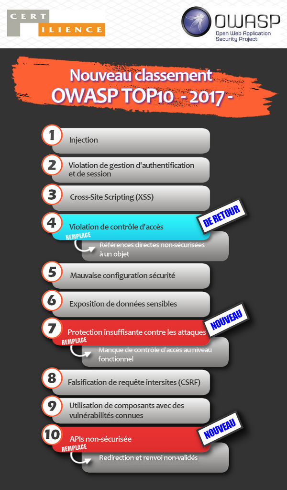
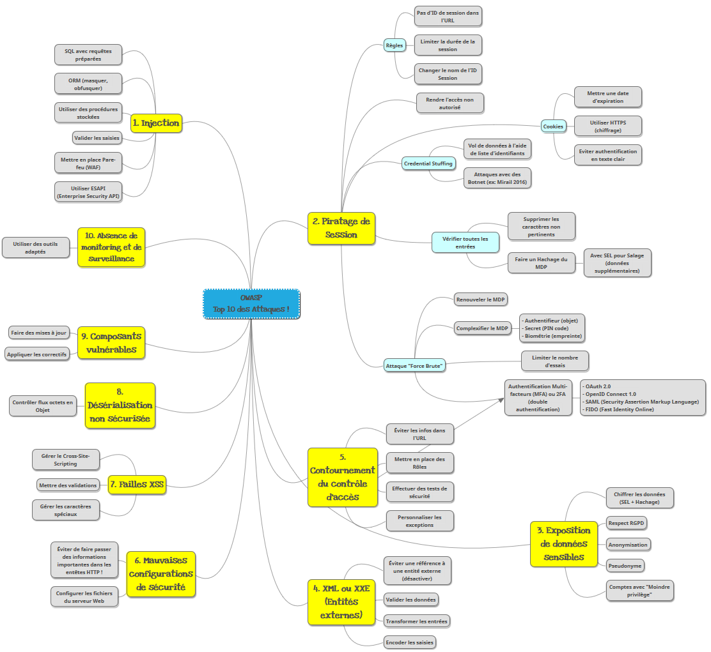

# OWASP

**Open Web Application Security Project**

Voici le lien officiel : https://www.owasp.org

[Document pour les tests de 224 pages à lire le soir pour s'endormir](https://www.owasp.org/images/1/19/OTGv4.pdf)

[liens vers les outils pour la mise en pratique de l'OWASP](https://www.linkedin.com/pulse/les-3-outils-owasp-indispensables-aux-d%C3%A9veloppeurs-pour-azziz-errime)

Utilisez le `Code Review Guide` : [Ici](https://www.owasp.org/index.php/File:OWASP_Code_Review_Guide_v2.pdf)

## Schéma des 10 attaques et de quelques solutions  

idem : lien vers ce Schéma réalisé avec MindMup qui résume les attaques et solutions (non exhaustives) :

https://atlas.mindmup.com/2020/03/be1e1b2061f411eaac2127beb7bef55d/owasp_top_10_des_attaques_/index.html

## Outils

Utilisez le **scanner de vulnérabilité** : [OWASP ZAP](https://www.owasp.org/index.php/OWASP_Zed_Attack_Proxy_Project)

L’outil `OWASP SKF` [OWASP Security Knowledge Framework](https://www.owasp.org/index.php/OWASP_Security_Knowledge_Framework) propose des exemples de code sécurisé pour les langages les plus connus, ce qui peut représenter une bonne source d’inspiration lors de la phase de développement.

Un petit site qui montre quelques exemples : [Ici](http://igm.univ-mlv.fr/~dr/XPOSE2012/OWASP_WebGoat/examples.html#sql)

Lien vers des [outils de Hack](https://www.journaldunet.com/solutions/dsi/1100767-10-outils-de-hacking-pour-les-experts/)

## Autres articles

[Cross-site request forgery (CSRF ou XSRF)](https://blog.clever-age.com/fr/2014/06/25/owasp-cross-site-request-forgery-csrf-ou-xsrf/)

[Injections SQL (iSQL)](http://blog.clever-age.com/fr/2013/09/18/securite-owasp-injection-sql/)

[Cross-Site Scripting (XSS)](http://blog.clever-age.com/fr/2014/02/10/owasp-xss-cross-site-scripting/)

[Local-Remote File Inclusion (LFI / RFI)](http://blog.clever-age.com/fr/2014/10/21/owasp-local-remote-file-inclusion-lfi-rfi/)

## Liste de sites pour la mise en pratique

https://www.web-eau.net/blog/10-outils-en-ligne-pour-tester-la-securite-de-votre-site

https://www.httpcs.com/fr/cartographie-complete-site-web

## Mise en pratique

Testez l'outil **OWASP ZAP** sur votre projet fil rouge ou tout autre projet web !
Proposez des solutions si vous découvrez une faille !

Voici le lien vers la mise en place d'un site web avec des failles et des aides d'OWASP pour apprendre à détecter les failles et les éviter.

https://github.com/WebGoat/WebGoat

Vous devez vous déconnecter d'internet pour lancer cette application de démo.