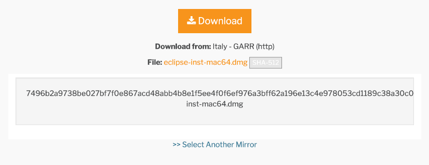

# HTTPS

Les enjeux de la sécurité, garantir :

    - l'identité du site que l'on visite.
    - la confidentialité des données échangées.
    - l'intégrité des données échangées.

#### (Contre) histoire de l'https

[Richard Stallman](videos/Richard_Stallman.mp4) : créateur de gnu et du copy left. Un idéaliste des premières heures d'internet.

[Philip Zimmermann](videos/Philip_Zimmermann.mp4) : créateur de pgp, il l'a distribué gratuitement pour que chacun puisse crypter ses contenus.

[Ecommerce](videos/ecommerce.mp4) : c'est le nerf de la guerre.

[Cyberspace](videos/cyberspace.mp4) : bienvenue dans un espace de liberté (et de substances cheloues).

#### Principe de fonctionnement

HTTPS est une surcouche du protocole HTTP. Il se compose :

- d'un certificat (pour assurer l'identité du site que l'on visite)
- du protocole TLS/SSL qui permet d'assurer :
    + la confidentialité (grâce au chiffrement asymétrique RSA + chiffrement symétrique type AES)
    + l'intégrité des données grâce à un hash (type SHA-256)

[Vidéo pour comprendre ce que sont le chiffrement symétrique et le chiffrement asymétrique](https://www.youtube.com/watch?v=AQDCe585Lnc&feature=youtu.be)

> A retenir : **hacher un message** = générer un code qui permet d'être sur que le message qu'on reçoit est le même que le message envoyé (non altéré).

> A retenir : **crypter un message** = le rendre illisible par les personnes qui ne possèdent pas la clé de déchiffrage.

> A retenir : **symétrique** = même clé pour chiffrer et déchiffrer. **Asymétrique** = une clé pour chiffrer + une clé pour déchiffrer
