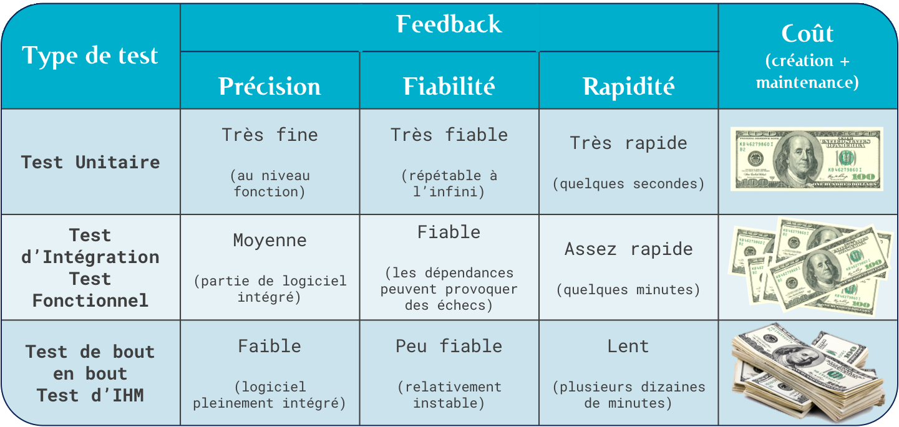
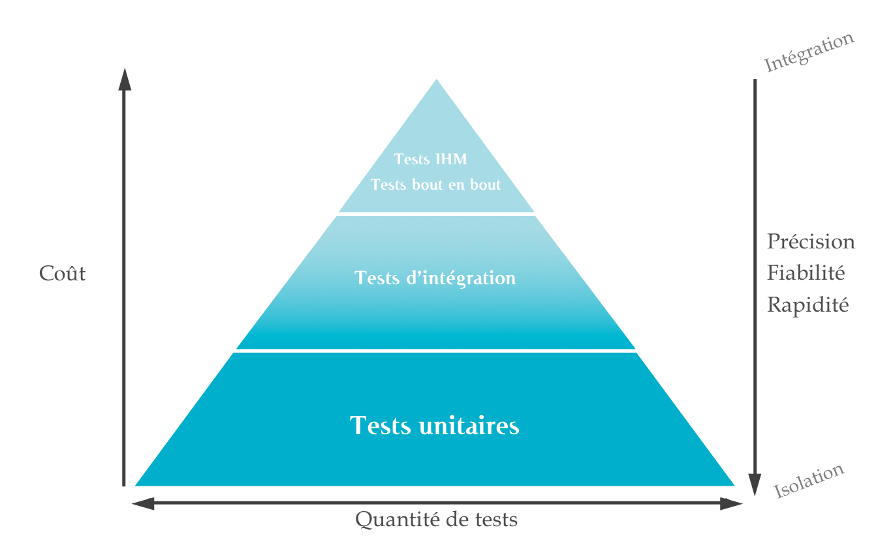
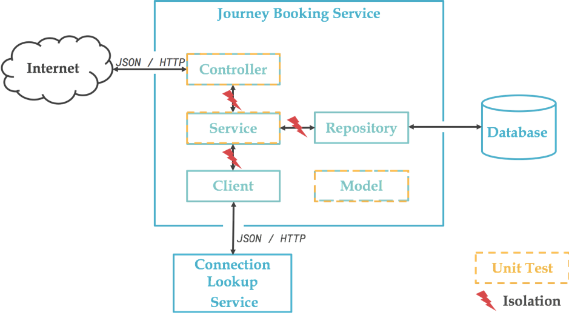

# Tests & SpringBoot

## Des tests, oui, mais pourquoi ?

>Le test n’a d’autre intérêt que de nous donner un feedback __mon programme fait-il bien ce qu’il doit faire ?__

On peut juger de la qualité de ce feedback sur 3 aspects :

- **Précision** : Si le test échoue, suis-je capable de déterminer précisément quelle partie du code ne fonctionne pas ?
- **Fiabilité** : La __répétabilité d’un test est primordiale__. Peut-on faire confiance à un test dont les résultats varient d’une exécution à l’autre, sans qu’aucune modification apparente n’ait été faite sur le code, la configuration ou une dépendance ?
- **Rapidité** : plus rapidement vous saurez si un test échoue, plus vite vous pourrez corriger le problème et moins cher il vous en coûtera de le faire



## Pyramide des Tests (source : Mike Cohn)



## Configurer Spring Boot pour les tests

Maven :

```xml
<dependency>
    <groupId>org.springframework.boot</groupId>
    <artifactId>spring-boot-starter-test</artifactId>
    <scope>test</scope>
</dependency>
```

Gradle :

```java

testImplementation('org.springframework.boot:spring-boot-starter-test') {
		exclude group: 'org.junit.vintage', module: 'junit-vintage-engine'
	}
	testImplementation 'org.springframework.security:spring-security-test'
```

### Commençons par les Tests Unitaires

>Un test unitaire vise à **valider un comportement unique (méthode ou sous ensemble d’une méthode) issu d’un cas d’utilisation métier en isolation du reste du monde**. Par conséquent, indépendemment :

- Autres objets : instanciation, attributs, paramètres...
- Autres systèmes : une base de données, un web service, l’heure du système...
- Autres tests : ordre des tests, données de test

>En règle générale, un test unitaire est indépendant de toute entrée/sortie, base de données, file system ou réseau.

Cela nous oblige à utiliser des bouchons, stubs, fakes ou Mock (Test Double ou doublure de test en français).

> **Mocks** : Simulacres d'objets réels !

De nombreuses librairies sont également disponibles comme **Mockito**, **EasyMock** ou **JMockit** pour les plus connus dans le monde Java.

## Librairies (API) que vous pouvez utiliser

- **JUnit**: Librairie incontournable pour les tests unitaires
- **Spring Test / Spring Boot Test** : Utilitaires notamment pour les tests d'intégration
- **AssertJ** : Librairie qui facilite les assertions
- **Hamcrest** : Librairie qui facilite aussi les assertions
- **Mockito** : Framework permettant de gérer les mocks
- **JSONassert** : Librairie d'assertion pour JSON
- **JsonPath** : XPath pour JSON

**AssertJ** and **Mockito** sont automatiquement accessible grâce à la dépendance __spring-boot-starter-test__.

## Quoi tester ?



- A-t-on besoin de tout tester ? 
- A quoi va nous servir de tester les Repositories qui ne contiennent aucun code ou si peu !

```java
public interface MovieRepository extends JpaRepository<Movie, Long> {
	
	Movie findByName(String name);

}
```

Voici quelques extraits de code de **MovieService** et **MovieController** :

```java
@Service
public class MovieServiceImpl implements MovieService {

    private MovieRepository movieRepository;

    public MovieServiceImpl(MovieRepository movieRepository) {
        this.movieRepository = movieRepository;
    }

    @Override
    public List<Movie> findAllMovies() {
        return movieRepository.findAll();
    }

    @Override
    public Movie createNewMovie(Movie newMovie) {
        return movieRepository.save(newMovie);
    }
    
    public Movie findByName(String name)
    {
    	return movieRepository.findByName(name);
    }
}
```

```java
@RestController
@RequestMapping("/api/movie")
public class MovieController {

    private MovieService movieService;

    public MovieController(MovieService movieService) {
        this.movieService = movieService;
    }

    @GetMapping
    public List<Movie> getAllMovies() {
        return movieService.findAllMovies();
    }

    @PostMapping
    @PreAuthorize("hasRole('ROLE_ADMIN') or hasRole('ROLE_CREATOR')")
    public ResponseEntity<Movie> createMovie(@RequestBody Movie newMovie) {
         return ResponseEntity.ok(movieService.createNewMovie(newMovie));
    }
}
```

### Tester Controller ou Service ?

En pratique les **TDD** (_Test Driven Development_) visent à spécifier le comportement attendu via un test avant de l’implémenter.
- On écrit donc en premier le test et ensuite le code le plus simple possible qui permet au test de passer et donc de satisfaire le comportement spécifié.

Si un __Controller__ semble n’avoir que peu de code, il a tout de même deux responsabilités :
- Exposer des DTO en lieu et place des entités (conversion d’objets)
- Exposer l’API via l’utilisation d’annotations.

Le code (même minime) sera donc testé unitairement et nous testerons l’exposition (mappings des urls, gestion des codes d’erreur,...) dans les tests de composants.

> On évite généralement de tester les API des frameworks que l'on utilise !

hghghghghghghghghghghghghghgh


- En utilisant l'approche **TDD**

> **Test d'Intégration** : permet de démontrer que les différentes parties d'une application fonctionnent correctement ensemble (nécessite un jeu de données important).

> **Mocks** : Simulacres d'objets réels !

> **Matcher** : ...

- **Top-Down**  : Intégration => Unitaire
- **Bottom-Up** : Unitaire => Intégration

Exemple de Top-Down


Comment faire pour tester les...

- Controllers
- Services
- Repositories
- Et le reste ?

Avec l'exemple des Villes et Monuments
L'exemple sur GitHub
Fonctionnalités Rest

    Récupérer la liste des villes
    Récupérer une ville avec son nom
    Récupérer les monuments d'une ville
    Récupérer le monument d'une ville avec son nom
    Ajouter une ville
    Ajouter un monument à une ville

Cela implique :

    Un CityController
    Un CityService
    Un CityRepository et un MonumentRepository
    Les entités City et Monument

Si on teste en Top-Down

Par quoi commencer ?

Les tests d'intégration de **haut niveau**

Tester au plus haut niveau <=> faire des appels au controller
Branche git 01-top-level-int-test

Comment faire des appels controller ?

- En chargeant tout le contexte Spring
- En utilisant TestRestTemplate

Exemple de code :

```java
@RunWith(SpringRunner.class)
@SpringBootTest(webEnvironment = WebEnvironment.RANDOM_PORT)
public class JavaCitySpringTestApplicationTests {
            
    @Autowired
    private TestRestTemplate restTemplate;
            
    @Test
    public void getCities()
    {
    // When retrieving cities from /api/city
    List<?> cities = this.restTemplate.getForObject("/api/city", List.class);
                
    // Then a non null list should be returned
    assertThat(cities).isNotNull();
    }
}
```

- Tests du controller

Tester le controller <=> vérifier les réponses et codes de retour
Branche git 02-controller-test
Comment tester son controller sans le contexte ?

    En utilisant @WebMvcTest et @MockMvc

Extrait de code


            @RunWith(SpringRunner.class)
            @WebMvcTest
            public class CityControllerTests {
            
              @Autowired
              MockMvc mockMvc;
              @MockBean
              CityService cityService;
            
              @Test
              public void getCities() throws Exception {
                when(this.cityService.getAllCities()).thenReturn(new ArrayList<>());
            
                this.mockMvc.perform(get("/api/city"))
                  .andExpect(status().isOk());
              }
            }
          

Les tests du service

Tester le service <=> Vrais tests unitaires
Branche git 03-service-test
Comment tester son service ?

    En utilisant les @Mock

Extrait de code


            @RunWith(MockitoJUnitRunner.class)
            public class CityServiceTests {

              @Mock
              CityRepository cityRepo;
              private CityService cityService;

              @Before
              public void setUp() throws Exception {
                cityService = new CityServiceImpl(cityRepo);
              }

              @Test
              public void getAllCities() {
                given(cityRepo.findAll()).willReturn(new ArrayList<>());
                List<City> cities = cityService.getAllCities();
                assertThat(cities).isNotNull();
              }
            }
          

Les tests du repository

Tester le repository <=> Tester les méthodes gratuites JpaRepository
Branche git 04-repository-test
Comment tester son repository sans le contexte ?

    En utilisant @DataJpaTest

Extrait de code


            @RunWith(SpringRunner.class)
            @DataJpaTest
            public class CityRepositoryTests {

              @Autowired
              private CityRepository cityRepo;

              @Autowired
              private TestEntityManager testEntityManager;

              @Test
              public void findCityByName() throws Exception {
                City savedCity = testEntityManager.persistFlushFind(new City("Toulouse", 31));
                City toulouse = this.cityRepo.findByName("Toulouse");
                assertThat(toulouse.getName()).isEqualTo(savedCity.getName());
                assertThat(toulouse.getDptCode()).isEqualTo(savedCity.getDptCode());
              }
            }
          

A vous de jouer ;-)

Faites des tests sur votre fil rouge
