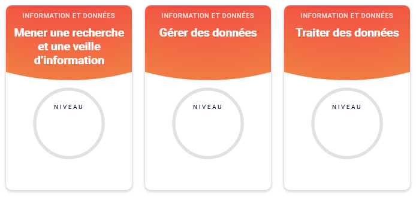
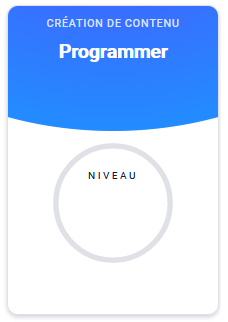

# Testez vos compétences avec **pix.fr**

## Votre objectif

>Effectuer une recherche efficace est une compétence essentielle pour une.e développeur.euse, voire pour tout le monde ! Le but de cet exercie consiste à prendre conscience que vous pouvez progresser dans votre capacité à effectuer des recherches et trouver des solutions adaptées à votre problème.

## Mise en pratique

Pix est une plateforme qui permet de tester ses compétences numériques. A l'heure où j'écris ces quelques lignes, il y en a **16** de disponibles. 

1. Créez votre compte en allant sur le site [pix](https://pix.fr/)

2. Testez une compétence

Choisissez **Mener une recherche et une veille d'information**

3. Testez une autre compétence

Choisissez **Programmer**

>Ne vous inquiétez pas si vous n'atteignez pas encore le niveau 6, c'est normal, il faut juste du temps...

## 3. Les moteurs de recherche

Google, Qwant, DuckDuckGo, Bing,...

## Pour des recherches efficaces

Ingrédients pour effectuer une recherche :

- **Pouvoir formuler ce que l'on cherche**. La langue Anglaise est conseillée car les pages anglophones sont bien plus nombreuses que les pages francophones.

- **Savoir identifier les bonnes sources**. Par exemple, utilisez des sites de références récents et consultés par de nombreuses personnes.

[Document pour dénicher les fausses infos](https://assets-decodeurs.lemonde.fr/assets-legacy/Decodex-notre-kit-pour-denicher-les-fausses-informations.pdf)

## Un documentaire (vidéo) en anglais

**Google and the World Brain** sur un projet pharaonique appelé "Google Books"

