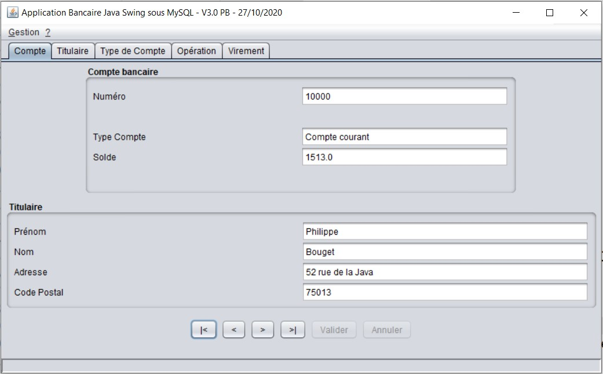
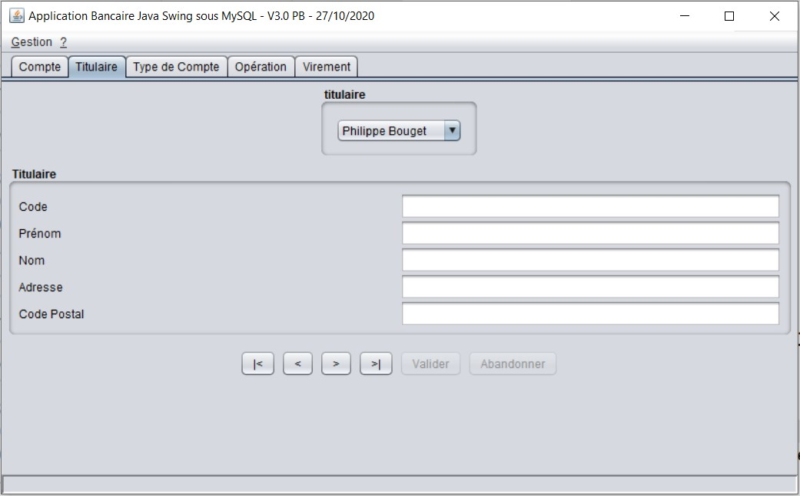
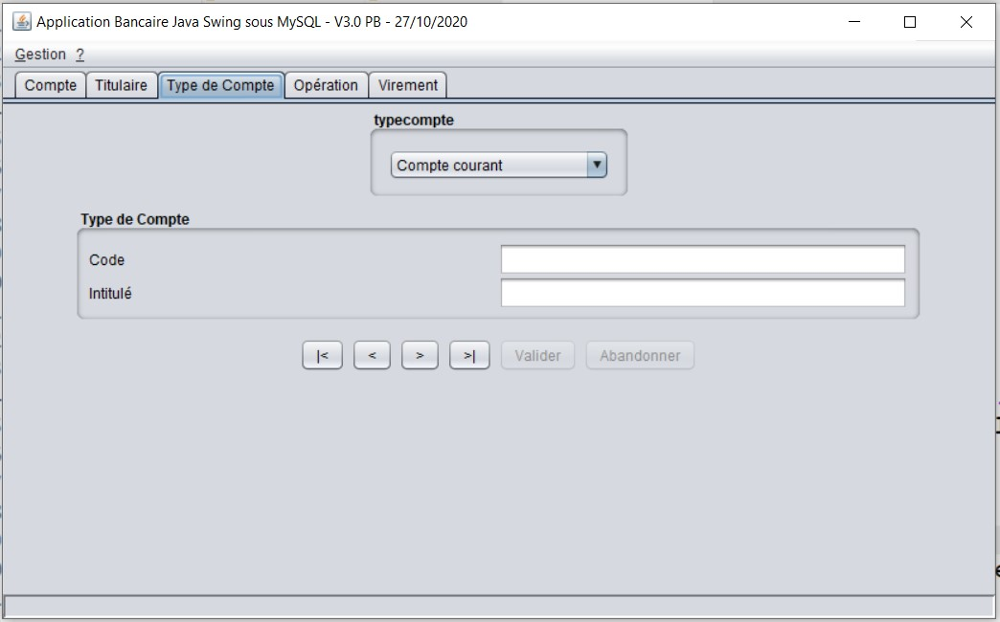
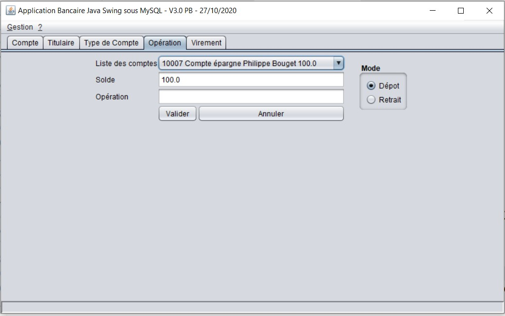
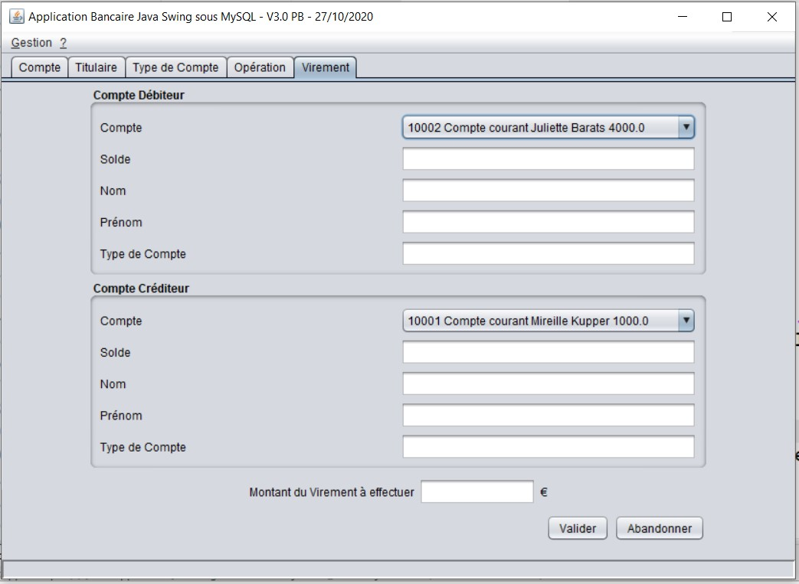

# Cahier des Charges (Opérations Bancaires)

## Objectifs

- Réaliser une application Java Desktop
- Gérer le multilingue (Anglais/Français/Allemand)
- Maquetter l'application avec un outil de maquettage
- Modéliser la BD avec Merise et/ou UML
- Modéliser avec UML (Uses Cases, Diag de classe)
- Mettre en place la base de données sous MySQL
- Respecter l'architecture MVC
- Choix libre sur les composants d'accès aux données :
    - JPA
    - Hibernate
    - **JDBC / DAO**
    - EJB3

- Réaliser les IHM en SWING
- Respecter la notion de multi-couches
- Gérer votre projet avec **Trello**
- Générer un fichier JAR exécutable
- Effectuer des tests et jeu d'essai
- Déployer l'application
- Mettre sur votre Git

### fonctionnalités de l'application

- l'opérateur doit pouvoir s'authentifier avec son identifiant et son mot de passe.
- Créer, lire, modifier et supprimer un titulaire de compte, un type de compte et un compte (CRUD).
- Enregistrer une opération sur un compte (Dépôt ou retrait)
- Effectuer un virement bancaire d'un compte vers un autre compte en vérifiant que le solde du compte à débiter est suffisant pour effectuer la transaction.
- avertir l'utilisateur si la transaction est impossible.
- afficher la liste des opérations pour un compte sélectionné.

### Règles de gestion

> Un **Compte** est associé à un et un seul **Titulaire**

> Un **Titulaire** peut avoir plusieurs **Compte**s

> Un **Compte** correspond à un seul **Type de compte**

> Un **Compte** peut avoir aucune ou plusieurs **Opérations**

> Une **Opération** de virement d'un **Compte** à un autre **Compte** doit se faire si et seulement si le compte débiteur a un solde suffisant. Si ce n'est pas le cas, la transaction ne pourra pas se réaliser et un message d'alerte doit s'afficher.

## Base de données sous MySQL

Vous devez créer une base de données vierge nommée : **banque**

### Concevoir une IHM

les contraintes sont :

- Charte graphique libre (liberté d'agencer vos composants comme vous le souhaitez en respectant les normes et la lisibilité des informations affichées)

- application multilingue (gestion des fichiers properties)
- navigation par onglets :
    - Titulaire
    - Compte
    - Opération
    - Virement
    - Type de Compte (compte courant, PEL, CEL,...)

Un Titulaire est identifié par un code auto-incrémenté, un prénom, un nom, une adresse et un code postal.

un Compte possède un numéro et correspond à un Type de compte, il appartient à un et un seul Titulaire. Il possède un solde qui est mis à jour après chaque opération ou virement le concernant.

Une Opération est associée à un Compte, elle possède un numéro d'ordre auto-généré, une date, un libellé, le montant de l'opération et le type de transaction (retrait, dépôt).

Un Type de compte est identifié par un code auto-généré et possède un intitulé.

L'utilisateur de l'application possède un identifiant et un mot de passe lui permettant de s'authentifier pour accèder aux fonctionnalités (à l'ouverture de la fenêtre principale de l'application).

### Propositions d'IHM pour cette application

#### Onglet Compte

#### Onglet Titulaire

#### Onglet Type Compte

#### Onglet Opération

#### Onglet Virement

