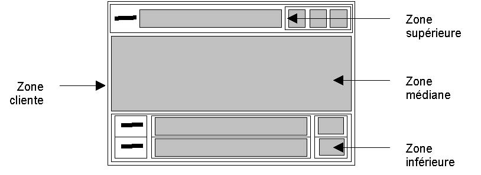
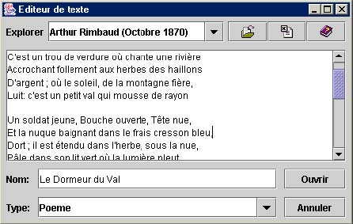
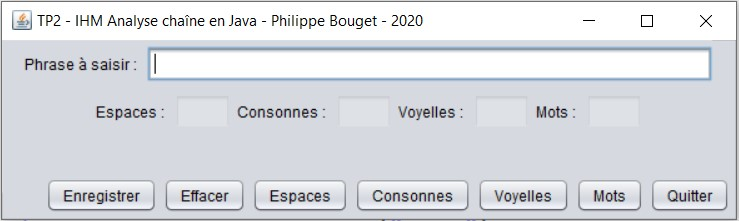

# Travaux Pratiques : Java Swing & JDBC

**Table des matières**

**TP1 – Agencement de composants Swing**

- Exercice simple avec agencement des Contrôles

**TP2 – Swing et gestion d'événements**

- 1. IHM et manipulation des chaînes de caractères avec la classe Swing
- 2. Construction IHM avec gestion des écouteurs

**TP3 – IHM Swing et accès BD avec JDBC**

#
## **TP1 – Agencement de composants Swing**

Objectifs : Mettre en place des composants graphiques de Java Swing sans gérer les événements.

## **Un petit exercice Agencement des Controles**

Ecrire une application ayant l'interface utilisateur décrit ci-dessous. La fenêtre application comporte 3 zones :

La partie supérieure de hauteur constante comprend :

- un **JLabel** (une étiquette) qui affiche le mot : *Explorer*
- une boîte **JComboBox** qui occupe le maximum de largeur,
- une barre d'outils de 3 boutons graphiques (ouvrirFichier, fermerFichier, aidezMoi).

Chaque bouton graphique est associé à une image que vous pouvez chercher sur internet :

  - *ouvrirFichier.png* pour le bouton ouvrirFichier
  - *fermerFichier.png* pour le bouton fermerFichier
  - *aidezMoi.png* pour le bouton aidezMoi


1. La partie médiane est une zone de texte multi-lignes (**JTextArea**) qui occupe le maximum d'espace en largeur avec un ascenseur (**JScrollPane** vertical toujours apparent)

1. - La partie inférieure est constituée elle-même de 3 zones sur 2 lignes :

Première ligne :

- JLabel (étiquette) qui affiche « Nom : »,
- zone de saisie du type JTtextField qui prend le maximum de largeur
- un JButton (bouton) ouvrir
 
Deuxième ligne :

- JLabel (étiquette) qui affiche « type : »,
- JComboBox qui prend toute la largeur
- JButton Quitter

Maquette



Résultat



## **TP2 – Swing et gestion d'événements**

IHM et manipulation des chaînes de caractères avec les classes de l'API javax.swing

Objectifs : Créer une classe de type **Chaîne** permettant l'analyse d'une chaîne de caractères quelconque. Cette classe métier sera utilisée par votre interface graphique à l'étape suivante.

### Créer une classe de type Chaîne ou (AnalyseChaine)

- uneChaîne
- nombreDeVoyelles
- nombreDeConsonnes
- nombreDeLettres
- nombreDeMots
- nombreEspaces

Créer un constructeur sans argument qui vous permet de saisir une phrase au clavier qui correspondra à la chaîne que vous allez analyser.

Créer une méthode **Extraire()** qui vous permettra de calculer toutes les valeurs de vos attributs (nombreDeVoyelles, nombreDeConsonnes, nombreDeLettres, nombreDeMots, nombreEspaces).

Créer une méthode **affiche()** pour afficher les résultats que vous avez trouvé dans la console.

Ensuite, vous allez créer une autre classe que vous pouvez appeler **TestChaîne** dans laquelle vous allez mettre la méthode main pour lancer votre programme d'analyse.

Voici ce dont vous devez connaître comme méthode java de la classe String :

- **length()** : permet de récupérer la longueur de la chaîne dans un entier.

- **charAt(position)** : permet d'extraire un caractère dans une chaîne à la position spécifiée.

- **indexOf(uneAutreChaine)** : permet de savoir si une chaîne se trouve dans une autre chaîne

Voici quelques lignes de codes pour vous aider à récupérer la saisie en console :

System.out.println(« Entrez une chaîne de caractères, puis validez ») ;

```java
InputStreamReader entree = new InputStreamReader(System.in) ;

BufferedReader clavier = new BufferedReader(entree) ;

maChaine = clavier.readLine() ;
```

### Construction de l'IHM avec écouteurs

Objectifs : Construire une interface graphique et utiliser la classe Chaine (ou AnalyseChaine) précédemment créee. Mise en place des composants graphiques et des écouteurs pour la gestion des événements.

**Partie A**

Modifier votre classe métier Chaîne selon les besoins :

- Déclarez-là public.

- Ajouter un constructeur pour y recevoir une chaîne de caractères.

-Ajouter 2 méthodes :

- **getVoyelles()** pour retourner le nombre de voyelles
- **getMots()** pour retourner le nombre de mots

Enlevez la classe dans laquelle se trouve la méthode main().

Créer une classe MaFenetre comme dans l'exemple du cours :

Voici la fenêtre que vous devez créer (vous êtes libre d'organiser vos composants comme vous voulez) :


Voici une proposition si vous ne savez pas comment commencer :

On va simplifier l'affichage en créant 3 JPanel (panneaux).

**le panneau du haut contiendra :**

- l'étiquette &quot;Phrase à saisir&quot;
- un champ texte pour la saisie de 40 caractères maximum

**le panneau du centre contiendra :**

- l'étiquette &quot;Nombre de Voyelles&quot;
- un champ d'affichage du nombre des voyelles trouvées de 3 caractères
- l'étiquette &quot;Nombre de Mots&quot;
- un champ d'affichage du nombre de mots trouvés de 3 caractères

**le panneau du bas contiendra (de gauche à droite) :**

- un bouton &quot;Voyelles&quot;
- un bouton &quot;Mots&quot;
- un bouton &quot;Quitter&quot;

Le titre de votre fenêtre sera «  **traitement d'une chaîne**  ».

Il vous faudra ajouter les méthodes habituelles, getters() et setters()set pour affecter/récupérer les valeurs correspondantes :

- le nombre de mots dans votre champ texte pour le nombre mots.
- le nombre de voyelles dans votre champ texte pour les voyelles.
- 3 écouteurs implémentant ActionListener pour gérer les événements des boutons

Il vous suffira de créer une classe TesterMonProgramme dans laquelle vous mettrez votre méthode main pour instancier un objet fenêtre :

```java
public class TesterMonProgramme
{
  public static void main (String args[])
  {
    MaFenetre aMoi = new MaFenetre();
    aMoi.pack();
    aMoi.setVisible(true);
  }

}
```

**Partie B**

*Vous allez ajouter d'autres fonctionnalités à votre programme*.



- Ajouter un bouton Consonnes pour afficher le nombre des consonnes

- Ajouter un bouton Espaces pour afficher le nombre d'espaces

- Ajouter un libellé et un champ texte de 3 caractères pour les consonnes

- Ajouter un libellé et un champ texte de 3 caractères pour les espaces

#
- Fonctionnalité optionnelle
Ajouter un bouton enregistrer pour écrire dans un fichier texte la chaîne étudiée avec tous les résultats de l'analyse générés par les méthodes de la classe chaîne. Vous devez présenter les résultats de l'analyse de la manière suivante :

Auteur : votre prénom

Chaîne analysée : chaîne que vous avez saisie

Nombre de voyelles : résultat

Nombre de consonnes : résultat

Nombre de lettres : résultat

Nombre de espaces : résultat

Nombre de mots : résultat

Fin analyse de la chaine.

Vous êtes libre d'enregistrer vos données en flux de caractères ou d'octets. Vous nommerez votre fichier « EtudeChaîne.txt ». Vous pouvez aussi envoyer un message lorsqu'il y a une saisie erronée, l'enregistrement du fichier, etc.

#

Au travail…

## **TP3 – IHM Swing et accès BD**

Objectifs : Synthèse des acquis. Mettre en place une petite application avec une interface graphique simple permettant l'accès à une base de données MySQL. Il faut donc utiliser :

- des composants graphiques (SWING)
- gérer la connexion à la base de données (java.sql)
- gérer les événements (listeners)
- gérer les exceptions (Classes Exception)

>L'interface graphique est relativement simple à mettre en place. L'application doit permettre de saisir une requête SQL dans une zone de **JTextField** , de lancer l'exécution en cliquant sur le bouton « Exécuter » en ayant sélectionné l'un des boutons radio «  **Query**  » ou «  **Update**  ». Par défaut le bouton radio «  **Query**  » est sélectionné et correspond au **SELECT**.

Dans la zone du bas, il doit y avoir 2 boutons, l'un pour effacer la zone de saisie de la requête et l'autre pour effacer la zone d'affichage des résultats de la requête.

Voici ce que vous devez obtenir


Description détaillée de la fenêtre :

Elle comporte 3 zones :

- La partie supérieure de hauteur constante comprend  de gauche à droite, les composants suivants :

- une JLabel (une étiquette) qui affiche le mot : **Requête**
- une JTextField pour la saisie de la requête SQL
- un JButton nommé **Exécuter** permettant l'exécution de la requête saisie.

- La partie médiane est une zone de texte multi-lignes (**JTextArea**) qui occupe le maximum d'espace en largeur avec un ascenseur (**JScrollPane vertical** toujours apparent). Vous pouvez aussi choisir d'utiliser une **JTable**. Dans ce cas, vous devez mettre en place une **JTableModel**

- La partie inférieure est constituée des composants suivants :

- un JRadioButton «  **Query**  »
- un JRadioButto «  **Update**  »
- un JButton «  **Effacer tout**  » pour mettre à blanc les zones de saisie et d'affichage.
- un JButton «  **Quitter**  » pour quitter votre application

Vamos, let's go, au travail,...

*Philippe Bouget Mis à jour le vendredi 30/10/2020*