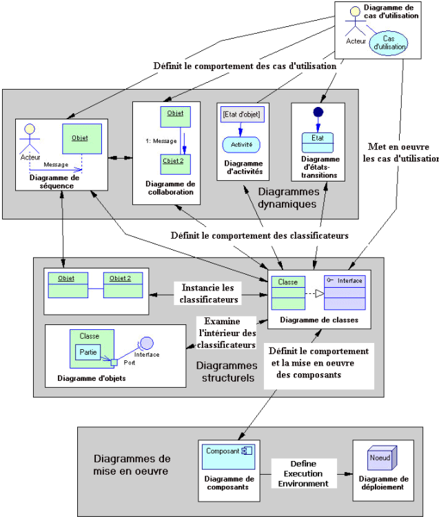
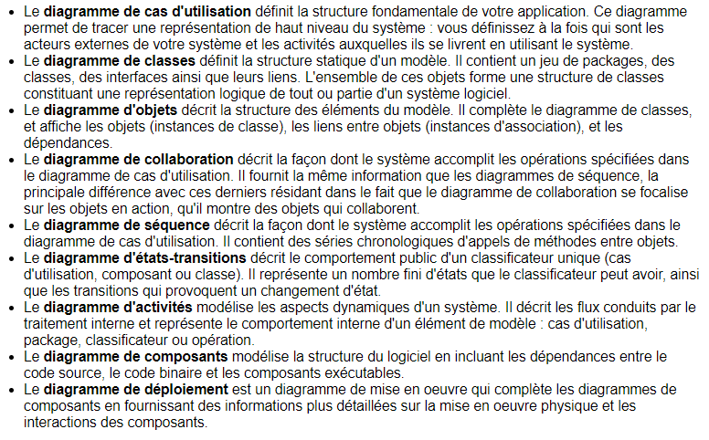
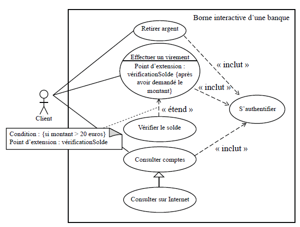
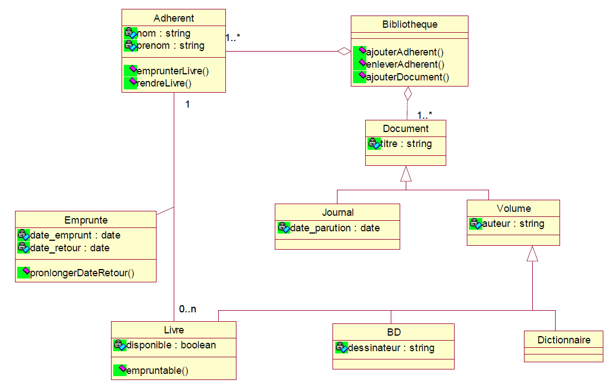
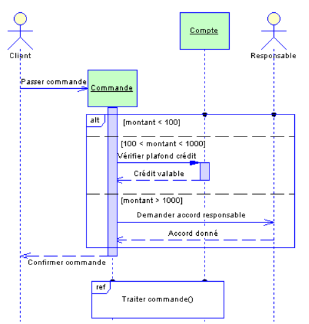
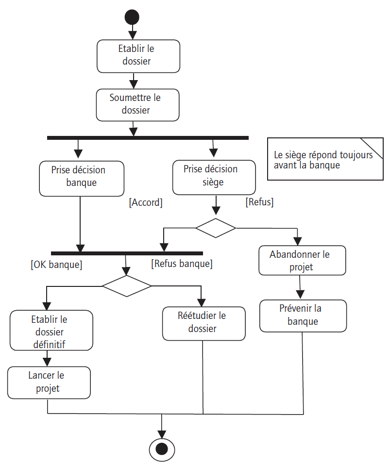
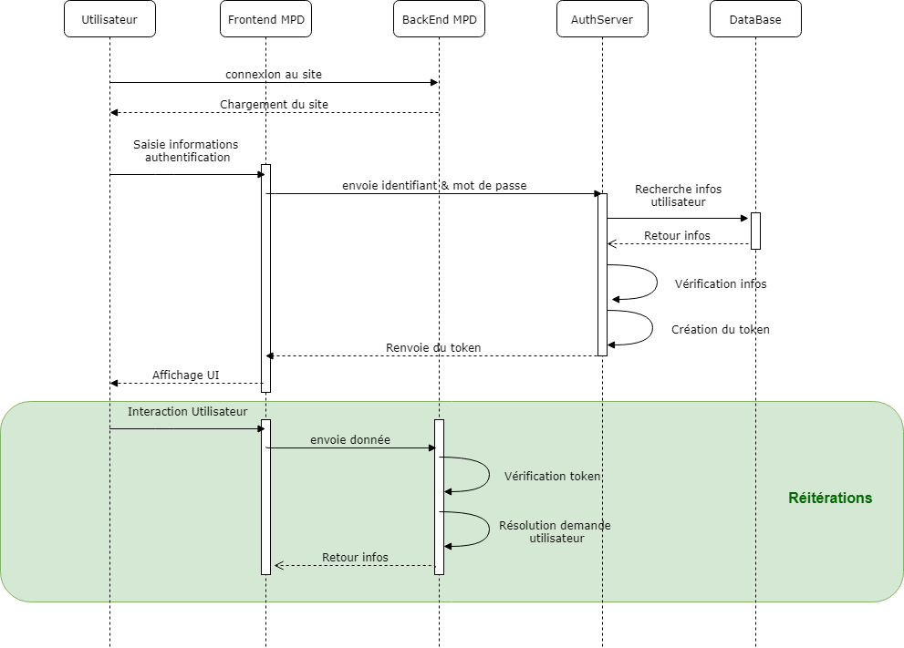
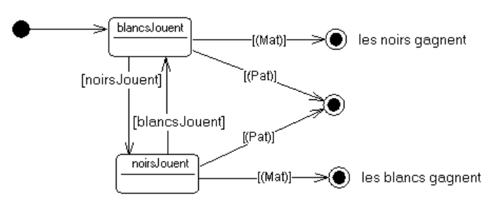
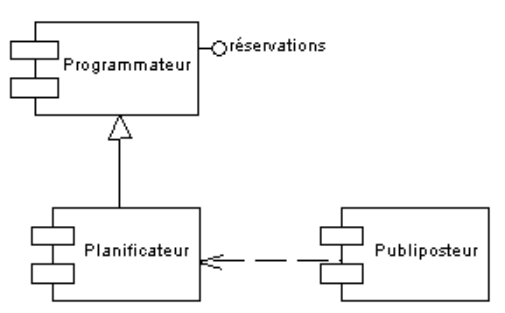
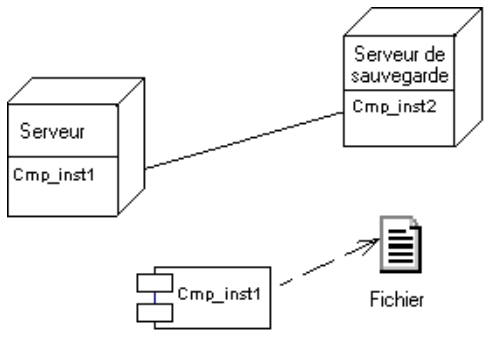

# Les diagrammes UML pour modéliser

## Liste des principaux diagrammes

Il existe 3 catégories de diagrammes :

* Diagramme décrivant les fonctionnalités
* Diagramme décrivant les données, la partie invariante
* Diagramme décrivant les actions dans le temps
  
## Description des fonctionnalités (résumé)

### Exemple diagramme de Use Case

Un seul  diagramme. C'est le **diagramme des cas d'utilisation (USE CASE)**
L'équivalent **SCRUM** est le **USER STORY**.   
Avec ce diagramme, on identifie les acteurs et leurs rôles ainsi que les fonctionnalités de l'application.  
On définit un Use Case global pour l'application, puis des Uses Cases détaillés si besoin pour chacun des Uses cases principaux.

[exemple](http://www.uml-sysml.org/diagrammes-uml-et-sysml/diagramme-uml/use-case-diagramme)

Chaque **Use Case** doit donner lieu à la description d'un scénario textuel décrivant tout le cheminement du traitement :

* Lorsque tout se passe bien
* Lorsque quelque chose se passe mal
Les scénaris permettent aussi de décrire les champs impactés par le traitement. On le relie souvent à une page Web.

## Description des données

### Exemple diagramme de classes

C'est le diagramme des classes (MOO) Modèle Orienté Objet.   
On définit les classes (entités) qui sont **persistantes** (celles qui seront stockées en base de données ou sous une autre forme (fichiers JSON, fichiers Objets, noSQL, autres).

[Tutoriel ici](modelisationPart1.md)

## Description des traitements

Vous utilisez au choix le **diagramme des séquences** ou le **diagramme d'activité**.  
Pour l'enchaînement des écrans, on utilise le diagramme de navigation qui permet de mettre en place la cinématique du site avec les relations.

### Exemple diagramme de Séquences

Lien vers une petite vidéo Youtube qui explique bien ce diagramme : https://www.youtube.com/watch?v=rDe6Hzsv68g

### Le diagramme d'activités

Le diagramme d'activité décrit un comportement *en fonction du temps*.   

[exemples](https://creately.com/diagram-community/examples/t/activity-diagram?utm_source=umltypes&utm_medium=blog&utm_campaign=tutorialposts)

### Le diagramme de navigation

Le diagramme de navigation définit l'enchaînement des vues (écrans). Il est complémentaire au diagramme d'activité.
C'est ce que l'on appelle la **cinématique**. Il n'y a pas de normalisation pour ce dernier. Vous êtes libre de le réaliser comme bon vous semble.

### Le diagramme de séquences

On définit une action utilisateur dans le *temps*.  
Une action exécute une URL et par conséquent, fait appel à une **méthode** d'un contrôleur, ce qui déclenche une action et renvoie une réponse ou pas.

Bien utile dans une architecture MVC, car il aide à la réalisation des contrôleurs. Avec ce diagramme, nous sommes capable de nommer une requête http.  
Un exemple d'authentification de token avec Spring Boot sous forme d'un diagramme de séquence.

## Pour aller plus loin

N'hésitez pas à vous procurer ce très bon [livre](https://www.eyrolles.com/Informatique/Livre/uml-2-9782212123890).

## Autres Exemples de diagrammes UML

### Etats-transitions

### Diagramme de Composants

### Diagramme de Déploiement

Auteur : **Philippe Bouget**
Sources : diverses (doc PowerAMC, Developpez.com)