
<h1>Modélisation partie 1 - les classes</h1> 

# Introduction

La modélisation des données est l'une des étapes la plus importante et la plus délicate d'un projet informatique.  
Elle permet de définir le côté back-end du logiciel.
A partir de cette modélisation, le développeur peut définir les classes et la base de données.  
En effet, les classes et la base sont étroitement liées. Le plus souvent une table a pour correspondance une classe qui aura les mêmes propriétés.  
Pour cela on va utiliser la notation UML.   
UML est composé de plusieurs diagrammes.   
Nous allons voir ici le diagramme des classes.

# UML

UML est une notation qui permet de représenter graphiquement les besoins du logiciel à développer.  
UML intervient dans la phase d'analyse des besoins. Il existe de nombreux diagrammes.
Les diagrammes UML doivent être considérés comme un **outil de communication**.

Ces diagrammes donnent des points de vu différents du projet à réaliser.
Pour avoir un bon aperçu de l'UML, je vous conseille ce [tuto de démarrage](https://openclassrooms.com/courses/debutez-l-analyse-logicielle-avec-uml?status=published).

Et pour une documentation plus poussée : [documentation complète](http://uml.developpez.com).

L'UML est très orienté objet. Il a donc tout son sens dès que l'application sera écrite en objet.  
Cette approche sera **insdispensable** dès que l'on utilisera un framework contenant un ORM (JPA, Hibernate, Doctrine).  
Le diagramme que l'on va exclusivement étudier dans ce tuto est le diagramme des classes du Modèle Orienté Objet (MOO).
C'est le diagramme le plus important pour un développeur.

# Le diagramme des classes

## Classe

La classe est la description d'une famille d'objet.
On définit son nom, ses attributs et ses méthodes.

* Le nom est l'identifiant de la classe. Il commence toujours par une majuscule. Deux classes ne peuvent pas avoir le même nom.  
* Les attributs sont les caractéristiques que possède une classe. C'est l'état ou la possesion => verbe être et avoir.  
* Les méthodes sont les actions que peut faire un objet appartenant à une classe.
Pour une modélisation rapide, on peut se permettre de ne mettre que les attributs importants et s'économiser l'écriture des méthodes.  

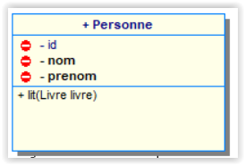

> Signification :  
> Une personne possède des propriétés : un id, un nom, un prénom  
> Elle posséde une méthode : elle sait lire.

## Les associations

Une fois les classes déterminées, il faut les relier entre elles.  
Une association est une relation entre 2 ou plusieurs classes.

## Héritage

L'héritage (ou la généralisation) est la base des langages objets.  
L'héritage consiste à regrouper dans une classe toutes les propriétés et méthodes communes à plusieurs classes.  
Si l'héritage est très employé en programmation, en modélisation il doit rester discret.
En effet, l'héritage n'est pas toujours utile et il faut choisir parmi 3 manières pour les adapter à une BD relationnelle.

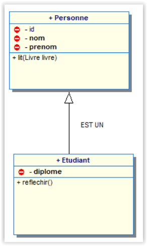

> Signification :  
> Un Etudiant EST une Personne (il hérite des propriétés et méthodes de Personne)  
> Il possède un id, un nom, un prénom et un diplôme.  
> Il sait lire et écrire.

### La multiplicité

La multiplicité exprime et quantifie la relation entre 2 instances de 2 classes.  
Les multiplicités s'expriment avec un nombre de relations minimales et maximales.  
Par exemple, on va dire qu'un véhicule possède entre 2 et 4 roues  (minimale : 2 roues, maximale : 4 roues).  
Ceci s'écrit 2..4.

Pour une modélisation plus rapide, on n'utilise que les multiplicités maximales et on se limite aux valeurs `0`, `1`, `*` (`*` signifiant plusieurs).

- `0` signifie une relation optionnelle.
- `1` signifie une relation unitaire.
- `*` signifie une relation multiple.

### La direction

La relation peut être **unidirectionnelle** ou **bidirectionnelle**.
Il existe une notion de **navigabilité** qui se traduit par des flèches.
Elle indique quelle classe contient la 2ème classe.  
Une relation unidirectionnelle est représentée par une flèche.

Par défaut une relation est bidirectionnelle (sans flèche).

* A -> B : A stocke B. B ne connait pas A.
* B -> A : B stocke A. A ne connait pas B.
* A <-> B : A stocke B, et B stocke A.

N'oublions pas. Il faut raisonner objet et non relationnel. Ceci signifie qu'une classe peut contenir une collection (ou un tableau) d'une autre classe.  
**Cette notion est importante pour l'écriture du code, mais ne l'est pas pour la modélisation d'une base de données.** 

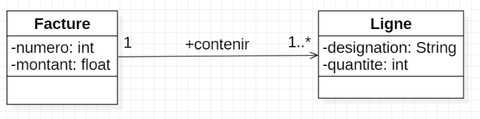

> Signification :

> les instances de la classe Ligne ne stockent pas de liste d'objets du type Facture.  
> chaque objet facture contient une liste de ligne

### Association 1..1

Une association 1..1 signifie que :

* une instance d'une classe A correspond une seule instance dans la classe B
* une instance d'une classe B correspond une seule instance dans la classe A (vice versa).  

note :  
Une association 1..1 1..1 signifie que les 2 classes sont très liées.  
Si vous créez une instance dans la classe A vous devez créer une instance dans la classe B.  
De même si vous supprimez l'instance A, l'instance B doit aussi être détruite.
Il faut vérifier ce type de relation qui n'est pas accepté dans un MCD Merise !

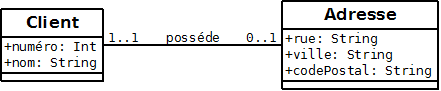

> Signification :  
> Un client a au plus une adresse  
> Une adresse appartient à un et un seul client et ne peut exister sans client.

### Association 1..*

Une association 1 * signifie que :

* une instance de la classe A peut avoir plusieurs instances dans la classe B.  
* une instance de la classe B peut avoir une seule instance dans la classe A.  

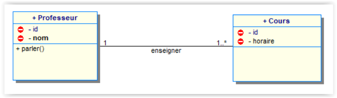  
> Signification :  
> Un professeur enseigne dans plusieurs cours.  
> Un cours est fait par un seul professeur.

### Association \*..* avec Classe d'association

Une association *..* signifie que :
* une instance de la classe A peut avoir plusieurs instances dans la classe B.  
* une instance de la classe B peut avoir plusieurs instance dans la classe A.  
Une association *..* génère automatiquement une nouvelle classe : la *classe association*.  

Ici, l'association **Participant** est porteuse d'une propriété, le numéro de place qui sera associé à chaque étudiant (participant au cours).

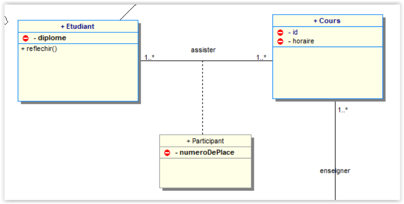

> Signification :  
> Un étudiant assiste à plusieurs cours.  
> Un cours contient plusieurs étudiants.  

Une association \*..* peut être remplacée par 2 associations 1..*.  

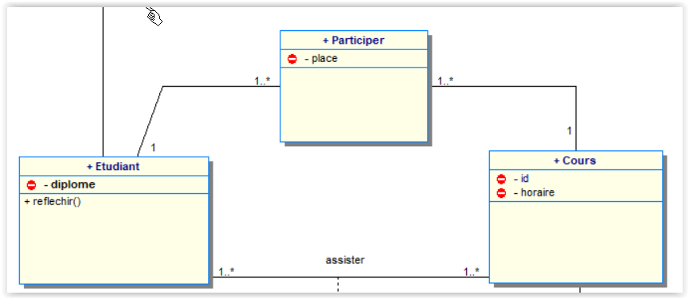  

### Association reflexive

C'est une association ou la classe a une relation avec elle même.    
Cette association est très utilisée pour représenter une arborescence.  
Par exemple, un dossier (enfant) est contenu dans un dossier (parent).  

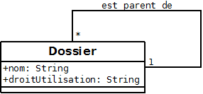 

### Agrégation

C'est une relation 1..* qui a une notion de subordination **faible** dans laquelle un objet agrégat est fait de composants. Les composants font partie de l'agrégat. L’agrégation est symbolisée par un **losange vide** en contact avec la classe agrégat.

>L'agrégation met en relation des instances d'objets. Deux objets distincts sont englobés, l’un des deux est une partie de l’autre sans toutefois en dépendre autant que dans une **composition**.

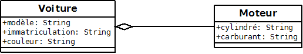  
> Signification :  
> Une voiture possède un moteur  
> On peut détruire une voiture sans détruire le moteur si nous l'avons enlevé pour être ré-utilisé ou pas.

### Composition

C'est une relation 1..* qui a une notion d'appartenance **forte**.

>Une composition est une **forme forte d'agrégation** dans laquelle le cycle de vie des parties composantes est lié à celui du composé.
Les composants n'existent pas seuls. Ils peuvent être créés après le composé, mais ensuite ils vivent et meurent avec lui. 

Si on détruit le composé, les composants n'existent plus. Une fois établis, les liens ne peuvent pas être changés.

A utiliser avec parcimonie !

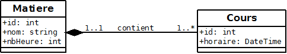  
> Signification :  
> Une matière est composée de plusieurs cours.  
> Si la matière disparait, le cours aussi.  

## Schéma global

Voici un exemple de modélisation d'un enseignement.  
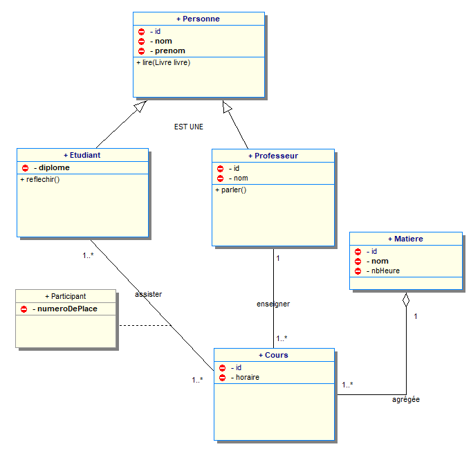

# Ce qu'il faut retenir

* Un modèle est un schéma. Il doit être facile à lire et permet de communiquer.  
* Plus le schéma est complexe, plus l'application sera complexe.  
* Pour modéliser simplement, il faut aller à l'essentiel.  
* Une entité doit être bien nommée pour bien comprendre la signification du schéma.  
* Une classe est souvent confondue avec l'**objet** ou l'**instance**.  
* Pour relier les classes entre elles, on utilise les liens (associations) ou l'héritage. 

Auteur : **Philippe Bouget**