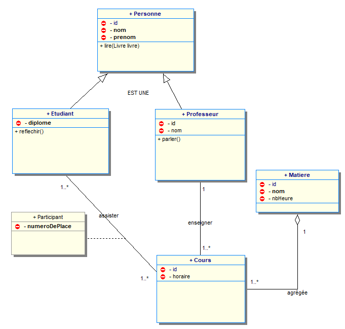

<center> <h1>Modélisation partie 2 - Base de données avec UML</h1> </center>

# Schéma global



# Génération des tables à partir des classes

* Une classe devient une table
* Toutes les propriétés de la classe deviennent de champs de la table
* Pour les associations, il y a importation des identifiants ou création nouvelle table dans (dans le cas du manyToMany).
* L'importation des identifiants entraîne la création d'une clef étrangère (foreign key).
* Le champ d'une table ne peut pas contenir d'occurrences (ni tableau, ni liste).
* Une classe d'association devient une table contenant les identifiants des classes qui la relient.
* Vous pouvez utiliser un logiciel comme **SQL Designer**, **MySQL WorkBench** ou **DataGrip** de JetBrains.

## Héritage

A hérite de B.  
2 solutions (voire 3) :

* créer 2 tables : tableA et tableB
* importer les champs dans la table fille : créer tableA avec les champs de la classe B
* Il existe une troisième solution que nous découvrirons lors du mapping (ORM)

## Associations

### Association 1..1

A--->B  
2 solutions :

* copie des champs dans la table maître si c'est la seule association : créer tableA avec les champs de la classe B
* 2 tables : tableA et tableB  

### Association 1..* et agrégation

A 1--->* B  
import de l'id de cardinalité 1 dans la table de cardinalité *.  
tableA avec idA  
tableB avec idB et idA.

### Association *..*

A *--->* B  
création d'ue table intermédiaire contenant les id des 2 tables reliées.
tableA avec idA  
tableB avec idB  
tableC avec idC idA et idB.

## Modèle Logique qui correspond (Merise)


## Solution possible relatif au diagramme vu plus haut 


# Clef et Index

Les clefs et les index permettent un accès rapide aux données, et servent aussi de contrainte d'intégrité.

## Clef primaire

La clef primaire est constituée d'un id. C'est un entier auto-incrémenté qui est **unique**.  
Ceci simplifie grandement les relations entre les tables.  
Il a l'inconvénient de ne pas contrôler les doublons.  
Il s'agit d'un id technique qui ne doit pas être visible pour l'utilisateur.  
Même si la clef primaire n'est pas obligatoire en MYSQL, vous devez en déclarer une **obligatoirement**.
C'est une erreur de conception d'avoir une table sans clef primaire.

## Clef fonctionnelle ou clef unique

La clef fonctionnelle (ou clef unique) est l'ensemble des champs constituants l'unicité d'un enregistrement (id primaire exclu).  
L'ajout de cette clef vous oblige à déterminer l'unicité des enregistrements et contribue fortement à l'intégrité des enregistrements de la base de données.  
Pour rappel : l'id est un concept technique, il ne doit pas être vu par l'utilisateur. 
C'est la clef fonctionnelle qui compte pour un utilisateur.
Cette clef est appelée aussi **clef unique**. Elle est composée d'un ou plusieurs champs.  

### Champ unique

S'il y a un seul champ, on la définit grâce à une contrainte d'unicité sur le champ.
Prenons l'exemple d'un produit qui a un champ *reference*. Il est unique. Il ne peut y avoir 2 produits qui ont la même référence.  
```sql
CREATE UNIQUE INDEX `reference_UNIQUE` ON `stock`.`produit` (`reference` ASC);
```

### Champs multiples

S'il y a plusieurs champs, on la définit grâce à un index unique composé des champs la composant.  
Prenons l'exemple d'une personne qui a 4 champs : *nom*, *prenom*, *dateDeNaissance*, *email*. (nom, prenom, dateDeNaissance) constitue la clef fonctionnelle.
Il ne peut pas avoir 2 personnes avec le même triplet nom, prénom et date de naissance.  
```sql
CREATE UNIQUE INDEX `uk_UNIQUE` ON `carnet`.`personne` (`nom` ASC, `prenom` ASC, `dateDeNaissance` ASC);
```

### Modification de la valeur de la clef

Dans la logique des choses, une fois l'enregistrement créé, on ne devrait pas pouvoir modifier les valeurs de la clef fonctionnelle. 
Ce contrôle est du domaine du développement (java, php).   
Imaginez : vous créez dans la base un produit avec une référence. Vous faites une commande avec ce produit et éditez une facture. 
Vous changer ensuite la référence du produit. Il sera impossible à l'acheteur de retrouver son produit inscrit sur la facture.
 
## Clef étrangère 

La clef étrangère permet d'établir la relation entre les 2 tables et maintient en partie l'intégrité de la base.  
C'est une contrainte de base.  
Cette clef vérifie si l'enregistrement étranger existe.  
Ceci est très utile lors de la création et la suppression d'un enregistrement
Dans une relation 1..*, c'est la table proche de * qui contient la clef étrangère.  
Dans une relation *..*, on décompose en 2 relations 1..*.  
Dans une relation 1..1, on décide d'une table maître.  

## Index

Les index permettent une lecture plus rapide de la base en fonction des champs indexés.  
En théorie, on pourrait avoir autant d'index que de critères de recherche.  
Cependant **les index sont coûteux en place et en temps d'écriture**.    
De plus les processeurs et les moteurs de base de données sont devenus très performants. 
En fait tout dépend de l'utilisation :

* nombre d'enregistrements
* table utilisée principalement en lecture
* table utilisée principalement en écriture 
* fréquence de la requête

# Normalisation des bases de données relationnelles

Il existe 6 niveaux de forme normale.  
Une base de données relationnelle doit être au minimum en 3ème forme normale.  
Avec les id techniques, il est très facile de ne pas respecter la normalisation.  
**Une base relationnelle non normalisée entraîne de graves erreurs de comportement, et oblige le développeur à écrire plus de code**.  

## Règles de normalisation

Dans une base de données relationnelle, il y a 3 règles obligatoires à connaître.  

### Atomicité

Il n'y a pas de tableau, ni de liste dans un champ.  
Par exemple, il est déconseillé de mettre un nom suivi du prénom dans le même champ. 
On doit dans ce cas créer un champ nom et un champ prénom.  
De même, il est interdit de mettre un tableau (array) de noms d'article dans la table facture. 
On doit créer une table article contenant le nom de l'article.

### Information centralisée

Les informations sur une entité sont sur un seul enregistrement de la table. 
Il est interdit de disperser les informations sur plusieurs enregistrements.  

### Information unique (Unicité)

**L'information est représentée une seule fois dans la base**. 
Il est interdit d'avoir des doublons dans la table. Pour cela il faut ajouter une contrainte d'unicité (clef unique ou fonctionnelle).  
De même il est interdit de dupliquer l'information dans une autre table.  
Par exemple la description d'un fournisseur ne peut pas être dans une table produit, seul y figure son id et des caractéristiques propres au produit.  


## Définition

Pour le fun, voici la définition mathématique.    
Note : la définition a été écrite avant l'utilisation systématique des id, il faut comprendre par clef primaire la clef fonctionnelle.  

### 1ère forme normale

Une relation est en 1ère forme normale si elle ne contient que des "valeurs atomiques", c'est-à-dire pas de "groupes répétitifs". **Non décomposable** 
Un champ contient une valeur au plus : pas de tableau, ni de liste.

### 2ème forme normale

Une relation est en 2ème forme normale si elle est déjà en 1ère forme normale,
et si tout attribut n’appartenant pas à la clé (primaire) dépend complètement de cette clef.  
Un champ non clé primaire ne doit pas dépendre d'une partie de la clé primaire. Il doit en dépendre entièrement.

### 3ème forme normale

Un champ non clé primaire ne doit pas dépendre d'un autre champ non clé primaire.  
Dans ce cas, on peut décomposer la table en deux tables afin d'éviter une redondance d'informations dans la base.

### Un complément d'informations

Vous voulez des explications complètes, [lisez ceci](http://fsmrel.developpez.com/basesrelationnelles/normalisation/).  
STOP, je n'ai rien compris, [lisez ceci](https://openclassrooms.com/courses/faites-une-base-de-donnees-avec-uml/optimisez-votre-modele-relationnel-avec-les-formes-normales).  


# Pièges à éviter lors de la conception et évolution de la base

* Ne pas prendre le temps de bien réfléchir
    * Un schéma complexe donnera une base complexe et une application complexe.
    * Une modélisation mal pensée donnera une mauvaise application.
    * Survoler la notion de clef primaire, fonctionnelle, étrangère.
    * Déclarer les VARCHAR avec des longueurs aléatoires. Il faut bien réfléchir à la longueur que prend un champ texte.
* Maintenance de la base
    * Il faut penser à l'évolution du système. Un logiciel vit. La description des données évoluent avec le temps. Mettre à jour le schéma d'une base de données sans mettre à jour le MOO rendra rapidement ce dernier inutile.
    * Lors d'une évolution d'une base mise en production, il faut penser aux données existantes.
* index et contraintes
    * Une utilisation immodérée des index, ralentira la base.
    * Oublier une contrainte lors de la conception peut nous faire perdre beaucoup de temps.
    Imaginer l'oubli d'une contrainte d'unicité. Dans la base nous avons un doublon. Comment allez-vous ajouter cette contrainte ?
