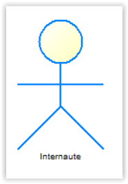
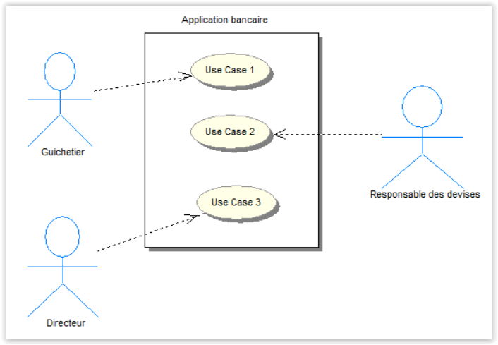
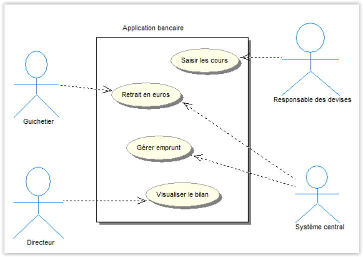
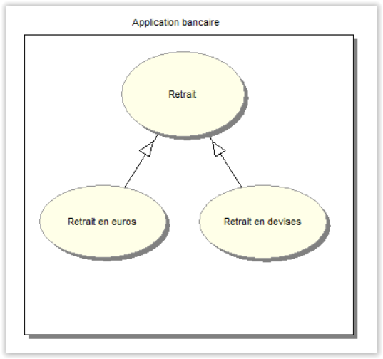
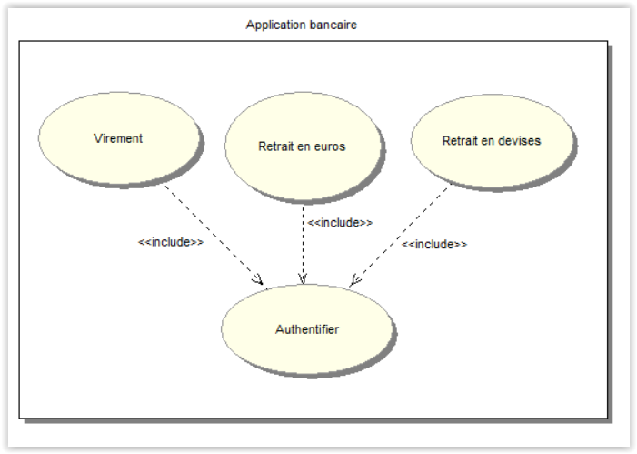
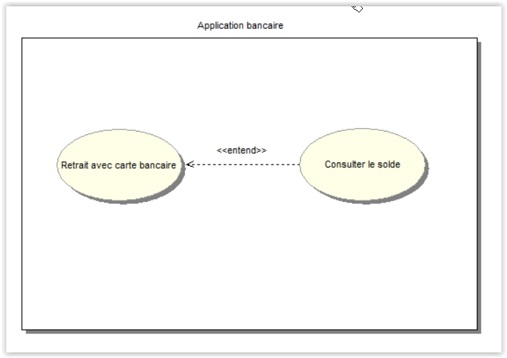

<h1>Modélisation partie 4 - Use Case</h1> 

# Introduction

## A quoi servent les Uses Cases (cas d’utilisation) ?

Ils permettent de CAPTURER LES BESOINS FONCTIONNELS du client sous la forme d’une interaction entre l’UTILISATEUR et le SYSTEME. Les cas d'utilisation décrivent le système en privilégiant le point de vue de l’utilisateur. Les cas d’utilisation mettent en évidence les ACTEURS (rôles) qui participent et les RELATIONS entre ces derniers. Ils donnent lieu à l’élaboration de scénario sous forme textuel ou graphique.
(Ils constituent l'approche principale de la méthode OOSE de Jacobson).   
Mots clés : BESOINS - SYSTEME – ACTEURS – INTERACTIONS – SCENARIO

## Découverte

Le client présente son SYSTÈME ou APPLICATION d'un point de vue FONCTIONNEL. Les cas d’utilisation vont permettre de **REFORMULER LES BESOINS** (de façon synthétique) et constituent un **MOYEN DE COMMUNICATION** efficace entre utilisateurs et équipes de développement.

Le cas d’utilisation décrit le système du point de vue de son UTILISATION :

* Les INTÉRACTIONS entre le SYSTÈME et les ACTEURS
* Les réactions du système aux événements externes
* Il permet de développer un système orienté utilisateur.

A partir du cahier des charges, la première étape de conceptualisation consiste à :

* identifier les acteurs (rôles)
* identifier les événements
* identifier les cas d’utilisation (Use Cases)

En résumé, le but des différents cas d’utilisation consiste à CAPTURER LES BESOINS du client en s’intéressant aux FONCTIONNALITÉS qu’il attend de la part du SYSTÈME ou de son APPLICATION.

Pour l’élaboration d’un cas d’utilisation, **il faut se mettre à la place d’un utilisateur**.

Les cas d’utilisation ne décrivent les comportements d’un système que du point de vue de l’utilisateur.

## Les Acteurs

Un acteur est une entité externe non obligatoirement physique agissant sur le système ou l'application. Graphiquement (typologie), **il est représenté par un petit bonhomme**.

Il peut s’agir :

* d’un utilisateur (humain)
* d’une machine ou un programme
* d’un autre système ou sous-système (voir notions de SI)

Du point de vue du système, il existe deux types d’acteurs :

* les acteurs **primaires qui utilisent le système**
* les acteurs **secondaires qui administrent le système**.

Par exemple, pour une application bancaire, on peut considérer les guichetiers qui enregistrent les opérations courantes et le directeur de l’agence qui établit le bilan de l’agence comme les acteurs primaires dits principaux.

Pour effectuer un change de devise, il faut connaître le cours de la devise. Il faut donc qu’un acteur secondaire soit capable de fournir ces informations. Cet acteur (responsable des devises) peut être représenté par une personne chargée de la saisie des cours journaliers ou par une application du système central qui fournit les informations nécessaires (ultérieurement, nous verrons les stéréotypes UML).

Selon la taille de l’agence, un individu (salarié d’une banque) peut jouer plusieurs rôles (guichetier, responsable de devises) et plusieurs individus peuvent jouer le même rôle.

Un acteur doit être défini à travers le rôle qu'il joue par rapport au système ou application.

## Description du Diagramme de Use Case

L'exécution du Use case est contrôlée par des **événements externes** envoyés au système par les acteurs.
L'ensemble des cas d’utilisation décrit les **exigences fonctionnelles du système ou application**.

Cette représentation permet de voir de façon simple :

* les différents acteurs
* les limites du système (grand rectangle)
* les fonctionnalités demandées au système (ellipses)
* les rôles des différents acteurs vis-à-vis du système. (indiqué sous les bonhommes)

Il existe 3 types de relations :

- **Communication** (flèche partant d’un acteur vers un cas d’utilisation).
- **Utilisation**  (`<<include>>` ou utilise).
- **Extension** (`<<Extend>>` ou étend) différent de l’héritage.
- **Généralisation** (Héritage représenté comme dans un diagramme de classe) cette relation n’est pas nommée.

## Organiser les cas d’utilisation au sein d’une application

### Relation de généralisation (héritage) : non nommée graphiquement

Considérons les use cases « retrait euros » et « retrait devises ». Nous pouvons imaginer un cas d’utilisation « retrait » qui décrit les fonctions communes dont héritent les use cases « retrait euros » et « retrait devises ». On retrouve ici des notions d’héritage de l’univers Objet.

Ce diagramme indique que le Use Case fils : « Retrait en devises » hérite de toutes les caractéristiques du Use Case père : « Retrait ».
Le use case « Retrait en devises » est une spécialisation du use case « Retrait ».

### Relation d’inclusion : « include » (Utilise ou uses)

Elle indique que le cas d’utilisation qui est pointé par la flèche est une sous-partie de l’autre, et non l’inverse ! Nous sommes ici dans un processus de factorisation. Une partie (ici un use case) est commune aux autres parties (uses cases)

La relation « include » quelques fois nommée `<<uses>>` permet de :

* factoriser des use cases correspondant à des fonctionnalités importantes qui servent fréquemment, ici « Saisir numéro de compte ».
* expliquer la constitution d’un use case complexe en le décomposant en plusieurs use cases.

### Relation de possibilité : `<<Extend>>` (étendre)

Considérons les uses cases « retirer de l’argent avec Carte Bancaire» et « Consulter le solde ». Nous pouvons imaginer que le client souhaite consulter le solde de son compte avant d’effectuer le retrait. On peut donc rapprocher les 2 cas d’utilisation en utilisant la relation `<<extend>>` d’extension comme une possibilité et non une obligation. Cela permet de préciser l’accès à d’autres fonctionnalités lors de l’exécution d’un scénario.

Ce diagramme indique que le use case : « Consulter le solde » peut s’intercaler à l’intérieur du scénario du cas d’utilisation « Retirer de l’argent avec une carte bancaire » au moment de la vérification du montant.
Nous sommes dans une possibilité. On peut donc consulter le solde avant d’effectuer le retrait.

### Le scénario :  il en faut un, comme au cinéma !

Un diagramme de cas d’utilisation ne suffit pas pour saisir les besoins du client. Il faut le compléter avec une **description détaillée** de chacun des cas d’utilisation. UML ne définit pas de standard en ce qui concerne la description de cas d’utilisation, mais il existe un certain nombre d’éléments qui sont communément admis.

**Un « Use Case » est une séquence d'actions réalisées par le système produisant un résultat observable à un acteur particulier. Sa description doit être synthétique et facilement compréhensible.**

Une description de cas d’utilisation doit comprendre :

Le NOM du cas d’utilisation.

Une DESCRIPTION brève du cas d’utilisation.

Le SCÉNARIO PRINCIPAL du cas d’utilisation, l’enchaînement des interactions entre les acteurs et le système lorsque tout se passe bien. Pour chaque acteur on doit indiquer clairement celui qui intervient.

Une série d’ALTERNATIVES s’il en existe, au déroulement du scénario principal.

Les PRÉ-CONDITIONS doivent figurer, c’est-à-dire l’état dans lequel on doit se trouver pour pouvoir réaliser le cas d’utilisation.

Les POST-CONDITIONS doivent figurer, c’est-à-dire l’état dans lequel on se trouve quand on a réalisé le cas d’utilisation. En général, on distingue les post-conditions de succès, quand on a suivi le scénario principal, tout s’est bien passé, et les post-conditions d’échec lorsque quelque chose s’est mal passé.

Un use case peut être décrit de différentes façons :

Dans la page suivante, il y a un exemple de présentation de cas d’utilisation, du scénario principal et des scénarios alternatifs. Ce exemple est lié à une gestion d’ouvrage et d’adhérents par une bibliothécaire.

#### Exemple de scénario textuel

Cas d’utilisation : Inscription d’un Adhérent

Informations générales 

Objectif			: opérations permettant d’inscrire un nouvel adhérent dans le système.    
Acteur principal	: bibliothécaire   
Acteur secondaire	: aucun   
Pré-condition		: aucun   
Post-condition		: Adhérent a été créé.   
Déclencheur		    : Le bibliothécaire choisit explicitement l’opération de création d’adhérent à l’aide de l’interface graphique utilisateur de l’application.   

Scénario Principal

Etape / Acteur / Description de l’action

1. Bibliothécaire / décide d’ajouter un nouvel adhérent par la fonction Création du GUI

2. Système / affiche l’interface utilisateur permettant d’inscrire un nouvel adhérent.

3.  Bibliothécaire / saisit les informations de l’adhérent (nom, prénom, adresse, ville, cp, pays) et valide.

4. Système / crée un nouvel adhérent avec les informations associés.

Scénari alternatifs
 
 * Alternative 4a : Adhérent déjà inscrit

cette alternative est effective à l’étape 4 du scénario principal.
 1- Système / affiche le message d’information spécifiant que l’adhérent est déjà inscrit.
Le cas d’utilisation reprend à l’étape 3 du scénario principal.

 * Alternative 4b : Informations partiellement saisies 

cette alternative est effective à l’étape 4 du scénario principal.   
 1- Système / affiche le message d’information spécifiant indiquant d’effectuer une saisie complète des informations nécessaires.

Le cas d’utilisation reprend à l’étape 3 du scénario principal.

* Alternative 4c : l’exploitant abandonne l’inscription 

cette alternative est effective à l’étape 2 du scénario principal.   
 1- Bibliothécaire / abandonne l’ajout d’un adhérent.   
Le cas d’utilisation se termine.

Autre description textuelle (séquentielle) :

Use case « retrait »

Le guichetier saisit le numéro de compte du client   
L’application valide le compte auprès du système central   
L’application demande le type d’opération au guichetier   
Le guichetier sélectionne un retrait d’espèces   
Le système « guichet » interroge le système central pour s’assurer que le compte est suffisamment approvisionné   
Le système central effectue le débit du compte   
Le système notifie au guichetier qu’il peut délivrer le montant demandé.   

Voilà, [vous pouvez passer à la pratique ICI](../pratique/Uses-Cases.md).

Auteur : **Philippe Bouget**