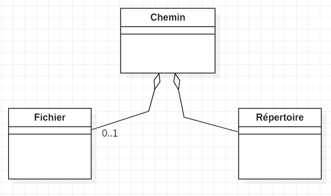

# Solutions des exercices pratiques

## Uses Cases

### 1. Garagiste

### 2. Gestion des Demandes de Formation

>Erreur sur les 2 diagrammes : il faut remplacer la relation \<<include>\>  par \<<extend>\> entre *établir une demande* et *consulter catalogue*. Le Use Case *Etablir une demande* peut être détaillé en d'autres *Uses Cases*

Autre exemple avec le logiciel ArgoUml :

### 3. Diagramme de cas d’utilisation (Guichet Automatique)

#### Etape 1

#### Etape 2

#### Etape 3

#### Etape 4

#### Scénario : Retirer Argent avec une CB

Cas d’utilisation : Retirer de l’argent (avec une Carte Bancaire)

Informations générales

**Objectif** : Effectuer un retrait d’argent avec une Carte Bancaire

**Acteur principal** : Porteur de Carte Bancaire ou Client de la Banque

**Acteur secondaire** : aucun

**Pré-condition** : Le distributeur contient des Billets. Il est dans l’attente d’une opération. Il n’est pas en panne.

**Post-condition** : Si l’argent a été retiré, la somme restante sur le compte est diminuée du montant du retrait effectué. Dans le cas contraire, la somme sur le compte est inchangée.

**Déclencheur** : introduction d’une carte bancaire dans le DAB

Scénario Principal

Etape - Acteur - Description de l’action

1. Client - introduit sa carte bancaire
2. Système - lit la carte et vérifie sa validité
3. Système - demande au client de taper son code
4. Client - tape son code confidentiel et valide
5. Système - Vérifie que le code correspond à la carte
6. Client - choisit une opération de retrait
7. Système - demande le montant à retirer
8. Client - saisit le montant du retrait souhaité et valide

Scénari alternatifs

Alternative 5a : Carte Invalide

cette alternative est effective à l’étape 2 du scénario principal.

1. Système - rejette la carte et affiche le message d’information « carte invalide »

Le cas d’utilisation se termine.

## Diagrammes de classes

### 1) 15 Diagrammes de classe (sans multiplicité)

#### Cas 1

#### Cas 2

#### Cas 3

#### Cas 4

#### Cas 5

#### Cas 6

#### Cas 7

#### Cas 8

Association ternaire (normalement, c'est un losange qui relie 3 ou plusieurs classes)
StarUML ne permet pas de créer ce type de relation. Il faut donc passer par une classe d'association.

#### Cas 9

#### Cas 10

#### Cas 11

#### Cas 12

Ce shéma est incomplet, il manque les supports SSD, et USB.

#### Cas 13

#### Cas 14

#### Cas 15

### 2) TP - Vols

### 3) TP - Locauto

### 4) Gestion de Locations Vidéos

Diagramme de flux (hors UML)

Use Case

Diagramme de classes

Télécharger le scénario "Enregistrer une location"

[scenario](scenario-video.pdf)